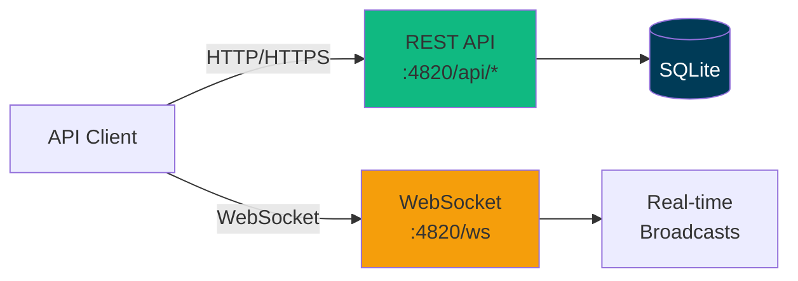
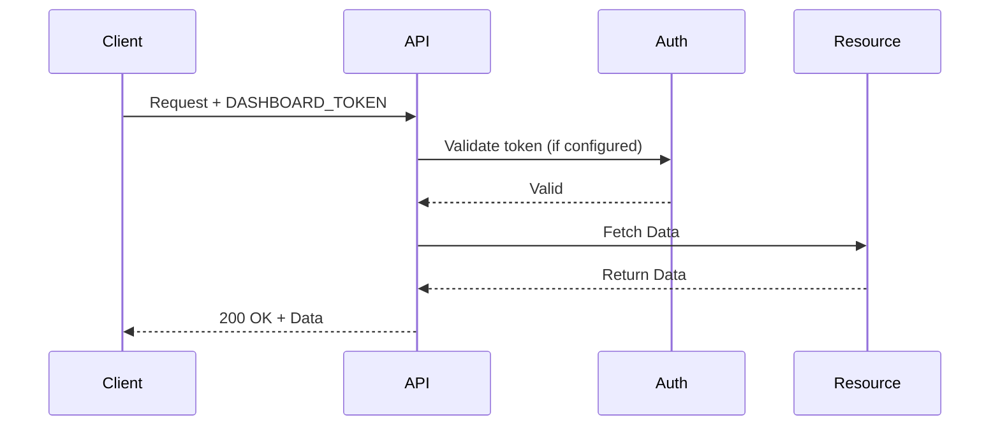
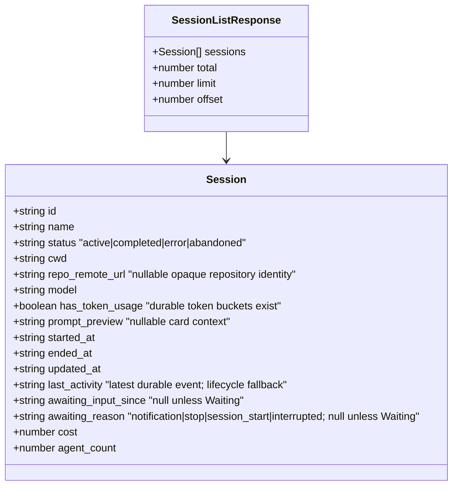
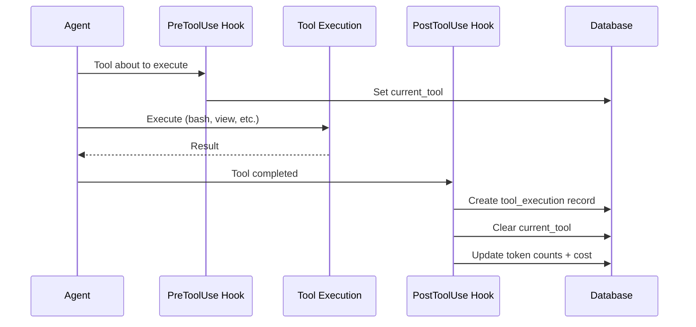
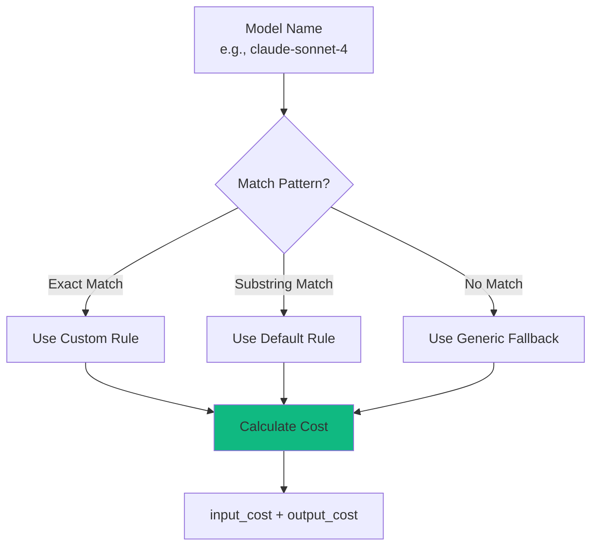
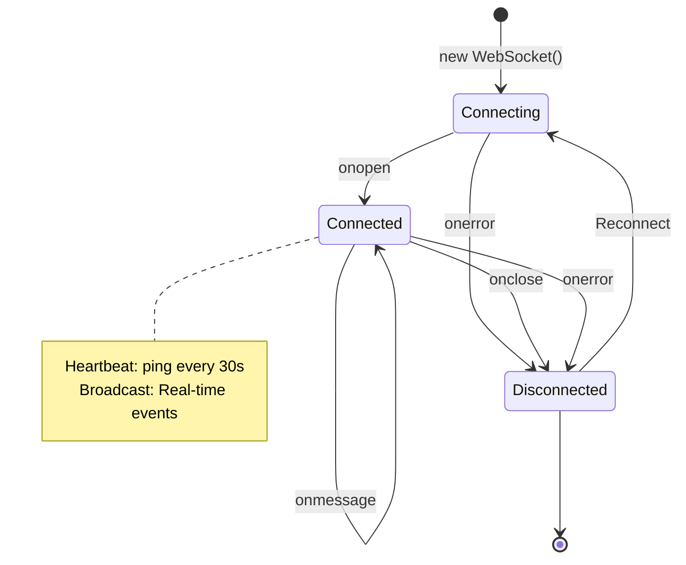
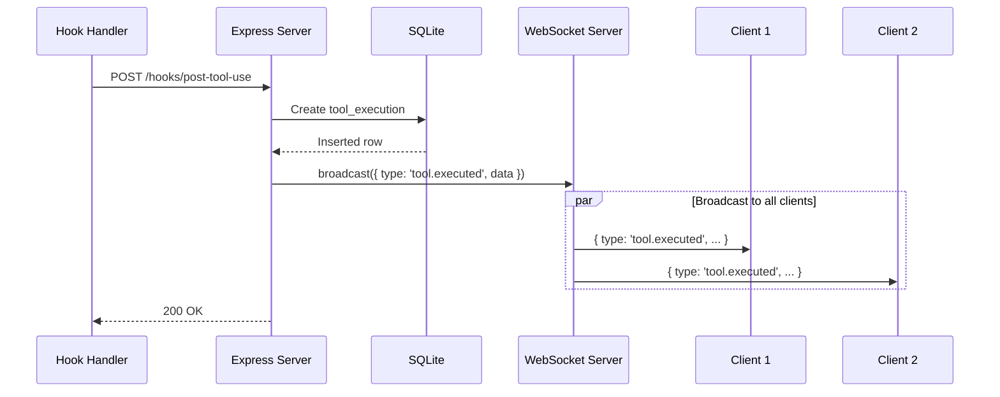
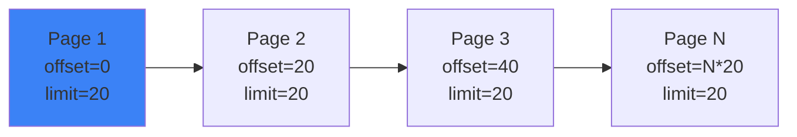

# API Reference

Complete REST API and WebSocket documentation for Agent Dashboard.

---

## Table of Contents

- [Overview](#overview)
- [Authentication](#authentication)
- [Base URL](#base-url)
- [REST API](#rest-api)
  - [Sessions](#sessions)
  - [Agents](#agents)
  - [Tools](#tools)
  - [Metrics](#metrics)
  - [Pricing](#pricing)
  - [Workflows](#workflows)
  - [Settings](#settings)
  - [Import History](#import-history)
  - [Notifications](#notifications)
  - [Remote Data Sources](#remote-data-sources)
  - [Remote Push Ingestion](#remote-push-ingestion)
- [WebSocket API](#websocket-api)
- [Error Handling](#error-handling)
- [Rate Limiting](#rate-limiting)
- [Pagination](#pagination)
- [Examples](#examples)

---

## Overview

The Agent Dashboard API provides programmatic access to Claude Code session monitoring data.



**Protocols:**
- **REST API** - HTTP/JSON for queries and mutations
- **WebSocket** - Real-time event streaming

---

## Authentication

The server is **local-first** and is hardened to keep the dashboard off the network by default (see GHSA-gr74-4xfh-6jw9). The trust boundary is the loopback bind, layered with origin and host checks:

- **Loopback bind by default** — the server binds `127.0.0.1`, so it is not network-reachable out of the box. Operators opt into a wider bind with `DASHBOARD_HOST` (e.g. `DASHBOARD_HOST=0.0.0.0` for LAN access), which logs a startup warning.
- **CORS restricted to loopback origins** — cross-origin web pages cannot read API responses. Requests with no `Origin` (curl, server-to-server) still work.
- **Host-header allowlist** — both HTTP requests and WebSocket upgrades are checked against an allowlist to block DNS-rebinding. Add extra LAN names (when you bind beyond loopback) via `DASHBOARD_ALLOWED_HOSTS` (comma-separated).

For deliberate LAN exposure, set `DASHBOARD_HOST` to a non-loopback address and list the names clients use in `DASHBOARD_ALLOWED_HOSTS`.

### Optional token (`DASHBOARD_TOKEN`)

Authentication is **off by default** (the loopback bind is the trust boundary). When `DASHBOARD_TOKEN` is set, every `/api/*` request **and** the WebSocket must present the token. It is strongly recommended whenever you bind beyond loopback. Pass it any of these ways:

- `Authorization: Bearer <token>` header
- `x-dashboard-token: <token>` header
- `?token=<token>` query parameter

These paths stay exempt even when a token is configured: `/api/health`, `/api/openapi.json`, `/api/docs`, and `/api/hooks` (local Claude Code and Codex hook ingestion, plus the optional `DASHBOARD_HOOK_TOKEN` when set). Requests that fail the check get `401` with error code `EUNAUTHORIZED`. The one exception inside that namespace is [`POST /api/hooks/ingest-batch`](#remote-push-ingestion), which carries its own mandatory `REMOTE_PUSH_TOKEN` and is disabled until it is configured.

`GET /api/settings/info` includes `server.version` (the running dashboard release). Pair with `ccam version` or the Settings About panel to confirm client and server builds match after deploy.



### Client integration checklist

- Prefer the `Authorization: Bearer <token>` header for regular integrations. The query parameter is supported for constrained clients, but URLs are more likely to end up in shell history, browser history, and access logs.
- Keep `DASHBOARD_TOKEN` in a secret store or environment variable; do not place it in a checked-in client bundle or example URL.
- Treat `/api/health` as a liveness probe only. It is intentionally exempt from token checks and cannot verify that a client is authorized for protected API routes.
- When exposing the dashboard beyond loopback, terminate TLS before the API, configure `DASHBOARD_ALLOWED_HOSTS` with the hostname clients use, and test both an authenticated REST request and WebSocket connection from the intended origin.

---

## Base URL

```
http://localhost:4820
```

For production, use HTTPS:

```
https://dashboard.example.com
```

---

## REST API

### Sessions

#### List Sessions

```http
GET /api/sessions
```

Returns all sessions, ordered by most recent activity. Each list row includes the boolean
`has_token_usage`: `true` means at least one durable `token_usage` bucket exists, even if every
counter is zero or the model is unpriced. It does not indicate whether all usage is priced.
Rows with no buckets, including transient Codex process-overlay rows, report `false`.
Do not infer coverage from `cost`, which can be zero in either case. This flag is computed
for the list response; it is not a stored session column or a guaranteed field on detail or
WebSocket responses.

`repo_remote_url` is optional collector-supplied metadata, not an automatically discovered Git
remote. The first non-empty sanitized value wins, including when supplied after session creation;
later hooks or batches cannot replace it. URL/SCP userinfo, query strings, and fragments are
removed, and malformed URL-style values are discarded before session or hook-event storage.
For example, `git@example.internal:team/project.git` becomes `example.internal:team/project.git`.
Consumers may canonicalize the retained value to match a repository across machine-local `cwd`
paths; it is an identity hint, not a clone credential. Each row may include an optional
`prompt_preview` for compact cards: the two newest distinct real human prompts, oldest to
newest and newline-separated. Claude Code persists this bounded summary from the local JSONL
cache during hooks, imports, and watchdog sweeps; Codex derives it from durable
`codex_user_message` records. Historical rows fall back to the main-agent task. The detail route
returns the same optional field.

**Query Parameters:**

| Parameter | Type | Default | Description |
|-----------|------|---------|-------------|
| `limit` | integer | 50 | Maximum durable sessions to return (up to 10000) |
| `offset` | integer | 0 | Pagination offset |
| `status` | string | - | Filter by persisted status: `active`, `completed`, `error`, `abandoned`. The UI **Waiting** state is derived from the `awaiting_input_since` column and is not a queryable enum — filter `status=active` and inspect `awaiting_input_since` (non-null = Waiting) |
| `q` | string | - | Case-insensitive search across `id`, `name`, and `cwd` |
| `cwd` | string (repeatable) | - | Exact working directory filter. Repeat it to include multiple projects, for example `cwd=/work/a&cwd=/work/b` |
| `sort_by` | string | `time` | Ordering dimension: `time`, `duration`, or `price` |
| `sort_desc` | boolean | `true` | Use descending order; set to `false` for ascending order |
| `sources` | string | - | Comma-separated data-source ids to include (the built-in local history is `local`; remote SSH machines use their `remote_sources.id`). Omit for all sources. Also accepted on `/api/events`, `/api/agents`, `/api/stats`, `/api/analytics`, and `/api/pricing/cost`. See [Remote Data Sources](#remote-data-sources) |
| `providers` | string | - | Comma-separated product providers: `claude`, `codex`, or both. It composes with `sources` and is accepted by the scoped list, aggregate, facet, per-session detail, cost, and workflow routes. Codex workflow responses include its recorded `response_item` tool calls, token/model totals, and `context_compacted` events; only Claude Code's Workflow-tool run journals are unavailable for Codex. |
| `include_transient` | boolean | `false` | Opt in to local, in-memory Codex startup cards before Codex exposes a stable session ID. On `/api/sessions`, this is honored only on the first page when `status` is absent or `active`; on `/api/agents`, only on the first `status=waiting` page without `session_id`. These cards are prepended without changing durable `total`, pagination, analytics, pricing, workflows, alerts, or history. |
| `include_task_progress` | boolean | `false` | Attach nullable `todo_summary` values for the latest top-level work item to at most the first 100 returned rows. A new Claude human turn or Codex task that emits no tracker clears older state; a turn/task ending without a final update drops unfinished state. Fully completed history remains available. Each transcript is read 32 MiB deep on first contact and incrementally after that, starting over with a fresh 32 MiB scan if it grew by more than that since the last read (state covers its newest 32 MiB), and each summary includes at most five preview tasks. Rows after the enrichment cap omit the field. |

**Example Request:**

```bash
curl "http://localhost:4820/api/sessions?limit=10&status=active&include_task_progress=true"
```

`last_activity` in every list row is the timestamp of the latest durable session event. It does **not** reuse the mutable `updated_at` bookkeeping timestamp, so a title, card-context, or watchdog repair cannot make an idle session appear newly active. Eventless historical rows fall back to their lifecycle timestamp.

**Example Response:**

```json
{
  "sessions": [
    {
      "id": "sess_abc123",
      "name": "Implement task progress",
      "model": "claude-sonnet-4",
      "status": "active",
      "cost": 1.23,
      "has_token_usage": true,
      "repo_remote_url": "ssh://example.internal:2222/team/project.git",
      "agent_count": 3,
      "started_at": "2024-03-18T12:00:00Z",
      "updated_at": "2024-03-18T14:30:00Z",
      "todo_summary": {
        "total": 2,
        "completed": 1,
        "inProgress": 1,
        "pending": 0,
        "cancelled": 0,
        "unknown": 0,
        "percentComplete": 50,
        "activeText": "Implement tracker",
        "sourceTool": "TaskList",
        "updatedAt": "2024-03-18T14:29:00Z",
        "previewItems": [
          {
            "id": "task-2",
            "text": "Implement tracker",
            "status": "in_progress",
            "sourceStatus": "in_progress",
            "order": 1,
            "agentId": "sess_abc123-main",
            "agentType": "main",
            "description": null
          }
        ],
        "overflowCount": 1,
        "ownerBreakdown": [
          {
            "agentId": "sess_abc123-main",
            "agentType": "main",
            "completed": 1,
            "total": 2
          }
        ]
      }
    }
  ],
  "total": 42,
  "limit": 10,
  "offset": 0
}
```

**Response Schema:**



---

#### Get Session

```http
GET /api/sessions/:id
```

Returns single session details. The `session.todo_snapshot` field contains the latest observable,
owner-attributed task state when Claude emitted `TaskCreate` / `TaskGet` / `TaskUpdate` /
`TaskList`, legacy `TodoWrite`, task lifecycle events, or Codex emitted `update_plan`; otherwise
it is `null`. State is scoped to the latest top-level work boundary: a real Claude human turn or
Codex `task_started` clears all prior owners, and a subagent's next assigned turn clears only that
owner. If no fresh task state follows, older trackers stay removed. Harness task notifications do
not count as human turns. Claude turn-end records and Codex `task_complete` / `turn_aborted` also
discard owner snapshots that still contain unfinished work, while fully completed/cancelled snapshots
remain as history. Persisted Claude prompt/stop/session lifecycle events apply those boundaries even
when the corresponding transcript marker has not flushed yet, so an immediate live refetch returns
the latest state. The parser reads the newest 32 MiB of each transcript on first contact, then only what was appended since the last complete line, starting over if more than 32 MiB arrived since the last read (state covers the newest 32 MiB), at a complete-line
boundary, and the full snapshot contains at most 200 task rows.
`GET /api/sessions?include_task_progress=true` exposes the nullable `todo_summary` counterpart
for list rows, including at most five preview tasks and enriching at most 100 returned rows.

**Path Parameters:**

| Parameter | Type | Description |
|-----------|------|-------------|
| `id` | string | Session ID (e.g., `sess_abc123`) |

**Example Request:**

```bash
curl http://localhost:4820/api/sessions/sess_abc123
```

**Example Response:**

```json
{
  "session": {
    "id": "sess_abc123",
    "name": "Implement task progress",
    "model": "claude-sonnet-4",
    "status": "active",
    "started_at": "2026-08-07T10:00:00.000Z",
    "updated_at": "2026-08-07T10:15:00.000Z",
    "todo_snapshot": {
      "provider": "claude",
      "source": "transcript",
      "sourceTool": "TaskList",
      "sourceLine": 42,
      "updatedAt": "2026-08-07T10:14:00.000Z",
      "explanation": null,
      "confidence": "full",
      "items": [
        {
          "id": "task-1",
          "text": "Implement task progress",
          "status": "in_progress",
          "sourceStatus": "in_progress",
          "order": 0,
          "agentId": "sess_abc123-main",
          "agentType": "main",
          "description": null
        }
      ],
      "total": 1,
      "completed": 0,
      "inProgress": 1,
      "pending": 0,
      "cancelled": 0,
      "unknown": 0,
      "percentComplete": 0,
      "activeText": "Implement task progress",
      "includesSubagents": false,
      "ownerBreakdown": [
        {
          "agentId": "sess_abc123-main",
          "agentType": "main",
          "completed": 0,
          "total": 1
        }
      ]
    }
  },
  "agents": [],
  "events": [],
  "workflows": []
}
```

**Error Responses:**

| Code | Description |
|------|-------------|
| 404 | Session not found |
| 500 | Internal server error |

---

#### Get Conversation Transcript

```http
GET /api/sessions/:id/transcript
```

Returns a cursor-paginated transcript page. Pass `limit` (up to 200), `after` to
read newer JSONL lines, or `before` to load the preceding page; responses include
`first_line`, `last_line`, and `has_more` for the next request. Claude Code
responses include its normal conversation and local command records. Codex
responses include human turns, legacy `function_call` records, and the primary
`custom_tool_call` stream (including `exec` input and paired output), so clients
can render the actual command flow rather than only `wait` calls. Both providers
also expose persisted PNG/JPEG/GIF/WebP user attachments as `image` content blocks;
missing or expired files are simply omitted, and Codex's duplicated response/event
user records are returned as one human turn. Cursor main sessions can return
`prompt_history.json` turns before JSONL exists. Their messages carry stable `id`
values; an incremental result with `refresh: true` is a latest window that clients
merge by `id`, allowing the canonical transcript to replace the pending prompt
without duplication.

#### Read Persisted Transcript Image

```http
GET /api/sessions/:id/transcript-image?line={line}&index={index}
```

Streams a same-origin image referenced by one persisted Claude transcript line. The
transcript response provides this opaque URL rather than its local path. Codex inline
attachments are already returned as validated `data:image/...` block sources. Only bounded
PNG, JPEG, GIF, and WebP images are served; unavailable files return `404`.

---

#### Get Session Stats

```http
GET /api/sessions/:id/stats
```

Returns aggregated counts powering the Session Detail overview panel. All aggregation runs in SQL — the response is cheap to compute even for sessions with tens of thousands of events.

**Path Parameters:**

| Parameter | Type | Description |
|-----------|------|-------------|
| `id` | string | Session ID |

**Example Request:**

```bash
curl http://localhost:4820/api/sessions/sess_abc123/stats
```

**Example Response:**

```json
{
  "session_id": "sess_abc123",
  "total_events": 14082,
  "events_by_type": [
    { "event_type": "PreToolUse", "count": 5210 },
    { "event_type": "PostToolUse", "count": 5208 }
  ],
  "tools_used": [
    { "tool_name": "Bash", "count": 1842 },
    { "tool_name": "Read", "count": 1340 }
  ],
  "error_count": 12,
  "first_event_at": "2026-04-26T18:59:00.000Z",
  "last_event_at": "2026-04-29T21:30:14.000Z",
  "agents": {
    "total": 12,
    "main": 1,
    "subagent": 11,
    "compaction": 5,
    "by_status": { "completed": 11, "working": 1 }
  },
  "subagent_types": [
    { "subagent_type": "Explore", "count": 4 }
  ],
  "tokens": {
    "input_tokens": 1376,
    "output_tokens": 760304,
    "cache_read_tokens": 337641891,
    "cache_write_tokens": 5126047
  }
}
```

**Error Responses:**

| Code | Description |
|------|-------------|
| 404 | Session not found |
| 500 | Internal server error |

---

#### Get Session Agents

```http
GET /api/sessions/:id/agents
```

Returns all agents for a session.

**Path Parameters:**

| Parameter | Type | Description |
|-----------|------|-------------|
| `id` | string | Session ID |

**Example Request:**

```bash
curl http://localhost:4820/api/sessions/sess_abc123/agents
```

**Example Response:**

```json
{
  "agents": [
    {
      "id": "sess_abc123-main",
      "session_id": "sess_abc123",
      "name": "Main Agent - my-project",
      "type": "main",
      "subagent_type": null,
      "status": "idle",
      "current_tool": null,
      "task": null,
      "started_at": "2024-03-18T12:00:00Z",
      "ended_at": null,
      "updated_at": "2024-03-18T12:05:00Z",
      "parent_agent_id": null,
      "awaiting_input_since": "2024-03-18T12:05:00Z",
      "awaiting_reason": "stop",
      "cost": 0
    }
  ]
}
```

> **Note on `cost`** — `/api/agents` and `/api/sessions/:id/agents` attach a `cost` (USD) to each agent: the agent's **own** cost, computed server-side from the per-agent token buckets stored in `agents.metadata.tokens` and priced at the current pricing rules (at the agent's start date, so promo/standard cutovers apply — see [Pricing](#pricing)). It is `0` for main agents (whose cost is the session total, reported by `/api/pricing/cost/:sessionId`), for compaction pseudo-agents, and for any subagent whose transcript is unavailable. This lets a subagent card show only what that subagent spent instead of the whole session's total.

> **Note on real activity time** — agent list/detail reads include `last_activity`, derived from the latest durable event attributed to that agent. Use it for user-facing time labels instead of mutable `updated_at`, which can change during status or metadata maintenance without new CLI activity.

> **Note on `status` vs Waiting** — agents are persisted with one of `idle | connected | working | completed | error`. The yellow **Waiting** badge surfaced in the dashboard is a UI overlay derived from `awaiting_input_since` being non-null on a non-terminal agent (typically `idle` after a `Stop`, or `connected` right after `SessionStart`). Filter `?status=idle` on `/api/agents` and inspect `awaiting_input_since` to enumerate currently-waiting main agents.

---

### Agents

#### Get Agent

```http
GET /api/agents/:id
```

Returns single agent details.

**Path Parameters:**

| Parameter | Type | Description |
|-----------|------|-------------|
| `id` | string | Agent ID (e.g., `agent_xyz789`) |

**Example Request:**

```bash
curl http://localhost:4820/api/agents/agent_xyz789
```

**Example Response:**

```json
{
  "agent": {
    "id": 1,
    "agent_id": "agent_xyz789",
    "session_id": "sess_abc123",
    "agent_type": "explore",
    "status": "completed",
    "current_tool": null,
    "input_tokens": 1500,
    "output_tokens": 800,
    "cost": 0.45,
    "created_at": "2024-03-18T12:00:00Z",
    "updated_at": "2024-03-18T12:05:00Z"
  }
}
```

---

#### Get Agent Tools

```http
GET /api/agents/:id/tools
```

Returns tool executions for an agent.

**Path Parameters:**

| Parameter | Type | Description |
|-----------|------|-------------|
| `id` | string | Agent ID |

**Example Request:**

```bash
curl http://localhost:4820/api/agents/agent_xyz789/tools
```

**Example Response:**

```json
{
  "tools": [
    {
      "id": 1,
      "agent_id": "agent_xyz789",
      "tool_name": "bash",
      "duration_ms": 1234,
      "success": 1,
      "error_message": null,
      "created_at": "2024-03-18T12:01:00Z"
    },
    {
      "id": 2,
      "agent_id": "agent_xyz789",
      "tool_name": "view",
      "duration_ms": 45,
      "success": 1,
      "error_message": null,
      "created_at": "2024-03-18T12:02:00Z"
    }
  ]
}
```

**Tool Execution Flow:**



---

### Tools

#### List All Tools

```http
GET /api/tools
```

Returns all tool executions across all sessions.

**Query Parameters:**

| Parameter | Type | Default | Description |
|-----------|------|---------|-------------|
| `limit` | integer | 100 | Max tools to return |
| `tool_name` | string | - | Filter by tool name |
| `success` | boolean | - | Filter by success status |

**Example Request:**

```bash
curl http://localhost:4820/api/tools?limit=50&tool_name=bash
```

**Example Response:**

```json
{
  "tools": [
    {
      "id": 1,
      "agent_id": "agent_xyz789",
      "tool_name": "bash",
      "duration_ms": 1234,
      "success": 1,
      "error_message": null,
      "created_at": "2024-03-18T12:01:00Z"
    }
  ],
  "total": 156
}
```

---

### Metrics

#### Prometheus exposition

```
GET /api/metrics
```

Exposes the dashboard's live counters in the [Prometheus text-exposition format](https://prometheus.io/docs/instrumenting/exposition_formats/) (v0.0.4) so this monitoring dashboard can itself be scraped into Prometheus / Grafana. Read-only. Values are read from the same prepared statements the REST API uses, so they match the UI.

Response `Content-Type: text/plain; version=0.0.4; charset=utf-8`.

| Metric | Type | Labels | Meaning |
| --- | --- | --- | --- |
| `ccam_up` | gauge | — | `1` when the API served the scrape |
| `ccam_build_info` | gauge | `version` | Always `1`; dashboard version rides on the label |
| `ccam_process_uptime_seconds` | gauge | — | Server process uptime |
| `ccam_process_resident_memory_bytes` | gauge | — | Server process RSS |
| `ccam_sessions` | gauge | `status` (`active`/`completed`/`error`/`abandoned`) | Sessions by status |
| `ccam_agents` | gauge | `status` (`working`/`waiting`/`completed`/`error`) | Agents by status |
| `ccam_events_total` | counter | — | Total events recorded |
| `ccam_websocket_clients` | gauge | — | Connected realtime clients |
| `ccam_remote_sources` | gauge | `enabled` (`true`/`false`) | Configured Remote Data Sources |
| `ccam_tokens_total` | counter | `kind` (`input`/`output`/`cache_read`/`cache_write`) | Cumulative token usage |

Status series are always emitted (even at `0`) so a series never disappears from the exposition. The endpoint is mounted under `/api`, so it sits behind the same two guards as every other route: the **Host-header (DNS-rebinding) guard** and the optional **`DASHBOARD_TOKEN`** guard. A scraper that reaches the server as anything other than loopback (e.g. Prometheus in Docker hitting `host.docker.internal`) must be allowlisted with `DASHBOARD_ALLOWED_HOSTS`, or the scrape returns `403 EBADHOST`; if a token is set, the scrape must also send it.

Example scrape config (start the server with `DASHBOARD_ALLOWED_HOSTS=host.docker.internal`):

```yaml
scrape_configs:
  - job_name: ccam
    metrics_path: /api/metrics
    static_configs:
      - targets: ["host.docker.internal:4820"]
    # authorization:              # only if DASHBOARD_TOKEN is set
    #   credentials: "<DASHBOARD_TOKEN>"
```

A ready-to-run Prometheus + Grafana stack (four auto-provisioned dashboards; default home **CCAM — Overview**) lives in [`monitoring/`](../monitoring/README.md). **npm path (no Docker):** `npm run monitoring:install` then `npm run monitoring:up` (binaries are pulled via the monitoring package's `postinstall` — there is no official `grafana`/`prometheus` server package on npm). **Docker path:** `npm run monitoring:docker:up` or `npm run docker:full:up` (set `DASHBOARD_ALLOWED_HOSTS=host.docker.internal` on the dashboard when Prometheus runs in a container). Pre-built Prometheus console: `http://localhost:9090/consoles/index.html`.

---

### Pricing

#### List Pricing Rules

```http
GET /api/pricing
```

Returns all pricing rules (default + custom).

**Example Request:**

```bash
curl http://localhost:4820/api/pricing
```

**Example Response:**

```json
{
  "rules": [
    {
      "id": 1,
      "pattern": "claude-sonnet-4",
      "input_cost_per_1m": 3.0,
      "output_cost_per_1m": 15.0,
      "is_default": true,
      "created_at": "2024-03-18T12:00:00Z"
    },
    {
      "id": 10,
      "pattern": "gpt-5.1-codex",
      "input_cost_per_1m": 2.5,
      "output_cost_per_1m": 10.0,
      "is_default": false,
      "created_at": "2024-03-18T14:30:00Z"
    }
  ]
}
```

**Pricing Rule Matching:**



---

#### Create or Update Pricing Rule

```http
PUT /api/pricing
```

Upsert a pricing rule, keyed by `model_pattern`. The same call creates a new rule or updates an existing one (matched on `model_pattern`). Rates are per **million** tokens.

**Request Body:**

```json
{
  "model_pattern": "claude-sonnet-5%",
  "display_name": "Claude Sonnet 5",
  "input_per_mtok": 2,
  "output_per_mtok": 10,
  "cache_read_per_mtok": 0.2,
  "cache_write_per_mtok": 2.5,
  "cache_write_1h_per_mtok": 4,
  "fast_input_per_mtok": 0,
  "fast_output_per_mtok": 0,

  "intro_until": "2026-08-31",
  "intro_input_per_mtok": 2,
  "intro_output_per_mtok": 10,
  "intro_cache_read_per_mtok": 0.2,
  "intro_cache_write_per_mtok": 2.5,
  "intro_cache_write_1h_per_mtok": 4
}
```

**Fields:**

| Field | Type | Constraints |
|-------|------|-------------|
| `model_pattern` | string | Required. SQL-style glob; `%` matches any characters (e.g. `claude-opus-4-7%`) |
| `display_name` | string | Required |
| `input_per_mtok` / `output_per_mtok` | number | Standard per-MTok rates (default 0) |
| `cache_read_per_mtok` / `cache_write_per_mtok` / `cache_write_1h_per_mtok` | number | Cache rates (default 0) |
| `fast_input_per_mtok` / `fast_output_per_mtok` | number | Fast-mode premium rates (default 0) |
| `intro_until` | string \| null | Optional promo cutoff `YYYY-MM-DD`. Usage **on or before** this date is priced at the `intro_*` rates, after it at the standard rates. Empty/`null` clears the promo (and zeroes the intro rates) |
| `intro_*_per_mtok` | number | Optional introductory (promo) rates, mirroring the standard fields |

The intro block is **optional and backward-compatible**: a request that omits every `intro_*`/`intro_until` field leaves any existing promo untouched, so older clients that send only the standard rates never clobber a promo.

**Validation:** every `*_per_mtok` rate present in the body must be a **non-negative finite number** (numeric strings are coerced); a `NaN`, non-numeric, or negative value is rejected with `400 INVALID_INPUT` naming the offending field, and nothing is written. `intro_until` must be a `YYYY-MM-DD` date (or empty/`null` to clear the promo).

**Example Request:**

```bash
curl -X PUT http://localhost:4820/api/pricing \
  -H "Content-Type: application/json" \
  -d '{
    "model_pattern": "gpt-5.1-codex",
    "display_name": "GPT-5.1 Codex",
    "input_per_mtok": 2.5,
    "output_per_mtok": 10.0
  }'
```

**Example Response:**

```json
{
  "pricing": {
    "model_pattern": "gpt-5.1-codex",
    "display_name": "GPT-5.1 Codex",
    "input_per_mtok": 2.5,
    "output_per_mtok": 10.0,
    "intro_until": null,
    "updated_at": "2026-07-01T14:30:00Z"
  }
}
```

**Error Responses:**

| Code | Description |
|------|-------------|
| 400 | Missing `model_pattern`/`display_name`, or `intro_until` not a `YYYY-MM-DD` date |
| 500 | Database error |

---

#### Cursor Pricing Rules

```http
GET    /api/pricing/cursor
PUT    /api/pricing/cursor
DELETE /api/pricing/cursor/:pattern
```

Cursor sessions are priced only against this independent four-column rate card. Each row contains `model_pattern`, `display_name`, `input_per_mtok`, `cache_write_per_mtok`, `cache_read_per_mtok`, and `output_per_mtok`. Rates are USD per million tokens; every supplied rate must be finite and non-negative. Longest/more-specific patterns win, so Cursor Fast entries override their base family. A zero cache-write column represents Cursor's unavailable (`-`) value and is displayed as an em dash in Settings.

```json
{
  "model_pattern": "grok-4.6-fast%",
  "display_name": "Cursor Grok 4.6 (Fast)",
  "input_per_mtok": 4,
  "cache_write_per_mtok": 0,
  "cache_read_per_mtok": 1,
  "output_per_mtok": 12
}
```

`POST /api/settings/reset-pricing` accepts `provider: "cursor"` in addition to `claude` and `codex`. Omitting the body resets all three tables. The response includes `pricing`, `cursor_pricing`, and `gpt_pricing`.

---

#### OpenAI GPT Pricing Rules

```http
GET    /api/pricing/gpt
PUT    /api/pricing/gpt
DELETE /api/pricing/gpt/:pattern
```

These endpoints manage the separate GPT rate card used only for Codex sessions. Each row has four USD-per-million-token rates for each of four groups: `short_*` for standard requests at or below 272K input tokens, `long_*` for larger standard requests, `fast_*` for short Fast requests, and `fast_long_*` for Fast requests above 272K. Older API clients that omit `fast_long_*` retain the existing values on update. The four rates are input, cached input, cache writes, and output. Every present rate must be a finite non-negative number. A published but unavailable tier is stored as an all-zero group and surfaced in cost responses as unpriced, rather than silently guessing a price.

**Upgrade behavior:** startup corrects only exact obsolete default Astra/Sol rates. When the
Fast long columns are first added, untouched defaults receive the published Astra and GPT-5.6
Fast long rates; customized rules inherit their existing Fast rates in the new band. Subsequent
restarts preserve edits, including an explicit zero rate. Cost estimates are calculated on read,
so corrected defaults also reprice existing sessions. No token re-import is required. Sol uses
the currently configured rate for historical estimates too; the dashboard neither fetches live
prices nor schedules an assumed promotional price increase. Reset Defaults deliberately replaces
the selected provider's custom prices.

`POST /api/settings/reset-pricing` accepts an optional provider body to reset only one table; see the Cursor section above. Omitting the body preserves compatibility and resets all provider tables.

```json
{
  "model_pattern": "gpt-5.6-terra%",
  "display_name": "GPT-5.6 Terra",
  "short_input_per_mtok": 2,
  "short_cached_input_per_mtok": 0.2,
  "short_cache_write_per_mtok": 2.5,
  "short_output_per_mtok": 12,
  "long_input_per_mtok": 4,
  "long_cached_input_per_mtok": 0.4,
  "long_cache_write_per_mtok": 5,
  "long_output_per_mtok": 18,
  "fast_input_per_mtok": 4,
  "fast_cached_input_per_mtok": 0.4,
  "fast_cache_write_per_mtok": 5,
  "fast_output_per_mtok": 24,
  "fast_long_input_per_mtok": 8,
  "fast_long_cached_input_per_mtok": 0.8,
  "fast_long_cache_write_per_mtok": 10,
  "fast_long_output_per_mtok": 36
}
```

---

#### Delete Pricing Rule

```http
DELETE /api/pricing/:pattern
```

Delete custom pricing rule (default rules cannot be deleted).

**Path Parameters:**

| Parameter | Type | Description |
|-----------|------|-------------|
| `pattern` | string | Pattern to delete (URL-encoded) |

**Example Request:**

```bash
# Pattern must be URL-encoded
curl -X DELETE http://localhost:4820/api/pricing/gpt-5.1-codex
```

**Example Response:**

```json
{
  "deleted": true
}
```

**Error Responses:**

| Code | Description |
|------|-------------|
| 404 | Pattern not found |
| 403 | Cannot delete default rule |
| 500 | Database error |

---

### Workflows

#### Aggregate Workflow Intelligence

```http
GET /api/workflows?status=active&sources=local&providers=codex
```

Returns the 11 workflow datasets used by the Workflows page. `status`, `sources`, and `providers` compose to scope every aggregate. For Codex, tool flow and the per-session timeline come from persisted `response_item` calls, while compaction counts come from `context_compacted` rollout events; the API never invents Claude-style subagents or Workflow-tool runs for Codex.

#### Session Drill-in

```http
GET /api/workflows/session/:id?sources=local&providers=codex
```

Returns the scoped session row, agent tree, recorded tool timeline, swim lanes, and chronological events. It returns `404` when the session is absent or falls outside the requested provider/source scope.

---

### Notifications

#### Get Session Notifications

```http
GET /api/sessions/:id/notifications
```

Returns notifications for a session.

**Path Parameters:**

| Parameter | Type | Description |
|-----------|------|-------------|
| `id` | string | Session ID |

**Example Request:**

```bash
curl http://localhost:4820/api/sessions/sess_abc123/notifications
```

**Example Response:**

```json
{
  "notifications": [
    {
      "id": 1,
      "session_id": "sess_abc123",
      "notification_type": "backgroundTaskComplete",
      "message": "Explore agent completed",
      "created_at": "2024-03-18T12:05:00Z"
    }
  ]
}
```

### Webhooks

The `/api/webhooks/*` namespace manages alert-delivery targets and their audit log.

```http
GET    /api/webhooks/providers
GET    /api/webhooks
POST   /api/webhooks
PATCH  /api/webhooks/:id
DELETE /api/webhooks/:id
POST   /api/webhooks/:id/test
GET    /api/webhooks/:id/deliveries
```

Hosted provider URLs require HTTPS. The `generic` and `n8n` types may use HTTP for local or self-hosted receivers. Delivery rejects redirects, so provider credentials, custom headers, and HMAC signatures are never forwarded to a second destination. List and mutation responses mask URLs and redact secrets.

### Remote Data Sources

The `/api/remote-sources/*` namespace configures **remote SSH machines** the dashboard pulls Claude Code, Codex, or both histories from, so one dashboard can consolidate sessions from several machines. Each provider is mirrored and imported independently; a source succeeds when either provider is present. Codex additionally mirrors its lightweight `session_index.jsonl` so native renamed titles survive import. **No secrets are stored** — SSH authentication defers entirely to the host's SSH stack (ssh-agent, `~/.ssh/config`, key files). Every imported session is tagged with the source's id in the `sessions.source` column (the built-in local history uses the id `local`), which powers the `sources` filter below.

**RemoteSource shape:**

```json
{
  "id": "4d1f0e2a-7b9c-4c33-8a21-9e0f7b6d4c11",
  "label": "Work laptop",
  "host": "son@studio.local",
  "ssh_port": 22,
  "identity_file": "~/.ssh/id_ed25519",
  "remote_home": "~/.claude",
  "remote_codex_home": "~/.codex",
  "enabled": true,
  "status": "ok",
  "claude_status": "ok",
  "codex_status": "ok",
  "last_error": null,
  "last_sync_at": "2026-07-22T18:41:55.117Z",
  "last_sync_counts": {
    "imported": 9,
    "skipped": 41,
    "backfilled": 0,
    "errors": 0,
    "sessions_seen": 50,
    "sessions_tagged": 50,
    "providers": {
      "claude": { "status": "ok", "sessions_tagged": 32 },
      "codex": { "status": "ok", "sessions_tagged": 18 }
    }
  },
  "created_at": "2026-07-20T09:15:00.000Z",
  "updated_at": "2026-07-22T18:41:55.117Z"
}
```

`ssh_port`, `identity_file`, `remote_home`, `remote_codex_home`, `claude_status`, `codex_status`, `last_error`, `last_sync_at`, and `last_sync_counts` are nullable. `remote_home` and `remote_codex_home` are the optional **Remote Claude home** and **Remote Codex home** overrides; send `null` on `PATCH` to return either provider to its default remote home. `status` is one of `idle`, `syncing`, `ok`, `error`; provider statuses additionally use `unavailable` when that CLI's history directory is absent.

#### List Remote Sources

```http
GET /api/remote-sources
```

Returns all configured remote sources. Response: `{ "sources": RemoteSource[] }`.

#### Create Remote Source

```http
POST /api/remote-sources
```

**Request Body:**

| Field | Type | Required | Description |
|-------|------|----------|-------------|
| `label` | string | Yes | Human-readable name |
| `host` | string | Yes | SSH destination (`user@host`) or a `~/.ssh/config` alias |
| `ssh_port` | integer | No | SSH port (defers to SSH default / config when omitted) |
| `identity_file` | string | No | Private-key path passed to ssh (`-i`) |
| `remote_home` | string | No | Remote Claude home (defaults to remote `~/.claude`) |
| `remote_codex_home` | string | No | Remote Codex home (defaults to remote `~/.codex`) |
| `enabled` | boolean | No | Whether the source is eligible for syncs (default `true`) |

> **Cursor boundary:** Remote SSH sources currently mirror Claude Code and Codex homes only. Local Cursor history is discovered independently from `DASHBOARD_CURSOR_HOME` (default `~/.cursor`); a remote Cursor home must be mounted or otherwise exposed locally before CCAM can ingest it.

Returns `{ "source": RemoteSource }` with HTTP **201**.

**Error Responses (400):** `{ "error": { "code", "message" } }` with one of:

| Code | Meaning |
|------|---------|
| `INVALID_LABEL` | Missing/blank `label` |
| `INVALID_HOST` | Missing/invalid `host` |
| `INVALID_PORT` | `ssh_port` out of range |
| `INVALID_IDENTITY_FILE` | Invalid `identity_file` value |
| `INVALID_REMOTE_HOME` | Invalid `remote_home` or `remote_codex_home` value |

#### Update Remote Source

```http
PATCH /api/remote-sources/:id
```

Partial update — only the keys present in the body change. Same fields (and the same validation codes) as create; both `label` and `host` are optional here. Returns `{ "source": RemoteSource }`, or **404** if the id is unknown.

#### Delete Remote Source

```http
DELETE /api/remote-sources/:id
```

**Query Parameters:**

| Parameter | Type | Default | Description |
|-----------|------|---------|-------------|
| `purge` | boolean | `false` | When `true`, also delete this source's imported sessions. When omitted/`false`, those sessions are **detached** — reassigned to the `local` source so history is preserved |

Returns `{ "ok": true, "purged": <bool> }` (`purged` is `true` only when `?purge=true` deleted the sessions). **404** if the id is unknown.

#### Test Remote Source

```http
POST /api/remote-sources/:id/test
```

Runs an SSH connectivity probe. Returns `{ "ok", "message", "remoteProjects", "remoteCodexSessions", "providers" }`; `providers.claude` and `providers.codex` each report the checked path, message, and `ok` / `unavailable` / `error` status. A source passes when either provider is available. Does not import anything. **404** if the id is unknown.

#### Sync Remote Source

```http
POST /api/remote-sources/:id/sync
```

Pulls Claude Code and Codex history from the remote over SSH now, through the same provider-specific idempotent import pipelines used locally. The Codex stage includes the native title index when available; each imported session is tagged with this source's id. A source succeeds when either provider is available and returns provider-specific counters. Progress/completion is also broadcast over the WebSocket as [`remote_source.status`](#remote_sourcestatus) frames.

**Example Response:**

```json
{
  "ok": true,
  "imported": 9,
  "skipped": 41,
  "backfilled": 0,
  "errors": 0,
  "sessions_seen": 50,
  "sessions_tagged": 50,
  "providers": {
    "claude": { "status": "ok", "imported": 6, "sessions_tagged": 31 },
    "codex": { "status": "ok", "imported": 3, "sessions_tagged": 19 }
  }
}
```

**404** if the id is unknown; **500** with `{ error: { code: "SYNC_FAILED", message } }` on SSH/import failure.

#### Sync All Remote Sources

```http
POST /api/remote-sources/sync-all
```

Pulls history from **every enabled** source sequentially (one SSH connection at a time). Per-source failures are isolated — one unreachable machine never aborts the others — and each outcome is returned in `results`. Always **200**.

**Example Response:**

```json
{ "ok": true, "synced": 2, "results": [{ "id": "src_a", "ok": true }, { "id": "src_b", "ok": false, "error": "ssh exited with code 255" }] }
```

#### The `sources` filter

`GET /api/sessions`, `/api/events`, `/api/agents`, `/api/stats`, and `/api/analytics` accept an optional `sources` query parameter: a comma-separated list of source ids to include (omit for all). `GET /api/sessions/facets` correspondingly returns a `sources: string[]` array (alongside `cwds`) listing the distinct `sessions.source` values so the UI can build the filter dropdown.

```bash
curl "http://localhost:4820/api/sessions?sources=local,4d1f0e2a-7b9c-4c33-8a21-9e0f7b6d4c11"
```

---

### Remote Push Ingestion

`POST /api/hooks/ingest-batch` is the third session-data ingestion path, alongside
local hooks and the SSH pull of [Remote Data Sources](#remote-data-sources). It
exists for the machine the dashboard can never reach to pull **from** — a roaming
laptop behind NAT, a CGNAT'd home connection — which pushes its own session data
instead.

Unlike every other route in the API this one is meant to be reachable from the
public internet (behind a reverse proxy such as Traefik) rather than loopback, so
it is **disabled by default** and gated by its own token:

```
REMOTE_PUSH_TOKEN=              # or REMOTE_PUSH_TOKEN_FILE=/path/to/token
```

That token is deliberately **not** `DASHBOARD_HOOK_TOKEN` — that one protects the
loopback-only hook routes, and an operator who sets it to harden those must not
thereby also open an internet-writable endpoint as a side effect.

| Condition | Response |
| --- | --- |
| `REMOTE_PUSH_TOKEN` unset | `503` `REMOTE_PUSH_NOT_CONFIGURED` |
| Token missing or mismatched | `401` `EUNAUTHORIZED` |
| `tokens + tool_events + turns` over 1000 | `413` `BATCH_TOO_LARGE` |

Send the token as `Authorization: Bearer <token>` or `X-Dashboard-Token: <token>`.
`?token=` is deliberately **rejected** here (unlike the dashboard/WebSocket token):
a query-string credential on a public-internet route ends up in access and proxy
logs.

**Request Body:**

```json
{
  "schema_version": 1,
  "session_id": "abc-123",
  "provider": "claude",
  "session_name": "optional display name (defaults to Session <first 8 chars of id>)",
  "cwd": "optional working directory",
  "repo_remote_url": "optional opaque Git remote URL",
  "model": "optional model id",
  "tokens": [
    {
      "model": "claude-opus-4",
      "speed": "1x",
      "inference_geo": "us",
      "service_tier": "standard",
      "input": 100,
      "output": 50,
      "cacheRead": 0,
      "cacheWrite": 0,
      "cacheWrite1h": 0,
      "webSearch": 0,
      "webFetch": 0,
      "codeExec": 0
    }
  ],
  "tool_events": [
    { "uuid": "evt-1", "agent_id": "optional, defaults to this session's main agent", "tool_name": "Bash", "status": "success", "timestamp": "optional ISO-8601, defaults to server now" }
  ],
  "turns": [
    { "uuid": "turn-1", "agent_id": "optional", "duration_ms": 1500, "timestamp": "optional ISO-8601" }
  ]
}
```

| Field | Type | Required | Description |
|-------|------|----------|-------------|
| `schema_version` | integer | Yes | Payload version; currently `1` |
| `session_id` | string | Yes | Identity of the pushed session |
| `provider` | string | Yes | `claude` or `codex` |
| `session_name` | string | No | Display name; defaults to `Session <id8>` |
| `cwd` | string | No | Working directory on the pushing machine |
| `repo_remote_url` | string | No | Optional collector Git remote; URL/SCP userinfo, query strings, and fragments are removed, malformed URL-style values are discarded, and the first non-empty sanitized value wins |
| `model` | string | No | Model id for the session |
| `tokens` | array | No | Each entry is that bucket's **full current total** (like a transcript re-parse), **not** a delta |
| `tool_events` | array | No | Tool calls, stored as `RemoteToolEvent` events |
| `turns` | array | No | Turn durations, stored as `RemoteTurn` events |

`tool_events[]` and `turns[]` are deduped by `(session_id, event_type, uuid)`
both against previously-committed rows and within the same batch, so resending a
batch is safe. A `session_id` already owned by a local or SSH-pulled session is
refused per item (`SESSION_LOCALLY_OWNED`) rather than allowed to hijack it — a
pushed session can only ever create a **new** session or append to one it created
itself.

**Example Response** (`200`, even when individual items were skipped or rejected —
check `errors[]` and `skipped` for partial-failure detail):

```json
{ "ok": true, "written": 2, "skipped": 1, "errors": [{ "item": "tokens[0]", "code": "INVALID_NUMERIC", "message": "..." }] }
```

WebSocket broadcasts for a batch are flushed **after** the transaction commits,
never during it, so a client never sees an event that a rolled-back batch never
persisted.


---

### Settings

| Method | Path | Description |
| --- | --- | --- |
| `GET` | `/api/settings/info` | Database, hook, server, process, and transcript-cache status |
| `GET` | `/api/settings/export` | Download a versioned full-dashboard JSON bundle |
| `POST` | `/api/settings/import` | Restore an export by multipart `file` or JSON `{ "path": "/absolute/file" }`; idempotent and non-destructive |
| `POST` | `/api/settings/install-hooks` | Install the selected `claude` and/or `codex` hook sets |
| `POST` | `/api/settings/cleanup` | Abandon stale sessions and/or purge old terminal sessions |
| `POST` | `/api/settings/clear-data` | Delete captured sessions, agents, events, token usage, fired alerts, and webhook delivery history |
| `GET` / `PUT` | `/api/settings/claude-home` | Read or update the Claude Code transcript/configuration root |
| `GET` / `PUT` | `/api/settings/codex-home` | Read or update the Codex rollout/hooks root; saving re-arms the live watcher and schedules an immediate session scan |

Both home updates accept `{ "path": "/absolute/path" }` (a leading `~/` is expanded). The resolved path must exist and be a directory; invalid input returns `400 INVALID_PATH`. Codex changes are persisted as `DASHBOARD_CODEX_HOME` and notify the background synchronizer after the response so a large history cannot delay the Settings action.

`POST /api/settings/import` accepts one export file up to 25 MiB. Multipart
callers use field `file`; CLI/MCP callers may send an absolute server-side
`path`. The restore skips existing sessions as a whole and inserts independent
run, alert-rule, and pricing rows only when absent. It never overwrites existing
rows. Malformed JSON returns `400 INVALID_JSON`, an invalid bundle returns
`400 INVALID_FORMAT`, and an oversized file returns `413 IMPORT_TOO_LARGE`.

### Agent Config

The `/api/cc-config/*` namespace powers the Claude Config Explorer page. All read endpoints are pure file reads under `CLAUDE_HOME` and the project's `.claude/` dir; requested files and allowed roots are canonicalized with `realpath`, so a symlink cannot escape those roots. Mutations are limited to low-risk text-file artifacts (skills, subagents, slash commands, output styles, memory) and always create a timestamped backup before writing. Plugins, MCP servers, hooks-in-settings, and live `settings.json` files stay read-only because they are written concurrently by the running Claude Code CLI.

```http
GET /api/cc-config/overview
GET /api/cc-config/skills?scope=user|project|all
GET /api/cc-config/agents
GET /api/cc-config/commands
GET /api/cc-config/output-styles
GET /api/cc-config/plugins
GET /api/cc-config/marketplaces
GET /api/cc-config/mcp
GET /api/cc-config/hooks
GET /api/cc-config/hook-scripts
GET /api/cc-config/keybindings
PUT /api/cc-config/keybindings Body: { groups: [{ context, bindings: [{ key, action }] }] }
GET /api/cc-config/statusline
GET /api/cc-config/settings
GET /api/cc-config/memory
GET /api/cc-config/file?path=<absolute-path>
GET /api/cc-config/backups[?scope=&type=]
PUT /api/cc-config/file        Body: { scope, type, name?, content }
DELETE /api/cc-config/file     Body: { scope, type, name? }
```

`scope` is `"user"`, `"project"`, or `"auto-memory"`. `type` is one of `skills`, `agents`, `commands`, `output-styles`, `memory`, `auto-memory`. `name` is required for everything except `memory` (which is `CLAUDE.md` itself). On `PUT`, `name` is validated against `^[A-Za-z0-9][A-Za-z0-9._-]{0,63}$` (for `auto-memory` it must instead be a flat `*.md` filename). Settings are returned with secret-like keys (matching `/token|secret|password|api[_-]?key|auth/i`) replaced by `"<redacted>"`.

`GET /api/cc-config/memory` also surfaces the per-project file-based memory store — every `*.md` under `~/.claude/projects/<slug>/memory/` (the common pattern of a `MEMORY.md` index plus one file per remembered fact). Those items have `scope: "auto-memory"` and carry `project` (the `projects/<slug>` dir name), `name` (filename), `isIndex` (true for `MEMORY.md` / `INDEX-*.md`, which sort first), and parsed `frontmatter`. They are **editable**: `PUT`/`DELETE /api/cc-config/file` accept `{ scope: "auto-memory", type: "auto-memory", project, name, content? }` and create a timestamped backup under `<memory-dir>/.cc-config-backups/auto-memory/` before mutating (an invalid `project` slug returns `EBADPROJECT`). `GET /api/cc-config/backups` lists these with `scope: "auto-memory"` and `project` set. Bodies are also readable via `GET /api/cc-config/file` (they live under `CLAUDE_HOME`).

`PUT /api/cc-config/keybindings` edits `~/.claude/keybindings.json` from a structured list of context groups (`{ groups: [{ context, bindings: [{ key, action }] }] }`). The server backs the file up first (under `<CLAUDE_HOME>/cc-config-backups/keybindings/`), preserves any top-level metadata (`$schema`/`$docs`), and replaces only the `bindings` array; duplicate contexts or duplicate keys within a context return `EBADCONTENT`. Unlike `settings.json` (which the live CLI rewrites mid-session and is therefore read-only here), `keybindings.json` is safe to edit from the dashboard.

Backup paths look like `<root>/cc-config-backups/<type>/<base>.<ISO>.bak[.dir]` — outside the directories Claude Code scans, so a deleted skill cannot resurface as a backup-named one. The Backups modal in the UI auto-builds `mv` restore commands.

### Codex Config Explorer

The Codex half of Agent Config discovers configuration defaults, account-visible model catalog entries, profiles, MCP servers, projects, skills, rules, hooks, installed plugins, and instruction files beneath the configured Codex home. The account model cache is read with a dedicated 4 MiB metadata cap rather than the 256 KiB preview cap, so large model instructions cannot make the Models tab falsely report zero models; base and profile model overrides are also included. Profiles are Codex-native top-level overlays named `<name>.config.toml` (letters, numbers, hyphens, and underscores only) and apply only when the CLI starts with `codex --profile <name>`; their cards expose that exact command with a one-click copy action. Normal inspection is redacted server-side for secret-like TOML or JSON values. Installed plugins come from `codex plugin list`, then use manifest metadata for names and descriptions—cache directories are never reported as plugins.

```http
GET /api/codex-config/overview
GET /api/codex-config/file?path=<absolute-path-under-codex-home>
GET /api/codex-config/edit-file?path=<allowlisted-configuration-path>
PUT /api/codex-config/file
DELETE /api/codex-config/file
Content-Type: application/json

{ "path": "<allowlisted-configuration-path>", "content": "..." }

POST /api/codex-config/profiles
Content-Type: application/json

{ "name": "deep-review" }
```

The normal file endpoint also accepts this repository's `AGENTS.md`, rejects every other path, canonicalizes the target before checking containment, and caps returned bodies at 256 KiB. The editor endpoint is stricter: only `config.toml`, named profile overlays, `hooks.json`, user `*.rules`, user `skills/**/SKILL.md`, and the Codex or current-project `AGENTS.md` are editable. Reads and writes reject symlinked path components beneath the trusted root, and writes also verify the canonical parent remains contained. The editor returns unredacted local text so a user can edit without turning secret placeholders into real file contents. `POST /profiles` creates a commented, non-overwriting profile template, then the UI opens it in that editor. The UI also exposes a one-click **Copy path** control for every managed artifact. `DELETE /file` is narrower still: it can back up then remove a named profile, `hooks.json`, a user rule, a whole user skill directory, or a Codex/project instruction file. `config.toml` is edit-only and always rejected for deletion. The dashboard does **not** validate TOML, JSON, hook, rule, skill, or instruction syntax. Every overwrite and allowed deletion receives a timestamped backup; writes are capped at 256 KiB and atomic. A write containing the preview marker `[redacted]` is rejected so a copied redacted preview cannot overwrite real secrets. `codex_config_changed` is emitted over WebSocket when relevant configuration, skill, rule, or plugin files change.

### Import History

The Import History endpoints accept a `provider` of `"claude"` (default) or
`"codex"`. Claude Code reads project transcripts; Codex reads rollout JSONL
through its live incremental ingestor, retaining token cursors, response-item
tools, lifecycle events, and an optional native title from `session_index.jsonl`.
External and browser-uploaded Codex files are copied into dashboard-owned
storage before temporary extraction directories are removed.

```http
GET  /api/import/guide?provider=codex
POST /api/import/rescan
Content-Type: application/json

{ "provider": "codex" }

POST /api/import/scan-path
Content-Type: application/json

{ "path": "/absolute/path/to/codex-history", "provider": "codex" }

POST /api/import/upload
Content-Type: multipart/form-data

files=@rollout-…jsonl&provider=codex
```

Every success response includes `{ ok, provider, source, imported, skipped,
backfilled, errors }`; path scans also return the resolved `path` and scan
counts. Provider-tagged `import.progress` WebSocket messages report live
`start`, `scan`, `extract`, `parse`, `complete`, and `error` phases. Invalid
providers return `400 INVALID_PROVIDER`.

### Run Agent

The `/api/run/*` namespace spawns and supervises Claude Code subprocesses **and native interactive Codex app-server threads** from the dashboard. Every route enforces a same-origin / loopback-Origin guard; browser requests must come from `localhost`, `127.0.0.1`, `::1`, or `0.0.0.0`. CLI / curl requests with no `Origin` header pass through. When `DASHBOARD_TOKEN` is set, a valid token is also required here (like the rest of `/api/*` — see [Authentication](#authentication)). A supplied `cwd` must be an existing absolute directory and is canonicalized with `realpath`. It intentionally may be outside the repository so Run Agent can operate from the user's home or any recent project.

```http
GET    /api/run                       List all handles + concurrency state
GET    /api/run/binary?provider=…     { found, path, provider } for `claude` or `codex`
GET    /api/run/models?provider=…     Dynamic provider model choices
GET    /api/run/cwds                  Suggested cwds (dashboard, home, recent)
GET    /api/run/files?cwd=&q=         Fuzzy file search inside cwd for the @-file autocomplete
                                       (skips node_modules, .git, dist, build, .next, .cache, coverage, vendor)
POST   /api/run                       Spawn — Body: { provider?, prompt, mode?, cwd?, model?, permissionMode?, sandbox?, resumeSessionId?, effort? }
POST   /api/run/:id/message           Send follow-up turn — Body: { text, provider? }
GET    /api/run/:id[?envelopes=1]     Handle state; ?envelopes=1 includes the in-memory envelope log
DELETE /api/run/:id                   Stop (SIGTERM → SIGKILL after 5 s)
```

`provider` defaults to `"claude"`. Claude keeps `"headless"` (single-shot, prompt in argv via `-p`) and `"conversation"` modes, including `resumeSessionId` support. Codex always uses a real multi-turn app-server thread; its `permissionMode` is an approval policy (`"untrusted"`, `"on-request"`, or `"never"`) and its `sandbox` is `"read-only"`, `"workspace-write"`, or `"danger-full-access"`. Codex's model list is retrieved from the signed-in local app server, while Claude returns its supported aliases plus locally observed models because the Claude CLI has no model-list command. `run_stream` carries parsed Claude stream-json envelopes or normalized Codex app-server events; `run_status` and `run_input_ack` cover both providers. Concurrency is effectively uncapped (default ceiling 10000, override with `RUN_MAX_CONCURRENT`) — the ceiling exists only to prevent fork-bomb footguns from a buggy client.

Spawned `claude` processes fire the dashboard's hooks like any other CLI session, so they show up in `/api/sessions`, the analytics, the Kanban board, and the Workflows page automatically — the Run page itself just owns the live streaming UX.

---

## WebSocket API

### Connection

```javascript
const ws = new WebSocket('ws://localhost:4820/ws');

ws.onopen = () => {
  console.log('Connected to Agent Dashboard');
};

ws.onmessage = (event) => {
  const message = JSON.parse(event.data);
  console.log('Received:', message);
};

ws.onerror = (error) => {
  console.error('WebSocket error:', error);
};

ws.onclose = () => {
  console.log('Disconnected');
};
```

When `DASHBOARD_TOKEN` is configured, pass the token as `?token=<token>` on the `/ws` upgrade (an `x-dashboard-token` header also works):

```javascript
const ws = new WebSocket('ws://localhost:4820/ws?token=YOUR_DASHBOARD_TOKEN');
```

### WebSocket Lifecycle



### Event Types

Server broadcasts JSON messages to all connected clients:

#### session.created

Sent when a new session is created.

```json
{
  "type": "session.created",
  "data": {
    "id": 1,
    "session_id": "sess_abc123",
    "model": "claude-sonnet-4",
    "status": "active",
    "total_cost": 0,
    "created_at": "2024-03-18T12:00:00Z",
    "updated_at": "2024-03-18T12:00:00Z"
  }
}
```

#### session.updated

Sent when session data changes (status, cost, etc.).

```json
{
  "type": "session.updated",
  "data": {
    "id": 1,
    "session_id": "sess_abc123",
    "model": "claude-sonnet-4",
    "status": "completed",
    "total_cost": 1.23,
    "created_at": "2024-03-18T12:00:00Z",
    "updated_at": "2024-03-18T14:30:00Z"
  }
}
```

#### agent.created

Sent when a new agent starts.

```json
{
  "type": "agent.created",
  "data": {
    "id": 1,
    "agent_id": "agent_xyz789",
    "session_id": "sess_abc123",
    "agent_type": "explore",
    "status": "running",
    "current_tool": null,
    "input_tokens": 0,
    "output_tokens": 0,
    "cost": 0,
    "created_at": "2024-03-18T12:00:00Z",
    "updated_at": "2024-03-18T12:00:00Z"
  }
}
```

#### agent.updated

Sent when agent data changes (tokens, status, current_tool).

```json
{
  "type": "agent.updated",
  "data": {
    "id": 1,
    "agent_id": "agent_xyz789",
    "session_id": "sess_abc123",
    "agent_type": "explore",
    "status": "completed",
    "current_tool": null,
    "input_tokens": 1500,
    "output_tokens": 800,
    "cost": 0.45,
    "created_at": "2024-03-18T12:00:00Z",
    "updated_at": "2024-03-18T12:05:00Z"
  }
}
```

#### tool.executed

Sent when a tool execution completes.

```json
{
  "type": "tool.executed",
  "data": {
    "id": 1,
    "agent_id": "agent_xyz789",
    "tool_name": "bash",
    "duration_ms": 1234,
    "success": 1,
    "error_message": null,
    "created_at": "2024-03-18T12:01:00Z"
  }
}
```

#### notification.received

Sent when a notification is created.

```json
{
  "type": "notification.received",
  "data": {
    "id": 1,
    "session_id": "sess_abc123",
    "notification_type": "backgroundTaskComplete",
    "message": "Explore agent completed",
    "created_at": "2024-03-18T12:05:00Z"
  }
}
```

#### run_stream / run_status / run_input_ack

Broadcast by `routes/run.js` and `lib/run-spawner.js` for `/run` page subprocesses. `run_stream.data.envelope` is a parsed stream-json envelope; the spawner runs claude with `--include-partial-messages` so this includes `stream_event` deltas (`message_start`, `content_block_delta` text/thinking deltas, `message_stop`, etc.) for character-level streaming.

```json
{ "type": "run_stream", "data": { "id": "<run-id>", "envelope": { "type": "stream_event", "event": { "type": "content_block_delta", "index": 0, "delta": { "type": "text_delta", "text": "Hello" } } } } }
{ "type": "run_status", "data": { "id": "<run-id>", "status": "running", "at": 1700000000000 } }
{ "type": "run_input_ack", "data": { "id": "<run-id>", "messageId": "<uuid>", "at": 1700000000000 } }
```

#### cc_config_changed

Broadcast whenever Claude Code configuration changes — either by dashboard mutations on `PUT/DELETE /api/cc-config/file` (`source: "dashboard"`) or by `lib/cc-watcher.js` picking up external `fs.watch` events on `~/.claude/` and `~/.claude.json` (`source: "fs"`, debounced at 500 ms). The Config Explorer page subscribes and refetches automatically.

```json
{ "type": "cc_config_changed", "data": { "source": "dashboard", "action": "write", "scope": "user", "type": "skill", "name": "my-skill" } }
{ "type": "cc_config_changed", "data": { "source": "fs", "paths": ["/Users/foo/.claude/settings.json"] } }
```

#### remote_data.updated

Broadcast once per successful remote sync (background poller, manual **Sync now**, or immediate pull after add/re-enable). `providers` preserves separate Claude/Codex results, so clients can show an unavailable provider without hiding successfully refreshed sibling data. Clients use this — and the per-session `session_created` / `session_updated` frames emitted in the same pass — to refetch sessions, costs, and analytics without polling.

```json
{
  "type": "remote_data.updated",
  "data": {
    "sourceId": "src_a1b2c3",
    "source": "src_a1b2c3",
    "label": "dev-box",
    "counters": {
      "imported": 1,
      "skipped": 0,
      "sessions_tagged": 3,
      "providers": { "claude": { "status": "unavailable" }, "codex": { "status": "ok", "sessions_tagged": 3 } }
    },
    "providers": { "claude": "unavailable", "codex": "ok" },
    "last_sync_at": "2026-07-26T21:15:00.000Z"
  }
}
```

#### remote_source.status

Broadcast when a remote data source changes sync state (during/after `POST /api/remote-sources/:id/sync`) or is deleted. `status` is one of `idle`, `syncing`, `ok`, `error`, or `deleted`; when present, `providers` gives the independent Claude/Codex state (`idle`, `syncing`, `ok`, `unavailable`, or `error`). `error` and `last_sync_at` are optional and present when relevant. See [Remote Data Sources](#remote-data-sources).

```json
{ "type": "remote_source.status", "data": { "id": "4d1f0e2a-7b9c-4c33-8a21-9e0f7b6d4c11", "status": "syncing" } }
{ "type": "remote_source.status", "data": { "id": "4d1f0e2a-7b9c-4c33-8a21-9e0f7b6d4c11", "status": "ok", "providers": { "claude": "unavailable", "codex": "ok" }, "last_sync_at": "2026-07-22T18:41:55.117Z" } }
{ "type": "remote_source.status", "data": { "id": "4d1f0e2a-7b9c-4c33-8a21-9e0f7b6d4c11", "status": "error", "error": "ssh exited with code 255" } }
{ "type": "remote_source.status", "data": { "id": "4d1f0e2a-7b9c-4c33-8a21-9e0f7b6d4c11", "status": "deleted" } }
```

### Event Flow



---

## Error Handling

### Error Response Format

All error responses follow this structure:

```json
{
  "error": "Human-readable error message",
  "code": "ERROR_CODE",
  "details": {
    "field": "Additional context"
  }
}
```

### HTTP Status Codes

| Code | Meaning | Example |
|------|---------|---------|
| 200 | Success | Resource retrieved |
| 201 | Created | Resource created |
| 400 | Bad Request | Invalid JSON, missing fields |
| 404 | Not Found | Session/agent not found |
| 409 | Conflict | Duplicate pattern |
| 500 | Server Error | Database error |

### Error Examples

**400 Bad Request:**

```json
{
  "error": "Missing required field: pattern",
  "code": "VALIDATION_ERROR",
  "details": {
    "field": "pattern",
    "message": "Pattern is required"
  }
}
```

**404 Not Found:**

```json
{
  "error": "Session not found",
  "code": "NOT_FOUND",
  "details": {
    "session_id": "sess_invalid"
  }
}
```

**409 Conflict:**

```json
{
  "error": "Pricing rule already exists",
  "code": "DUPLICATE_PATTERN",
  "details": {
    "pattern": "claude-sonnet-4"
  }
}
```

---

## Rate Limiting

Currently, no rate limiting is enforced. For production deployments, implement rate limiting:

```javascript
// Using express-rate-limit
import rateLimit from 'express-rate-limit';

const limiter = rateLimit({
  windowMs: 15 * 60 * 1000, // 15 minutes
  max: 100, // Limit each IP to 100 requests per windowMs
  message: 'Too many requests, please try again later.'
});

app.use('/api/', limiter);
```

---

## Pagination

For endpoints returning lists, use `limit` and `offset`:

```http
GET /api/sessions?limit=20&offset=40
```

**Pagination Pattern:**



**Response includes pagination metadata:**

```json
{
  "sessions": [...],
  "total": 156,
  "limit": 20,
  "offset": 40,
  "has_more": true
}
```

---

## Examples

### Full Session Workflow

```javascript
// 1. List sessions
const sessions = await fetch('http://localhost:4820/api/sessions');
const { sessions: sessionList } = await sessions.json();

// 2. Get specific session
const sessionId = sessionList[0].session_id;
const session = await fetch(`http://localhost:4820/api/sessions/${sessionId}`);
const sessionData = await session.json();

// 3. Get session agents
const agents = await fetch(`http://localhost:4820/api/sessions/${sessionId}/agents`);
const { agents: agentList } = await agents.json();

// 4. Get agent tools
const agentId = agentList[0].agent_id;
const tools = await fetch(`http://localhost:4820/api/agents/${agentId}/tools`);
const { tools: toolList } = await tools.json();

console.log('Session:', sessionData);
console.log('Agents:', agentList);
console.log('Tools:', toolList);
```

### Real-time Monitoring

```javascript
// Connect to WebSocket
const ws = new WebSocket('ws://localhost:4820/ws');

ws.onopen = () => {
  console.log('Connected to real-time stream');
};

ws.onmessage = (event) => {
  const message = JSON.parse(event.data);
  
  switch (message.type) {
    case 'session.created':
      console.log('New session:', message.data.session_id);
      break;
    
    case 'agent.updated':
      console.log('Agent updated:', message.data.agent_id);
      console.log('Cost:', message.data.cost);
      break;
    
    case 'tool.executed':
      console.log('Tool executed:', message.data.tool_name);
      console.log('Duration:', message.data.duration_ms, 'ms');
      break;
  }
};
```

### Creating Pricing Rules

```javascript
// Create custom rule
const response = await fetch('http://localhost:4820/api/pricing', {
  method: 'POST',
  headers: { 'Content-Type': 'application/json' },
  body: JSON.stringify({
    pattern: 'my-custom-model',
    input_cost_per_1m: 5.0,
    output_cost_per_1m: 20.0
  })
});

const { rule } = await response.json();
console.log('Created rule:', rule);

// List all rules
const rules = await fetch('http://localhost:4820/api/pricing');
const { rules: ruleList } = await rules.json();
console.log('All rules:', ruleList);

// Delete rule
await fetch('http://localhost:4820/api/pricing/my-custom-model', {
  method: 'DELETE'
});
```

---

## Summary

The Agent Dashboard API provides:

- ✅ **RESTful endpoints** for querying sessions, agents, tools, pricing
- ✅ **WebSocket streaming** for real-time updates
- ✅ **Type-safe responses** with consistent JSON structure
- ✅ **Error handling** with descriptive error codes
- ✅ **Pagination** for large datasets
- ✅ **Pricing management** with custom rule support

For interactive API exploration with live request/response examples, see the built-in Swagger UI at `/api/docs` and ReDoc at `/api/redoc`. For MCP integration, see [MCP.md](./MCP.md).
