# Database Schema Reference

Comprehensive database schema documentation for Agent Dashboard SQLite database.

---

## Table of Contents

- [Overview](#overview)
- [Schema Diagram](#schema-diagram)
- [Table Definitions](#table-definitions)
- [Indexes](#indexes)
- [Migrations](#migrations)
- [Query Patterns](#query-patterns)
- [Performance Optimization](#performance-optimization)
- [Data Integrity](#data-integrity)
- [Backup Strategies](#backup-strategies)

---

## Overview

Agent Dashboard uses **SQLite 3** as its primary data store with the following characteristics:

- **File-based** - Single database file, portable across systems
- **Embedded** - No separate server process required
- **ACID compliant** - Transactions ensure data integrity
- **WAL mode** - Write-Ahead Logging for better concurrency
- **Prepared statements** - Prevent SQL injection, optimize performance

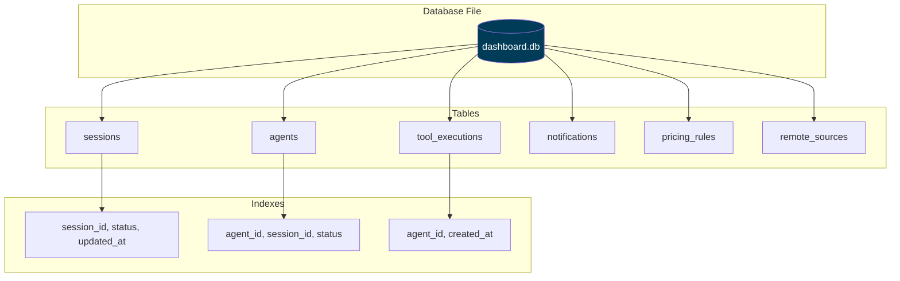

**Database Location:**
- **Canonical (default):** `~/.claude/agent-dashboard/dashboard.db` — shared by `npm start`, `npm run dev`, Docker (bind mount), and the desktop app when it uses the same data dir
- **Override:** set `DASHBOARD_DATA_DIR` (directory) or `DASHBOARD_DB_PATH` (file path) for tests or custom deployments
- **Legacy:** repo-local `./data/dashboard.db` is migrated into the canonical location on first launch (see `server/db.js`)

---

## Schema Diagram

### Entity-Relationship Diagram

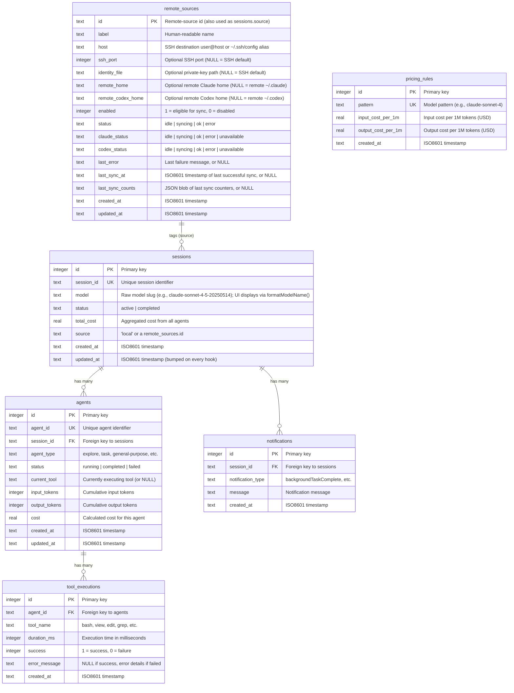

### Relationship Cardinality

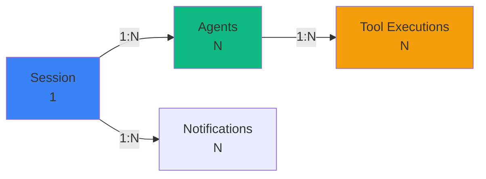

---

## Table Definitions

### sessions

Tracks Claude Code, Cursor, and Codex sessions (one per CLI invocation or background task). Schema mirrors `server/db.js`.

Session rows also retain optional `repo_remote_url` metadata: the first sanitized remote supplied by a collector wins. URL userinfo, query strings, and fragments are removed; malformed URLs are discarded before session or event persistence.

> **Cursor:** Native rows are first discovered from `~/.cursor/chats/*/<session>/meta.json` and stored with `provider = 'cursor'` even while `transcript_path` is null. Prompt history updates that row immediately; the later `~/.cursor/projects/*/agent-transcripts` path and dashboard-owned snapshot remain separately resolvable, so conversation history survives source cleanup and pricing uses only the Cursor rate card.

```sql
CREATE TABLE sessions (
    id TEXT PRIMARY KEY,                                              -- UUID from Claude Code
    name TEXT,
    status TEXT NOT NULL DEFAULT 'active'
        CHECK (status IN ('active','completed','error','abandoned')),
    cwd TEXT,
    repo_remote_url TEXT,                                            -- first sanitized collector remote
    model TEXT,
    provider TEXT NOT NULL DEFAULT 'claude',                          -- claude | cursor | codex
    started_at TEXT NOT NULL DEFAULT (strftime('%Y-%m-%dT%H:%M:%fZ','now')),
    ended_at TEXT,
    metadata TEXT,
    card_prompt_preview TEXT,                                        -- newest two distinct human prompts
    updated_at TEXT NOT NULL DEFAULT (strftime('%Y-%m-%dT%H:%M:%fZ','now')),
    awaiting_input_since TEXT,                                        -- NULL unless Waiting
    awaiting_reason TEXT,                                             -- notification|stop|session_start|interrupted, or NULL
    transcript_path TEXT,                                             -- absolute path to JSONL transcript
    source TEXT NOT NULL DEFAULT 'local'                              -- data source: 'local' or a remote_sources.id
);
```

**Columns:**

| Column | Type | Nullable | Description |
|--------|------|----------|-------------|
| `id` | TEXT | NO | Session UUID (assigned by Claude Code) |
| `name` | TEXT | YES | Human-readable label. Synced from the transcript title by `routes/hooks.js` (and the 15 s watchdog) on every event: the `custom-title` line (`/rename`, `claude -n`, picker `Ctrl+R`) always wins, otherwise the auto-generated `ai-title` fills a placeholder/auto name, otherwise the session's first user prompt (60-char label) fills it. Falls back to `Session <id8>` |
| `status` | TEXT | NO | `active`, `completed`, `error`, or `abandoned` (CHECK-constrained). Besides the `SessionEnd` hook, the 15 s watchdog's **liveness reap** also lands `active` → `completed` when no running matching local `claude` or `codex` process has the session's `cwd` (a `SessionEnd` lost while the dashboard was down); gated by `DASHBOARD_LIVENESS_IDLE_SECONDS`, disabled via `DASHBOARD_LIVENESS_PROBE=0`. Sessions with a non-`local` `source` (Remote Data Sources) are always exempt from the local process reap and transcript watchdog. Each remote provider has independent health: sessions stay out of stale sweeps only while their own Claude or Codex mirror is healthy. If that provider reports `error`/`unavailable`, or remains `syncing` longer than `DASHBOARD_STALE_MINUTES`, an active session older than that same window falls back to the ordinary stale sweep (`abandoned`, agents completed) until a fresh mirror can reactivate it |
| `cwd` | TEXT | YES | Working directory the CLI was launched from |
| `repo_remote_url` | TEXT | YES | First non-empty sanitized collector remote; later hooks/batches cannot overwrite it. Not discovered automatically from `cwd`. |
| `model` | TEXT | YES | Claude model ID (e.g. `claude-opus-4-7`) |
| `provider` | TEXT | NO | Product that produced the session: `claude` (default), `cursor`, or `codex`. Powers the composable `providers` API scope and lets shared token buckets use the correct rate card; selecting the Claude-compatible product scope includes both `claude` and `cursor`. |
| `started_at` | TEXT | NO | ISO 8601 timestamp |
| `ended_at` | TEXT | YES | ISO 8601 timestamp on terminal transition |
| `metadata` | TEXT | YES | JSON blob for extras (turn duration totals, thinking blocks, …). Codex sessions also carry `provider`, `transcript_path`, `cli_version`, `model_provider`, and `git`; a Codex run that never wrote a rollout to disk (`codex exec --ephemeral`) additionally carries `hook_only: true`, which the UI uses to explain the absent transcript. That flag and the hook-reconstructed events tagged `data.source = "hook"` are both removed if a real rollout is later linked to the session |
| `card_prompt_preview` | TEXT | YES | Newline-separated, bounded card-only context containing the two newest distinct human prompts. Claude Code derives it from the shared transcript cache during hooks, imports, and watchdog sweeps; Codex reads equivalent durable `codex_user_message` events when list/detail responses are built. It is not a transcript copy: full conversation content remains in JSONL, and historical rows fall back to their main-agent task. |
| `updated_at` | TEXT | NO | Bumped on every event for staleness detection |
| `awaiting_input_since` | TEXT | YES | ISO 8601 stamp set when the session is **Waiting** (Claude Stop, SessionStart with source `startup`/`resume`/`clear`, permission Notification, watchdog user-interrupt/Esc recovery, or Codex `task_complete` / `turn_aborted`). NULL otherwise. A Claude SessionStart with source `compact` (auto-compaction fires mid-turn while Claude is working) leaves this column untouched, so a genuinely-active session is not mislabeled Waiting |
| `awaiting_reason` | TEXT | YES | Why the row is waiting: `notification`, `stop`, `session_start`, or `interrupted`. Set/cleared in lock-step with `awaiting_input_since` (Claude SessionStart→`session_start`, Claude Stop and Codex `task_complete`→`stop`, permission/input Notification→`notification`, watchdog/Esc recovery and Codex `turn_aborted`→`interrupted`). NULL otherwise. Exception: a Claude `compact`-source SessionStart preserves the existing value (neither stamps `session_start` nor clears it) |
| `transcript_path` | TEXT | YES | Absolute path to the session's JSONL transcript. Written by `routes/hooks.js` on the first event that carries it (subsequent events no-op via a SQL guard) and read by the periodic compaction sweep — so the sweep touches only active session rows instead of scanning the entire `events` table for `json_extract(data,'$.transcript_path')`. Backfilled once from `events` by the `db.js` migration |
| `source` | TEXT | NO | Data source this session was captured from. `'local'` for this machine's own Claude Code or Codex history (the default); otherwise the `remote_sources.id` of the remote SSH machine it was pulled from. Powers the `sources` query filter on `/api/sessions`, `/api/events`, `/api/agents`, `/api/stats`, and `/api/analytics`, and the `sources` facet on `/api/sessions/facets`. Indexed by `idx_sessions_source` |

**Constraints:**
- `status` must be one of the four enum values
- `awaiting_input_since` is ignored on non-`active` sessions for UI bucketing

**Lifecycle:**

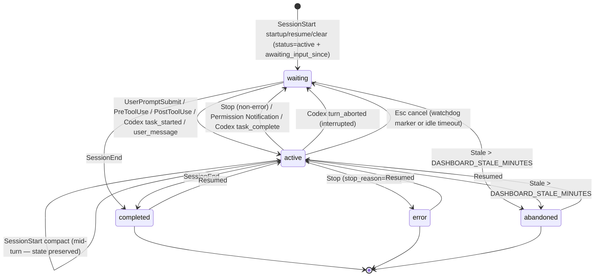

---

### agents

Tracks main agents and subagents within a session. Main agents have id `${session_id}-main`; subagents get a fresh UUID.

```sql
CREATE TABLE agents (
    id TEXT PRIMARY KEY,
    session_id TEXT NOT NULL,
    name TEXT NOT NULL,
    type TEXT NOT NULL DEFAULT 'main' CHECK (type IN ('main','subagent')),
    subagent_type TEXT,
    status TEXT NOT NULL DEFAULT 'idle'
        CHECK (status IN ('idle','connected','working','completed','error')),
    task TEXT,
    current_tool TEXT,
    started_at TEXT NOT NULL DEFAULT (strftime('%Y-%m-%dT%H:%M:%fZ','now')),
    ended_at TEXT,
    parent_agent_id TEXT,
    metadata TEXT,
    updated_at TEXT NOT NULL DEFAULT (strftime('%Y-%m-%dT%H:%M:%fZ','now')),
    awaiting_input_since TEXT,                                        -- main-agent waiting flag
    awaiting_reason TEXT,                                             -- notification|stop|session_start|interrupted, or NULL
    FOREIGN KEY (session_id) REFERENCES sessions(id) ON DELETE CASCADE,
    FOREIGN KEY (parent_agent_id) REFERENCES agents(id) ON DELETE SET NULL
);
```

**Columns:**

| Column | Type | Nullable | Description |
|--------|------|----------|-------------|
| `id` | TEXT | NO | UUID (subagents) or `${session_id}-main` (main agent) |
| `session_id` | TEXT | NO | FK to `sessions.id`, cascades on delete |
| `name` | TEXT | NO | Display label (e.g. `Main Agent - {session name}` or subagent description) |
| `type` | TEXT | NO | `main` or `subagent` |
| `subagent_type` | TEXT | YES | `Explore`, `general-purpose`, `code-review`, `compaction`, … |
| `status` | TEXT | NO | `idle`, `connected`, `working`, `completed`, `error` (CHECK-constrained). The dashboard's **Waiting** badge is the UI overlay produced by `awaiting_input_since`; it is not a persisted status |
| `task` | TEXT | YES | Subagent prompt / brief |
| `current_tool` | TEXT | YES | Tool currently running (cleared on `PostToolUse`) |
| `parent_agent_id` | TEXT | YES | FK to the spawning agent for nested subagent trees (`ON DELETE SET NULL`). Set to the main agent at insert, then repointed to the true spawner by `reconcileSubagentParents` from each subagent transcript's Task tool result (`toolUseResult.agentId`), so subagents-of-subagents nest correctly instead of flattening under main |
| `metadata` | TEXT | YES | JSON blob for extras. For subagents it carries `model` (the subagent's own model, issue #185) and `tokens` — an array of per-agent token buckets parsed from the subagent's transcript. The agent-list endpoints price `tokens` at the current rates to attach a per-agent `cost` (so a subagent card shows its OWN cost, not the session total). Empty `[]` means the subagent did no billable work; absent means its transcript wasn't available to parse |
| `awaiting_input_since` | TEXT | YES | Mirrors the parent session's flag for the main agent, including Codex `task_complete` / `turn_aborted` waiting state. NULL on subagents |
| `awaiting_reason` | TEXT | YES | Why the row is waiting: `notification`, `stop`, `session_start`, or `interrupted`. Set/cleared in lock-step with `awaiting_input_since`; for Codex, `task_complete` uses `stop` and `turn_aborted` uses `interrupted`. NULL on subagents |

**Lifecycle:**

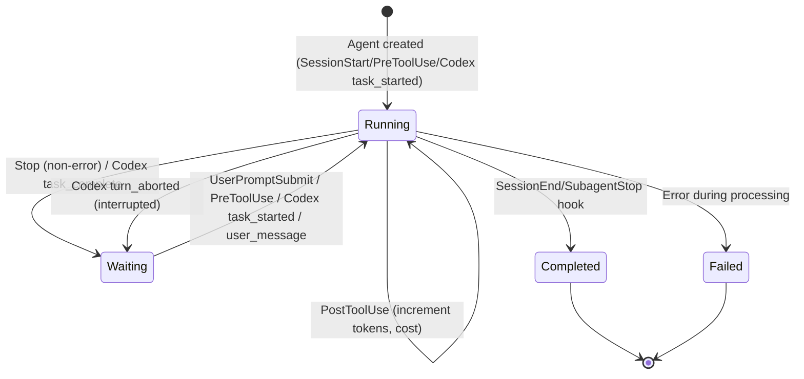

**current_tool Behavior:**
- Set to tool name on `PreToolUse` hook (e.g., `"bash"`, `"view"`)
- Cleared to `NULL` on `PostToolUse` hook
- Used to show real-time tool execution in UI

---

### tool_executions

Records each tool call made by agents.

```sql
CREATE TABLE tool_executions (
    id INTEGER PRIMARY KEY AUTOINCREMENT,
    agent_id TEXT NOT NULL,
    tool_name TEXT NOT NULL,
    duration_ms INTEGER,
    success INTEGER DEFAULT 1,
    error_message TEXT,
    created_at TEXT DEFAULT (datetime('now')),
    FOREIGN KEY (agent_id) REFERENCES agents(agent_id)
);
```

**Columns:**

| Column | Type | Nullable | Description |
|--------|------|----------|-------------|
| `id` | INTEGER | NO | Auto-increment primary key |
| `agent_id` | TEXT | NO | Foreign key to `agents.agent_id` |
| `tool_name` | TEXT | NO | Tool name (`bash`, `view`, `edit`, `grep`, etc.) |
| `duration_ms` | INTEGER | YES | Execution time in milliseconds |
| `success` | INTEGER | NO | 1 = success, 0 = failure |
| `error_message` | TEXT | YES | NULL if success, error details if failed |
| `created_at` | TEXT | NO | ISO8601 timestamp of execution |

**Common Tool Names:**
- `bash` - Shell command execution
- `view` - File/directory viewing
- `edit` - File editing
- `grep` - Code search
- `glob` - File pattern matching
- `task` - Sub-agent invocation
- `sql` - SQLite query execution

**Duration Distribution:**

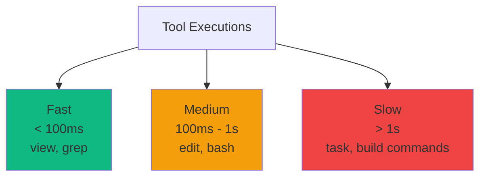

---

### notifications

Stores system notifications from Claude Code.

```sql
CREATE TABLE notifications (
    id INTEGER PRIMARY KEY AUTOINCREMENT,
    session_id TEXT NOT NULL,
    notification_type TEXT NOT NULL,
    message TEXT,
    created_at TEXT DEFAULT (datetime('now')),
    FOREIGN KEY (session_id) REFERENCES sessions(session_id)
);
```

**Columns:**

| Column | Type | Nullable | Description |
|--------|------|----------|-------------|
| `id` | INTEGER | NO | Auto-increment primary key |
| `session_id` | TEXT | NO | Foreign key to `sessions.session_id` |
| `notification_type` | TEXT | NO | Type of notification |
| `message` | TEXT | YES | Notification message content |
| `created_at` | TEXT | NO | ISO8601 timestamp |

**Common Notification Types:**
- `backgroundTaskComplete` - Background agent finished
- `errorOccurred` - Error during execution
- `systemMessage` - General system message

---

### model_pricing

Per-model pricing rules for cost calculation, keyed by `model_pattern` (a SQL-style glob; `%` matches any characters). Rates are per **million** tokens (USD).

```sql
CREATE TABLE model_pricing (
    model_pattern TEXT PRIMARY KEY,
    display_name TEXT NOT NULL,
    input_per_mtok REAL NOT NULL DEFAULT 0,
    output_per_mtok REAL NOT NULL DEFAULT 0,
    cache_read_per_mtok REAL NOT NULL DEFAULT 0,
    cache_write_per_mtok REAL NOT NULL DEFAULT 0,
    cache_write_1h_per_mtok REAL NOT NULL DEFAULT 0,   -- 1h-ephemeral cache-write tier
    fast_input_per_mtok REAL NOT NULL DEFAULT 0,       -- fast-mode premium rates
    fast_output_per_mtok REAL NOT NULL DEFAULT 0,
    -- Time-limited introductory (promo) rates. When intro_until is set, usage on
    -- or before that date (YYYY-MM-DD) is priced at the intro_* rates and usage
    -- after it at the standard rates. All 0 / NULL = no promo.
    intro_input_per_mtok REAL NOT NULL DEFAULT 0,
    intro_output_per_mtok REAL NOT NULL DEFAULT 0,
    intro_cache_read_per_mtok REAL NOT NULL DEFAULT 0,
    intro_cache_write_per_mtok REAL NOT NULL DEFAULT 0,
    intro_cache_write_1h_per_mtok REAL NOT NULL DEFAULT 0,
    intro_until TEXT,                                   -- promo cutoff YYYY-MM-DD, or NULL
    updated_at TEXT NOT NULL DEFAULT (strftime('%Y-%m-%dT%H:%M:%fZ','now'))
);
```

**Columns (highlights):**

| Column | Type | Nullable | Description |
|--------|------|----------|-------------|
| `model_pattern` | TEXT | NO | Primary key. SQL-style glob (e.g. `claude-opus-4-7%`, `claude-%-haiku`). Rules are matched longest-pattern-first |
| `display_name` | TEXT | NO | Human-readable model name shown in Settings |
| `input_per_mtok` / `output_per_mtok` | REAL | NO | Standard input / output rate per 1M tokens |
| `cache_read_per_mtok` / `cache_write_per_mtok` / `cache_write_1h_per_mtok` | REAL | NO | Cache read + 5m/1h cache-write rates |
| `fast_input_per_mtok` / `fast_output_per_mtok` | REAL | NO | Fast-mode premium rates (0 = no premium) |
| `intro_*_per_mtok` | REAL | NO | Introductory (promo) rates, mirroring the standard fields |
| `intro_until` | TEXT | YES | Promo cutoff `YYYY-MM-DD`. Usage on/before it uses the intro rates; NULL = no promo. Editable per-rule in Settings |
| `updated_at` | TEXT | NO | ISO8601 timestamp of the last edit |

Standard rates and intro rates are edited independently: the pricing update path writes intro columns only when the caller sends intro fields, so a standard-rate edit never disturbs a promo (and vice versa). Clearing `intro_until` also zeroes the intro rates.

**Example default rule (Claude Sonnet 5, retaining its historical promo cutoff; $2/$10 is now also the standard rate):**

| Pattern | Input | Output | Intro Input | Intro Output | Intro Until |
|---------|-------|--------|-------------|--------------|-------------|
| `claude-sonnet-5%` | $2.00 | $10.00 | $2.00 | $10.00 | `2026-08-31` |

---

### cursor_model_pricing

Dedicated Cursor rate card for sessions stored with `provider = 'cursor'`. Keeping it separate prevents Cursor-native and routed third-party models from accidentally matching Anthropic or OpenAI/Codex rules.

```sql
CREATE TABLE cursor_model_pricing (
    model_pattern TEXT PRIMARY KEY,
    display_name TEXT NOT NULL,
    input_per_mtok REAL NOT NULL DEFAULT 0,
    cache_write_per_mtok REAL NOT NULL DEFAULT 0,
    cache_read_per_mtok REAL NOT NULL DEFAULT 0,
    output_per_mtok REAL NOT NULL DEFAULT 0,
    updated_at TEXT NOT NULL
);
```

Defaults mirror Cursor's published four-column USD-per-million-token card for Cursor Grok 4.6/4.5, Composer 2.5, and the supported Anthropic, Google, Z.ai, OpenAI, Moonshot, and Meta models. Fast Cursor models have more-specific patterns; `speed = 'fast'` also tries the corresponding `-fast` pattern. Rows are editable through Settings and `/api/pricing/cursor`, and are included in export/restore bundles beginning with bundle version 3.

---

### gpt_model_pricing

Separate OpenAI/Codex rate card. It deliberately does not reuse `model_pricing`: Codex tracks explicit cached-input and cache-write token classes, and OpenAI's published card has Standard short/long and Fast short/long groups.

```sql
CREATE TABLE gpt_model_pricing (
    model_pattern TEXT PRIMARY KEY,
    display_name TEXT NOT NULL,
    short_input_per_mtok REAL NOT NULL DEFAULT 0,
    short_cached_input_per_mtok REAL NOT NULL DEFAULT 0,
    short_cache_write_per_mtok REAL NOT NULL DEFAULT 0,
    short_output_per_mtok REAL NOT NULL DEFAULT 0,
    long_input_per_mtok REAL NOT NULL DEFAULT 0,
    long_cached_input_per_mtok REAL NOT NULL DEFAULT 0,
    long_cache_write_per_mtok REAL NOT NULL DEFAULT 0,
    long_output_per_mtok REAL NOT NULL DEFAULT 0,
    fast_input_per_mtok REAL NOT NULL DEFAULT 0,
    fast_cached_input_per_mtok REAL NOT NULL DEFAULT 0,
    fast_cache_write_per_mtok REAL NOT NULL DEFAULT 0,
    fast_output_per_mtok REAL NOT NULL DEFAULT 0,
    fast_long_input_per_mtok REAL NOT NULL DEFAULT 0,
    fast_long_cached_input_per_mtok REAL NOT NULL DEFAULT 0,
    fast_long_cache_write_per_mtok REAL NOT NULL DEFAULT 0,
    fast_long_output_per_mtok REAL NOT NULL DEFAULT 0,
    updated_at TEXT NOT NULL
);
```

Standard Codex usage whose request input is `<= 272000` tokens uses the `short_*` group; requests above that boundary use `long_*`; `speed = fast` uses `fast_*` at or below the same boundary and `fast_long_*` above it. A zero/missing group is reported as unpriced rather than treated as a free model. Users manage these rows through `/api/pricing/gpt` and the dedicated Settings table.

Startup corrects exact obsolete Astra/Sol seed values and adds the Fast long-context columns to existing databases. Published Fast long rates are filled only for untouched default rows; custom rules inherit their previous Fast rates in the new long band to preserve existing calculations. Pricing is calculated on read, so corrected defaults also update historical cost estimates.

### codex_ingest_state

Durable append cursor for every Codex `rollout-*.jsonl`. It stores the byte offset, incomplete-line remainder, owning session id, and latest cumulative token snapshot. This makes simultaneous hook, `fs.watch`, and 4-second poll notifications idempotent: only newly appended complete JSONL records become events or token deltas. The latest persisted `codex_user_message`, `codex_task_started`, `codex_task_complete`, or `codex_turn_aborted` event also lets restart reconciliation restore the correct Working or Waiting card state without replaying the full rollout history.

### codex_tool_ingest_state

Independent durable byte cursor for each Codex rollout's `response_item` records. It is transactionally advanced only after every newly discovered invocation is stored as a `codex_tool_call` event with a normalized display category and its raw tool name. This gives the Workflows tool flow and session drill-in an exact, once-only record of Codex commands, edits, reads, searches, MCP calls, and delegation tools while the separate `codex_ingest_state` cursor remains responsible for messages, lifecycle state, and cumulative token deltas. Existing rollout history is safely backfilled without replaying token accounting or changing historical session freshness.

---

### remote_sources

Config for remote SSH machines the dashboard pulls Claude Code and Codex history from, so a single dashboard can consolidate sessions from several machines. **No secrets are stored** — SSH authentication defers entirely to the host's SSH stack (ssh-agent, `~/.ssh/config`, key files). The optional `remote_home` and `remote_codex_home` values are the UI's **Remote Claude home** and **Remote Codex home** overrides; each row's `id` is used as the `source` value on every session imported from that machine (see `sessions.source`).

```sql
CREATE TABLE remote_sources (
    id TEXT PRIMARY KEY,
    label TEXT NOT NULL,
    host TEXT NOT NULL,
    ssh_port INTEGER,
    identity_file TEXT,
    remote_home TEXT,
    remote_codex_home TEXT,
    enabled INTEGER NOT NULL DEFAULT 1,
    status TEXT NOT NULL DEFAULT 'idle',
    claude_status TEXT,
    codex_status TEXT
        CHECK (status IN ('idle','syncing','ok','error')),
    last_error TEXT,
    last_sync_at TEXT,
    last_sync_counts TEXT,
    created_at TEXT DEFAULT (strftime('%Y-%m-%dT%H:%M:%fZ','now')),
    updated_at TEXT DEFAULT (strftime('%Y-%m-%dT%H:%M:%fZ','now'))
);
```

**Columns:**

| Column | Type | Nullable | Description |
|--------|------|----------|-------------|
| `id` | TEXT | NO | Primary key. Also used as `sessions.source` for sessions pulled from this machine |
| `label` | TEXT | NO | Human-readable name shown in the UI |
| `host` | TEXT | NO | SSH destination (`user@host`) or a `~/.ssh/config` alias |
| `ssh_port` | INTEGER | YES | Optional SSH port; NULL defers to the SSH default / `~/.ssh/config` |
| `identity_file` | TEXT | YES | Optional private-key path passed to ssh (`-i`); NULL to omit |
| `remote_home` | TEXT | YES | Optional remote Claude home to read transcripts from; NULL defaults to remote `~/.claude` |
| `remote_codex_home` | TEXT | YES | Optional remote Codex home; NULL defaults to remote `~/.codex` and sync imports `sessions/` plus the native title index when available |
| `enabled` | INTEGER | NO | `1` = eligible for scheduled/manual syncs, `0` = disabled (default `1`) |
| `status` | TEXT | NO | Last sync status: `idle`, `syncing`, `ok`, or `error` (CHECK-constrained) |
| `claude_status` | TEXT | YES | Provider-specific Claude Code sync state: `idle`, `syncing`, `ok`, `error`, or `unavailable`; existing sources retain NULL until their first provider-aware sync |
| `codex_status` | TEXT | YES | Provider-specific Codex sync state: `idle`, `syncing`, `ok`, `error`, or `unavailable`; lets a healthy Codex mirror remain authoritative if Claude is unavailable (and vice versa) |
| `last_error` | TEXT | YES | Error message from the last failed sync/test, or NULL |
| `last_sync_at` | TEXT | YES | ISO 8601 timestamp of the last successful sync, or NULL |
| `last_sync_counts` | TEXT | YES | JSON blob of the last sync's counters (imported/skipped/backfilled/errors/sessions_seen/sessions_tagged), or NULL |
| `created_at` | TEXT | YES | ISO 8601 creation timestamp |
| `updated_at` | TEXT | YES | ISO 8601 timestamp of the last edit |

Managed through the `/api/remote-sources/*` routes. One source may expose Claude Code, Codex, or both; its top-level `status` is healthy when either provider imports, while `claude_status` / `codex_status` control the matching provider's remote lifecycle and stale-session fallback. Sync/status changes are broadcast over the WebSocket as `remote_source.status` and, on success, `remote_data.updated` plus per-session `session_created` / `session_updated`. See [docs/API.md → Remote Data Sources](./API.md#remote-data-sources).

---

## Indexes

### sessions Indexes

```sql
CREATE INDEX idx_sessions_session_id ON sessions(session_id);
CREATE INDEX idx_sessions_status ON sessions(status);
CREATE INDEX idx_sessions_updated_at ON sessions(updated_at DESC);
CREATE INDEX idx_sessions_source ON sessions(source);   -- powers the `sources` query filter

-- Partial index covering only the rows the periodic compaction sweep reads:
-- active sessions with a known transcript_path. Writes to other sessions skip
-- the index entirely, so the maintenance cost stays bounded by the small set
-- of live sessions.
CREATE INDEX idx_sessions_active_tp
    ON sessions(status, transcript_path)
    WHERE status='active' AND transcript_path IS NOT NULL;
```

**Query Patterns:**
- `SELECT * FROM sessions WHERE session_id = ?` - Primary key lookup
- `SELECT * FROM sessions WHERE status = 'active'` - Filter by status
- `SELECT * FROM sessions WHERE source IN ('local', ?)` - Filter by data source (covered by `idx_sessions_source`)
- `SELECT * FROM sessions ORDER BY updated_at DESC LIMIT 50` - Recent sessions
- `SELECT id, transcript_path FROM sessions WHERE status='active' AND transcript_path IS NOT NULL ORDER BY updated_at DESC` — periodic compaction sweep (covered by the partial index above)

### agents Indexes

```sql
CREATE INDEX idx_agents_agent_id ON agents(agent_id);
CREATE INDEX idx_agents_session_id ON agents(session_id);
CREATE INDEX idx_agents_status ON agents(status);
```

**Query Patterns:**
- `SELECT * FROM agents WHERE agent_id = ?` - Primary key lookup
- `SELECT * FROM agents WHERE session_id = ?` - All agents for session
- `SELECT * FROM agents WHERE status = 'running'` - Active agents

### events Indexes

```sql
-- Keeps the per-tool-event dedup used by subagent import an index seek instead
-- of a full events scan. importSubagentFromJsonl checks
-- `... WHERE agent_id = ? AND event_type = ? AND data LIKE '%"tool_use_id":"X"%'`
-- before inserting; on a subagent-heavy re-import this drops a large sweep from
-- tens of seconds to sub-second.
CREATE INDEX idx_events_agent_type ON events(agent_id, event_type);
CREATE INDEX idx_events_agent_created ON events(agent_id, created_at);
CREATE INDEX idx_events_session_created ON events(session_id, created_at);

-- The analytics tool-usage panel groups every event by tool_name. With no index
-- on that column it is a full events-table scan on every request, and
-- better-sqlite3 is synchronous, so the whole server stalls for its duration
-- (45.7s on a 3.9M-row table; 0.25s with this index). Only tool events carry a
-- tool_name, so the partial predicate keeps the index small.
CREATE INDEX idx_events_tool_name ON events(tool_name) WHERE tool_name IS NOT NULL;

-- Serves the POST /api/hooks/ingest-batch dedup, which looks each incoming item
-- up by (session_id, event_type, json_extract(data,'$.uuid')).
--
-- Partial on two counts. json_valid(data) = 1 because CREATE INDEX evaluates the
-- indexed expression against every existing row, and legacy rows predating the
-- JSON-events convention would make json_extract() throw "malformed JSON" and
-- abort startup. The event_type list because, unrestricted, every installation
-- would build and maintain this index over its whole events table whether or not
-- remote push is configured (~28MB per 500k events; ~224MB at 4M rows).
--
-- SQLite only uses a partial index when the query's own WHERE provably implies
-- the index's, so the dedup query must repeat BOTH predicates literally. A bare
-- `event_type = ?` parameter is not provably inside the IN list to the planner
-- and falls back to a full scan. The json_valid guard is also required for
-- correctness at query time, not just index-build time: json_extract() throws on
-- a non-JSON row whenever it is evaluated.
CREATE INDEX idx_events_session_type_uuid
    ON events(session_id, event_type, json_extract(data, '$.uuid'))
    WHERE json_valid(data) = 1
      AND event_type IN ('RemoteToolEvent', 'RemoteTurn');
```

**Query Patterns:**
- `SELECT tool_name, COUNT(*) FROM events WHERE tool_name IS NOT NULL GROUP BY tool_name ORDER BY count DESC LIMIT 20` — analytics tool-usage panel (covering scan of `idx_events_tool_name`)
- `SELECT 1 FROM events WHERE session_id = ? AND json_valid(data) = 1 AND event_type IN ('RemoteToolEvent', 'RemoteTurn') AND json_extract(data, '$.uuid') = ?` — `ingest-batch` dedup (covered by `idx_events_session_type_uuid`)

> **Startup migration.** An installation that already carries an older, broader
> copy of `idx_events_session_type_uuid` (created before the `event_type`
> predicate was narrowed) would keep paying its full size forever, because
> `CREATE INDEX IF NOT EXISTS` is a no-op against it. `server/db.js` therefore
> reads the stored definition from `sqlite_master` on startup and drops the index
> first when it does not already carry the narrowed predicate, so the `CREATE`
> below it actually rebuilds it. Best-effort — a brand-new or already-correct
> database is unaffected either way.

### tool_executions Indexes

```sql
CREATE INDEX idx_tools_agent_id ON tool_executions(agent_id);
CREATE INDEX idx_tools_created_at ON tool_executions(created_at DESC);
```

**Query Patterns:**
- `SELECT * FROM tool_executions WHERE agent_id = ?` - All tools for agent
- `SELECT * FROM tool_executions ORDER BY created_at DESC LIMIT 100` - Recent tools

### notifications Indexes

```sql
CREATE INDEX idx_notifications_session_id ON notifications(session_id);
```

**Query Patterns:**
- `SELECT * FROM notifications WHERE session_id = ?` - All notifications for session

---

## Migrations

### Schema Versioning

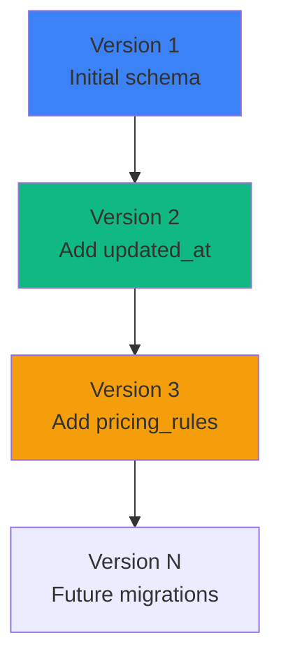

### Migration Strategy

```javascript
// db.js - Schema versioning
const SCHEMA_VERSION = 3;

function runMigrations() {
  const currentVersion = db.pragma('user_version', { simple: true });
  
  if (currentVersion < 1) {
    // Initial schema
    db.exec(`
      CREATE TABLE sessions (...);
      CREATE TABLE agents (...);
      -- etc.
    `);
    db.pragma('user_version = 1');
  }
  
  if (currentVersion < 2) {
    // Add updated_at column
    db.exec(`ALTER TABLE sessions ADD COLUMN updated_at TEXT DEFAULT (datetime('now'))`);
    db.pragma('user_version = 2');
  }
  
  if (currentVersion < 3) {
    // Add pricing_rules table
    db.exec(`CREATE TABLE pricing_rules (...)`);
    db.pragma('user_version = 3');
  }
}
```

### Migration Workflow

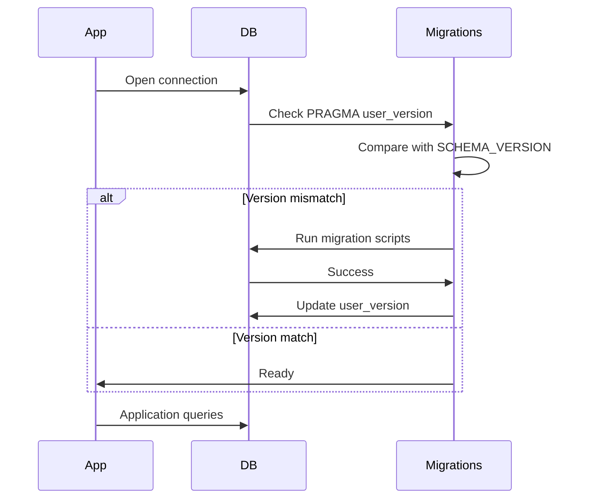

---

## Query Patterns

### Common Queries

#### List Recent Sessions

```sql
SELECT 
  s.*,
  COUNT(DISTINCT a.id) as agent_count,
  COUNT(DISTINCT t.id) as tool_count
FROM sessions s
LEFT JOIN agents a ON s.session_id = a.session_id
LEFT JOIN tool_executions t ON a.agent_id = t.agent_id
GROUP BY s.id
ORDER BY s.updated_at DESC
LIMIT 50;
```

**Performance:** ~5-10ms (with indexes)

#### Get Session with Agents

```sql
SELECT * FROM sessions WHERE session_id = 'sess_abc123';
SELECT * FROM agents WHERE session_id = 'sess_abc123';
```

**Performance:** ~1-2ms per query

#### Get Agent Tools

```sql
SELECT * FROM tool_executions 
WHERE agent_id = 'agent_xyz789'
ORDER BY created_at DESC;
```

**Performance:** ~2-5ms

#### Calculate Total Cost

```sql
SELECT 
  SUM(cost) as total_cost
FROM agents
WHERE session_id = 'sess_abc123';
```

**Performance:** ~1-2ms

### Query Optimization

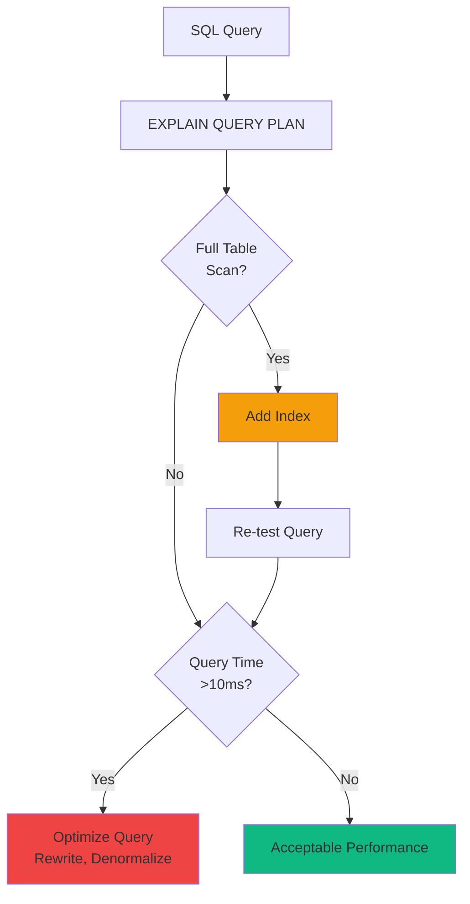

---

## Performance Optimization

### SQLite Pragmas

```javascript
// db.js - Performance tuning
db.pragma('journal_mode = WAL');        // Write-Ahead Logging
db.pragma('synchronous = NORMAL');      // Faster writes (safe with WAL)
db.pragma('cache_size = -64000');       // 64MB cache
db.pragma('temp_store = MEMORY');       // Temp tables in memory
db.pragma('mmap_size = 30000000000');   // Memory-mapped I/O (30GB)
db.pragma('page_size = 4096');          // Optimal page size
```

### Prepared Statements

```javascript
// db.js - Prepared statements prevent SQL injection + optimize performance
const stmts = {
  findSession: db.prepare('SELECT * FROM sessions WHERE session_id = ?'),
  createSession: db.prepare('INSERT INTO sessions (session_id, model) VALUES (?, ?)'),
  updateSession: db.prepare('UPDATE sessions SET status = ?, total_cost = ? WHERE session_id = ?'),
  touchSession: db.prepare("UPDATE sessions SET updated_at = datetime('now') WHERE session_id = ?")
};

// Usage
const session = stmts.findSession.get('sess_abc123');
stmts.touchSession.run('sess_abc123');
```

### Transaction Batching

```javascript
// Batch multiple writes in a transaction
const insertMany = db.transaction((tools) => {
  for (const tool of tools) {
    stmts.createToolExecution.run(tool.agent_id, tool.tool_name, tool.duration_ms);
  }
});

insertMany([
  { agent_id: 'agent_1', tool_name: 'bash', duration_ms: 100 },
  { agent_id: 'agent_1', tool_name: 'view', duration_ms: 50 },
  // ... more tools
]);
```

### Performance Benchmarks

| Operation | Without Optimization | With Optimization | Improvement |
|-----------|---------------------|-------------------|-------------|
| Session list (50) | 25ms | 5ms | 5x faster |
| Hook processing | 15ms | 2ms | 7.5x faster |
| Batch insert (100 tools) | 500ms | 50ms | 10x faster |

---

## Data Integrity

### Foreign Key Constraints

```sql
-- Enabled by default in db.js
PRAGMA foreign_keys = ON;
```

**Constraint Enforcement:**

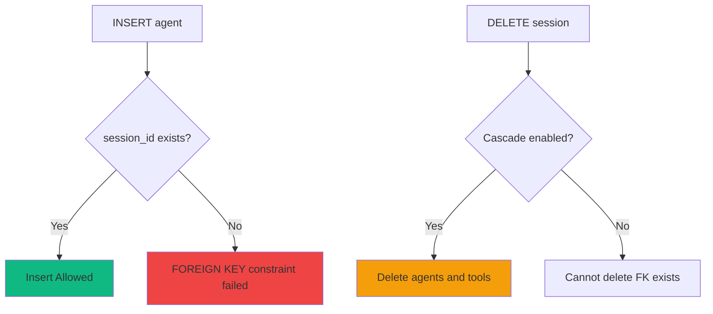

### Data Validation

```javascript
// Validate before insert
function validateSession(session) {
  if (!session.session_id) throw new Error('session_id required');
  if (session.total_cost < 0) throw new Error('total_cost must be >= 0');
  if (!['active', 'completed'].includes(session.status)) {
    throw new Error('Invalid status');
  }
}
```

---

## Backup Strategies

### Online Backup (Recommended)

```sql
-- Using VACUUM INTO (SQLite 3.27+)
VACUUM INTO '/backups/dashboard_20240318.db';
```

### Backup Verification

A backup is useful only when it can be opened independently of the live database. Verify each new snapshot before relying on it:

```bash
# Expect exactly: ok
sqlite3 /backups/dashboard_20240318.db 'PRAGMA integrity_check;'

# Confirm the snapshot contains expected dashboard data
sqlite3 /backups/dashboard_20240318.db 'SELECT count(*) FROM sessions;'
```

Keep the verified snapshot outside the live data directory, and periodically perform a restore drill against a **copy** of the backup. Point that isolated dashboard at the copy with `DASHBOARD_DB_PATH` (or an isolated `DASHBOARD_DATA_DIR`) and a different port; never use a restore drill to overwrite the running database.

### Offline Backup

```bash
#!/bin/bash
# Stop application
systemctl stop agent-dashboard

# Copy database file
cp /var/lib/agent-dashboard/dashboard.db /backups/dashboard_$(date +%Y%m%d).db

# Start application
systemctl start agent-dashboard
```

### Backup Schedule

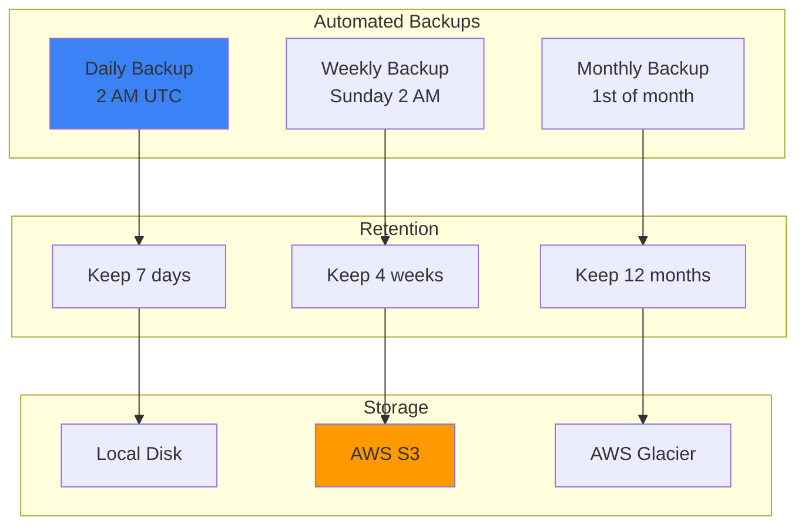

---

## Summary

The database schema provides:

- ✅ **Normalized design** - Minimal redundancy, clear relationships
- ✅ **Performance optimized** - Indexes, prepared statements, WAL mode
- ✅ **Data integrity** - Foreign keys, constraints, transactions
- ✅ **Migration support** - Schema versioning with PRAGMA user_version
- ✅ **Comprehensive indexing** - Fast queries for common access patterns
- ✅ **Backup strategies** - Online + offline backup options

For API usage, see [docs/API.md](./API.md).
