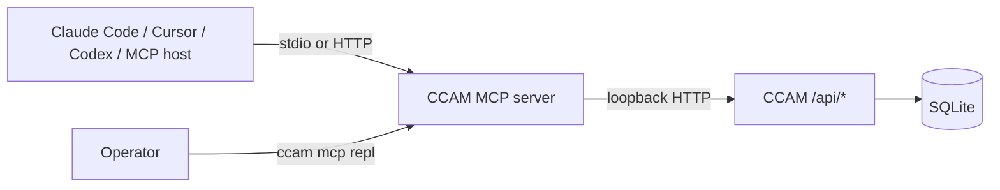

# CCAM MCP Server Reference

The Claude Code Agent Monitor (CCAM) MCP server exposes the local dashboard's complete supported action surface as **97 typed tools**. The same canonical catalog is used by stdio, Streamable HTTP, legacy SSE, and the interactive REPL, so tool names, schemas, and policy guards cannot drift between transports.

## Architecture



The MCP server does not read the dashboard database directly. Every tool calls the same Express routes used by the web app and `ccam` CLI. This keeps validation, redaction, WebSocket broadcasts, backups, and provider-specific behavior in one backend.

## Setup

```bash
npm run setup
npm run mcp:typecheck
npm run test:mcp
ccam mcp stdio
```

`npm run setup` installs and builds the MCP package. The direct npm launchers remain available:

```bash
npm run mcp:start
npm run mcp:start:http
npm run mcp:start:repl
```

## Transports

| Mode | Command | Endpoint or stream |
| --- | --- | --- |
| stdio | `ccam mcp stdio` | MCP JSON-RPC on stdin/stdout |
| Streamable HTTP + SSE | `ccam mcp http` | `/mcp`, `/sse`, `/messages`, `/health` on port `8819` by default |
| REPL | `ccam mcp repl` | Direct validated tool invocation with domain filtering |

### Choosing a transport

- Use **stdio** for Claude Code, Codex, and IDE integrations on the same machine. It keeps the protocol on the host process's stdin/stdout and needs no HTTP listener.
- Use **Streamable HTTP + SSE** only when a separate local process must share the MCP server. Keep the listener on loopback unless you intentionally operate a protected reverse-proxy deployment, and set `MCP_HTTP_AUTH_TOKEN` for non-probe endpoints.
- Use the **REPL** for an operator's one-off inspection or an explicitly reviewed mutation. It invokes the same schema and safety gates as the protocol transports, so it is a good way to validate an operation before wiring it into automation.

### Stdio lifecycle and orphan shutdown

A stdio server is owned by the host that launched it, and the MCP SDK's stdio transport only reacts to stdin `data`/`error` events. When a host exits without sending `SIGTERM`/`SIGINT` first, stdin simply goes quiet and the server would otherwise linger forever with nothing to talk to. CCAM therefore watches two independent conditions — stdin closing, and the process being re-parented — and shuts the server down the moment either fires:

| Signal | Logged reason | Fires when |
| --- | --- | --- |
| stdin reaches end of stream | `stdin_end` | The host closed its end of the pipe, including a normal protocol-level shutdown |
| stdin is destroyed | `stdin_close` | The host process died and took the pipe with it |
| The process is re-parented | `reparented` | The launching parent exited while stdin stayed open — checked every 5s |

Re-parenting is detected by comparing the current parent pid against the one captured at startup, **not** by testing for pid 1. That distinction matters in both directions: a server legitimately launched with an init-like parent (a container running `tini` as PID 1, or an `exec`-style launcher) keeps pid 1 as its parent while perfectly healthy, and a Linux orphan under a `systemd --user` session or another subreaper is re-parented to that supervisor rather than to pid 1.

Shutdown closes the transport and the server, then exits `0`. A 2-second deadline forces the exit even when teardown hangs, since an unresponsive shutdown is exactly how an orphaned process ends up running indefinitely. Each shutdown is logged to stderr with its reason, so `reason` in the log tells you which signal ended a session.

Only the stdio transport does this. HTTP servers outlive any single client by design and stop on `SIGINT`/`SIGTERM` only; the REPL owns its own lifecycle.

### HTTP session lifecycle

Each Streamable HTTP or SSE client gets its own `McpServer`, tracked under the session id returned in the `mcp-session-id` header (`sessionId` query parameter for legacy SSE). Send that id on every later request, or the server answers `Bad Request: No valid session or initialization`.

Sessions are released three ways: an explicit `DELETE /mcp` carrying the session id, an SSE stream disconnecting, and an idle sweep for everything else. The sweep matters because terminating a session is optional in the protocol — the SDK client's `close()` does not send `DELETE` (only `terminateSession()` does), so a client that crashes or simply walks away would otherwise pin its `McpServer` for the life of the process. Any request on a session counts as activity. `GET /health` reports the live count as `activeSessions`.

Tune the timeout with `MCP_HTTP_SESSION_TIMEOUT_MS` (default 30 minutes, floor 60 seconds so a typo cannot reap live sessions), or set it to `0` to disable reaping and manage sessions yourself.

## Tool Catalog

### Observability

- `dashboard_health_check`
- `dashboard_get_stats`
- `dashboard_get_analytics`
- `dashboard_get_system_info`
- `dashboard_export_data`
- `dashboard_get_operational_snapshot`
- `dashboard_get_prometheus_metrics`

Stats, analytics, sessions, agents, events, workflows, and cost tools accept provider/source scope where the app does.

### Sessions and transcripts

- `dashboard_list_sessions`, `dashboard_get_session`, `dashboard_create_session`, `dashboard_update_session`
- `dashboard_get_session_facets`, `dashboard_get_session_stats`
- `dashboard_list_session_transcripts`, `dashboard_get_session_transcript`
- `dashboard_get_transcript_image`

The transcript tool supports `agent_id`, `run_id`, `limit`, `offset`, `after`, and `before`. Transcript images are returned as `{ content_type, base64, bytes }` without exposing local file paths.

### Agents

- `dashboard_list_agents`, `dashboard_get_agent`
- `dashboard_create_agent`, `dashboard_update_agent`

### Events and hooks

- `dashboard_list_events`, `dashboard_get_event_facets`
- `dashboard_ingest_hook_event`

Event filtering covers event types, tools, agents, sessions, text, time range, providers, and sources.

### Pricing and cost

- `dashboard_get_pricing_rules`, `dashboard_upsert_pricing_rule`, `dashboard_delete_pricing_rule`
- `dashboard_get_cursor_pricing_rules`, `dashboard_upsert_cursor_pricing_rule`, `dashboard_delete_cursor_pricing_rule`
- `dashboard_get_gpt_pricing_rules`, `dashboard_upsert_gpt_pricing_rule`, `dashboard_delete_gpt_pricing_rule`
- `dashboard_get_total_cost`, `dashboard_get_session_cost`
- `dashboard_reset_pricing_defaults`

Claude pricing includes standard, 1-hour cache-write, fast-mode, and introductory rates. Cursor pricing uses its separate input/cache-write/cache-read/output card. GPT/Codex pricing includes short-context, long-context, and fast-mode rates.

### Workflows

- `dashboard_get_workflows`, `dashboard_get_session_workflow`
- `dashboard_list_workflow_runs`, `dashboard_get_workflow_run`

### Alerts

- `dashboard_list_alerts`, `dashboard_acknowledge_alert`, `dashboard_acknowledge_all_alerts`
- `dashboard_list_alert_rules`, `dashboard_create_alert_rule`
- `dashboard_update_alert_rule`, `dashboard_delete_alert_rule`

### Webhooks

- `dashboard_list_webhook_providers`, `dashboard_list_webhooks`
- `dashboard_list_webhook_deliveries`
- `dashboard_create_webhook`, `dashboard_update_webhook`, `dashboard_delete_webhook`
- `dashboard_test_webhook`

Webhook responses stay redacted. Test delivery is a real external side effect.

### Import and portability

- `dashboard_get_import_guide`
- `dashboard_rescan_history`, `dashboard_import_history_path`
- `dashboard_upload_history_files`
- `dashboard_restore_export`

History import supports Claude Code and Codex. `dashboard_upload_history_files` sends local JSONL/archive files through the same multipart route used by the app. Export restore is idempotent and does not overwrite existing rows.

MCP-side history uploads are capped at 50 MiB per file and 100 MiB total per call before file contents are loaded. Dashboard backup restore separately accepts one export bundle up to 25 MiB.

### Claude Code config

- `dashboard_get_claude_config`, `dashboard_read_claude_config_file`
- `dashboard_list_claude_config_backups`
- `dashboard_write_claude_config_artifact`, `dashboard_delete_claude_config_artifact`
- `dashboard_write_claude_keybindings`

Only the app's allowlisted text artifacts are writable. Every write/delete creates a timestamped backup.

### Codex config

- `dashboard_get_codex_config`, `dashboard_read_codex_config_file`
- `dashboard_write_codex_config_file`, `dashboard_delete_codex_config_file`
- `dashboard_create_codex_profile`

Redacted previews are read-only. Use `edit=true` only for the explicit editable allowlist. Base `config.toml` is edit-only.

### Run Agent

- `dashboard_list_runs`, `dashboard_list_run_history`
- `dashboard_list_run_directories`, `dashboard_list_run_files`
- `dashboard_get_run_binary`, `dashboard_list_run_models`, `dashboard_get_run`
- `dashboard_start_run`, `dashboard_send_run_message`, `dashboard_stop_run`

These tools launch or control real local Claude Code/Codex processes and require the mutation gate.

### Remote Data Sources

- `dashboard_list_remote_sources`, `dashboard_create_remote_source`
- `dashboard_update_remote_source`, `dashboard_test_remote_source`
- `dashboard_sync_remote_source`, `dashboard_sync_all_remote_sources`
- `dashboard_delete_remote_source`

Deleting a source retains imported data by default. Purging requires `confirmation_token = "PURGE_REMOTE_SOURCE_DATA"`.

### Settings and updates

- `dashboard_get_update_status`, `dashboard_check_for_updates`
- `dashboard_get_agent_homes`, `dashboard_set_claude_home`, `dashboard_set_codex_home`
- `dashboard_install_hooks`

### Push notifications

- `dashboard_get_push_public_key`
- `dashboard_subscribe_push`, `dashboard_unsubscribe_push`
- `dashboard_send_push_notification`

### Maintenance

- `dashboard_cleanup_data`, `dashboard_reimport_history`
- `dashboard_reinstall_hooks`, `dashboard_clear_all_data`

## Safety Model

| Tier | Default | Required for |
| --- | --- | --- |
| Read | enabled | all GET-like tools |
| Mutation | disabled | writes, process control, imports, syncs, notifications, external tests |
| Destructive | disabled | full data clearing |

Enable controlled writes with:

```bash
MCP_DASHBOARD_ALLOW_MUTATIONS=true ccam mcp stdio
```

Full data clearing additionally requires:

```bash
MCP_DASHBOARD_ALLOW_MUTATIONS=true \
MCP_DASHBOARD_ALLOW_DESTRUCTIVE=true \
ccam mcp stdio
```

The call must also pass `confirmation_token = "CLEAR_ALL_DATA"`.

All dashboard fetches reject HTTP redirects. Binary transcript-image responses are streamed with a 10 MiB cap, including responses without a trustworthy `Content-Length`, so a local endpoint cannot make the MCP process buffer an unbounded payload.

## Configuration

| Variable | Default | Purpose |
| --- | --- | --- |
| `MCP_DASHBOARD_BASE_URL` | `http://127.0.0.1:4820` | Local dashboard URL. Only direct loopback and approved container-host aliases are accepted |
| `MCP_DASHBOARD_API_TOKEN` | unset | Bearer token when the dashboard uses `DASHBOARD_TOKEN`; falls back to `DASHBOARD_API_TOKEN` |
| `MCP_DASHBOARD_API_TOKEN_FILE` | unset | File-backed dashboard token for Docker/Kubernetes secrets |
| `MCP_DASHBOARD_TIMEOUT_MS` | `10000` | Request timeout |
| `MCP_DASHBOARD_RETRY_COUNT` | `2` | Extra attempts for GET requests only |
| `MCP_DASHBOARD_RETRY_BACKOFF_MS` | `250` | Exponential backoff base |
| `MCP_DASHBOARD_ALLOW_MUTATIONS` | `false` | Enable write-capable tools |
| `MCP_DASHBOARD_ALLOW_DESTRUCTIVE` | `false` | Enable full data clearing, with mutation gate and confirmation token |
| `MCP_TRANSPORT` | `stdio` | `stdio`, `http`, or `repl` |
| `MCP_HTTP_HOST` | `127.0.0.1` | HTTP transport bind host |
| `MCP_HTTP_PORT` | `8819` | HTTP transport port |
| `MCP_HTTP_AUTH_TOKEN` | unset | Bearer token required by `/mcp`, `/sse`, and `/messages`; `/health` remains probeable |
| `MCP_HTTP_AUTH_TOKEN_FILE` | unset | File-backed MCP client token |
| `MCP_HTTP_SESSION_TIMEOUT_MS` | `1800000` | Close an HTTP/SSE session after this long with no request; `0` disables reaping. Clamped to `[60000, 86400000]` |
| `MCP_LOG_LEVEL` | `info` | `debug`, `info`, `warn`, or `error` |

Direct loopback URLs (`127.0.0.1`, `localhost`, or `::1`) and the private Compose service `agent-monitor` may use a bearer token over HTTP. A tokenized container-host alias such as `host.docker.internal`, `gateway.docker.internal`, or `host.containers.internal` must use HTTPS. Startup fails instead of sending the token over an unsafe route.

## Host Configuration

Claude and Codex plugins use the stable launcher:

```json
{
  "mcpServers": {
    "ccam-dashboard": {
      "command": "ccam",
      "args": ["mcp", "stdio"]
    }
  }
}
```

This avoids plugin-cache-relative paths. Run `npm run setup` in the CCAM checkout first so `ccam` is linked and `mcp/build/index.js` exists.

## Validation

```bash
npm run mcp:typecheck
npm run test:mcp
npm run mcp:build
npm run extensions:validate
```

`test:mcp` asserts the 97-tool catalog, unique names, policy gates, destructive confirmations, and schema validation in direct REPL invocation.

## Troubleshooting

- Dashboard unreachable: run `ccam status`, then `ccam start` or `npm run dev`.
- Auth failure: set `MCP_DASHBOARD_API_TOKEN` or its `DASHBOARD_API_TOKEN` fallback to the same value as `DASHBOARD_TOKEN`.
- MCP HTTP `401`: set `MCP_HTTP_AUTH_TOKEN` or `_FILE`, then send `Authorization: Bearer <token>` or `x-mcp-token`.
- Tokenized container-host alias rejected: terminate TLS for the dashboard and use an `https://` base URL, or run the MCP process on the host and use direct loopback HTTP.
- Upload or image is too large: keep each history file at or below 50 MiB, each upload call at or below 100 MiB total, transcript images at or below 10 MiB, and backup exports at or below 25 MiB.
- Mutation denied: set `MCP_DASHBOARD_ALLOW_MUTATIONS=true` for that MCP process.
- Plugin MCP launch fails: run `npm run setup`, then verify `ccam mcp repl`.
- HTTP clients cannot connect: verify `/health`, bind host, firewall, and the exact `/mcp` endpoint.
- Streamable HTTP requests fail with `Bad Request: No valid session or initialization`: send the `mcp-session-id` header returned by `initialize` on every later request. A session ends when the client sends `DELETE /mcp` with that header, and `/health` reports the live count as `activeSessions`.
- Never write protocol logs to stdout in stdio mode. MCP logs use stderr.
