# Server Application

Enterprise-grade Node.js backend for Claude Code agent monitoring with real-time WebSocket updates.


---

## Table of Contents

- [Overview](#overview)
- [Architecture](#architecture)
- [Database Design](#database-design)
- [API Reference](#api-reference)
- [WebSocket Protocol](#websocket-protocol)
- [Hook Processing](#hook-processing)
- [Pricing System](#pricing-system)
- [Data Flow](#data-flow)
- [Error Handling](#error-handling)
- [Performance](#performance)
- [Testing](#testing)
- [Deployment](#deployment)
- [Configuration](#configuration)

---

## Overview

The server is a lightweight Express application that:

1. **Receives hook events** from Claude Code, compatible Cursor sessions, and Codex via HTTP POST
2. **Persists data** in SQLite database with schema migrations
3. **Broadcasts updates** to connected web clients via WebSocket
4. **Serves REST API** for sessions, agents, events, stats, analytics, pricing, workflows, settings, and docs
5. **Manages isolated Claude, Cursor, and Codex pricing rules** for cost calculation and attribution

Cursor history is native rather than an alias for Claude storage. `lib/cursor-home.js` resolves `~/.cursor`, while `lib/cursor-ingest.js` discovers chat directories immediately from `meta.json`, applies `prompt_history.json` updates before a transcript exists, records deduplicated `cursor_user_message` activity for Timeline/last-active state, later joins agent transcripts, backfills existing rows, imports subagents, and copies durable transcript snapshots into the dashboard data directory. `index.js` watches both chat and project trees and broadcasts ordinary session/agent/event frames; `routes/sessions.js` merges pending prompts with Cursor's `role/message.content` JSONL by stable message id for the Conversation tab. `DASHBOARD_CURSOR_HOME` overrides the root; `DASHBOARD_CURSOR_SYNC_MS` controls only the periodic safety scan, not filesystem watching.

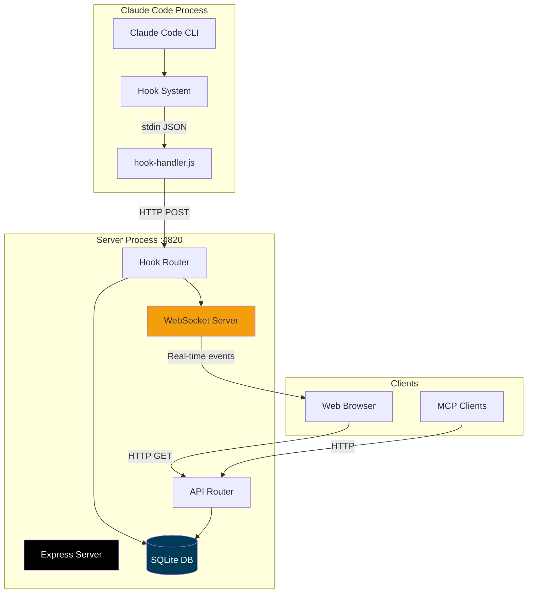

---

## Architecture

### Server Structure

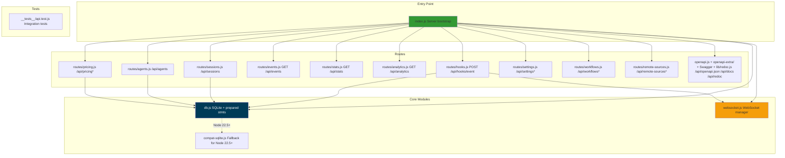

### Directory Structure

```
server/
├── index.js               # Express app + server bootstrap
├── db.js                  # SQLite connection + prepared statements
├── websocket.js           # WebSocket server + broadcast
├── compat-sqlite.js       # Fallback for node:sqlite (Node 22.5+)
│
├── routes/
│   ├── hooks.js           # Hook ingestion endpoints
│   ├── sessions.js        # Session CRUD API
│   ├── agents.js          # Agent CRUD API
│   ├── events.js          # Event list API
│   ├── stats.js           # Dashboard stats API
│   ├── analytics.js       # Analytics aggregate API
│   ├── pricing.js         # Pricing rules + cost API
│   ├── settings.js        # Ops/settings API
│   └── workflows.js       # Workflow intelligence API
│
├── openapi.js             # OpenAPI 3.0.3 spec generator (createOpenApiSpec)
├── openapi-extra/         # Supplementary OpenAPI fragments merged into the spec
│   ├── cc-config.js       #   /api/cc-config/* paths + schemas
│   ├── push.js            #   /api/push/* paths + schemas
│   ├── run.js             #   /api/run/* paths + schemas
│   └── misc.js            #   remaining route groups
│
├── lib/
│   └── redoc.js           # Serves ReDoc reference (/api/redoc) + self-hosted bundle
│
└── __tests__/
    └── api.test.js        # Integration tests
```

---

## Database Design

### Schema Overview

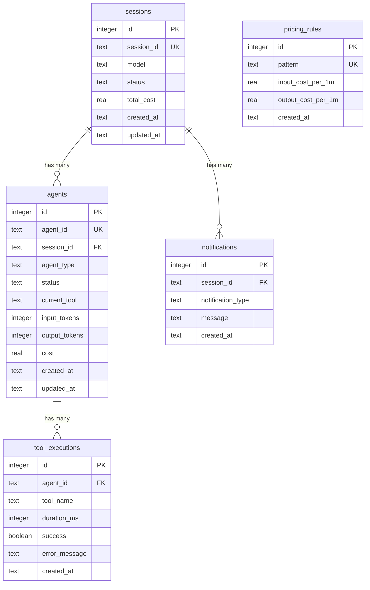

### Table Definitions

#### `sessions`

Tracks Claude Code sessions (one per CLI invocation or agent task).

```sql
CREATE TABLE sessions (
    id INTEGER PRIMARY KEY AUTOINCREMENT,
    session_id TEXT UNIQUE NOT NULL,
    model TEXT,
    status TEXT DEFAULT 'active',
    total_cost REAL DEFAULT 0,
    source TEXT NOT NULL DEFAULT 'local',   -- data source: 'local' or a remote_sources.id
    created_at TEXT DEFAULT (datetime('now')),
    updated_at TEXT DEFAULT (datetime('now'))
);

CREATE INDEX idx_sessions_session_id ON sessions(session_id);
CREATE INDEX idx_sessions_status ON sessions(status);
CREATE INDEX idx_sessions_updated_at ON sessions(updated_at DESC);
CREATE INDEX idx_sessions_source ON sessions(source);   -- powers the ?sources= data-scope filter
```

The `source` column is added migration-safe (additive `ALTER TABLE ... NOT NULL DEFAULT 'local'`), so every historical row keeps reading exactly as before; only sessions pulled from a configured remote carry a non-`local` source id.

#### `agents`

Tracks individual agents (main agent, explore, task, code-review, etc.).

```sql
CREATE TABLE agents (
    id INTEGER PRIMARY KEY AUTOINCREMENT,
    agent_id TEXT UNIQUE NOT NULL,
    session_id TEXT NOT NULL,
    agent_type TEXT,
    status TEXT DEFAULT 'running',
    current_tool TEXT,
    input_tokens INTEGER DEFAULT 0,
    output_tokens INTEGER DEFAULT 0,
    cost REAL DEFAULT 0,
    created_at TEXT DEFAULT (datetime('now')),
    updated_at TEXT DEFAULT (datetime('now')),
    FOREIGN KEY (session_id) REFERENCES sessions(session_id)
);

CREATE INDEX idx_agents_agent_id ON agents(agent_id);
CREATE INDEX idx_agents_session_id ON agents(session_id);
CREATE INDEX idx_agents_status ON agents(status);
```

#### `tool_executions`

Records each tool call (bash, view, edit, grep, etc.).

```sql
CREATE TABLE tool_executions (
    id INTEGER PRIMARY KEY AUTOINCREMENT,
    agent_id TEXT NOT NULL,
    tool_name TEXT NOT NULL,
    duration_ms INTEGER,
    success INTEGER DEFAULT 1,
    error_message TEXT,
    created_at TEXT DEFAULT (datetime('now')),
    FOREIGN KEY (agent_id) REFERENCES agents(agent_id)
);

CREATE INDEX idx_tools_agent_id ON tool_executions(agent_id);
CREATE INDEX idx_tools_created_at ON tool_executions(created_at DESC);
```

#### `notifications`

Stores system notifications (backgroundTaskComplete, etc.).

```sql
CREATE TABLE notifications (
    id INTEGER PRIMARY KEY AUTOINCREMENT,
    session_id TEXT NOT NULL,
    notification_type TEXT NOT NULL,
    message TEXT,
    created_at TEXT DEFAULT (datetime('now')),
    FOREIGN KEY (session_id) REFERENCES sessions(session_id)
);

CREATE INDEX idx_notifications_session_id ON notifications(session_id);
```

#### `pricing_rules`

Custom pricing rules for model pattern matching.

```sql
CREATE TABLE pricing_rules (
    id INTEGER PRIMARY KEY AUTOINCREMENT,
    pattern TEXT UNIQUE NOT NULL,
    input_cost_per_1m REAL NOT NULL,
    output_cost_per_1m REAL NOT NULL,
    created_at TEXT DEFAULT (datetime('now'))
);
```

#### `remote_sources`

Configured remote machines whose Claude Code, Codex, or combined history the dashboard pulls over SSH (see [Remote Data Sources](#remote-data-sources)). Config + operational status only — **no secrets** are stored; authentication defers to the host SSH stack.

```sql
CREATE TABLE remote_sources (
    id TEXT PRIMARY KEY,          -- also stamped onto sessions.source
    label TEXT NOT NULL,
    host TEXT NOT NULL,           -- ssh destination (user@host or ~/.ssh/config alias)
    ssh_port INTEGER,
    identity_file TEXT,           -- optional path to a key the user already controls
    remote_home TEXT,             -- optional Remote Claude home holding ~/.claude/projects
    remote_codex_home TEXT,       -- optional Remote Codex home holding ~/.codex/sessions
    enabled INTEGER NOT NULL DEFAULT 1,
    status TEXT NOT NULL DEFAULT 'idle',   -- idle | syncing | ok | error
    claude_status TEXT,           -- provider state, including unavailable
    codex_status TEXT,            -- provider state, including unavailable
    last_error TEXT,
    last_sync_at TEXT,
    last_sync_counts TEXT,        -- JSON import counters from the last sync
    created_at TEXT NOT NULL DEFAULT (strftime('%Y-%m-%dT%H:%M:%fZ','now')),
    updated_at TEXT NOT NULL DEFAULT (strftime('%Y-%m-%dT%H:%M:%fZ','now'))
);
```

### Database Module (db.js)

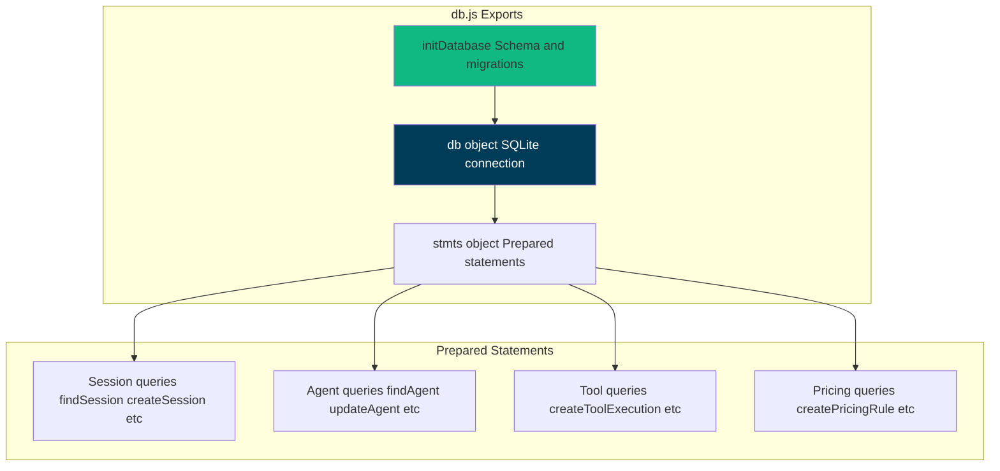

**Key Functions:**

```javascript
// Initialize database (create tables, indexes, defaults)
initDatabase();

// Prepared statements (prevents SQL injection, optimizes performance)
stmts.findSession.get(session_id);
stmts.createSession.run(session_id, model);
stmts.updateSession.run(status, total_cost, session_id);
stmts.touchSession.run(session_id); // Update updated_at

stmts.findAgent.get(agent_id);
stmts.createAgent.run(agent_id, session_id, agent_type);
stmts.updateAgent.run(status, input_tokens, output_tokens, cost, current_tool, agent_id);

stmts.createToolExecution.run(agent_id, tool_name, duration_ms, success, error_message);
stmts.createNotification.run(session_id, notification_type, message);
stmts.createPricingRule.run(pattern, input_cost_per_1m, output_cost_per_1m);
```

---

## API Reference

All endpoints return JSON unless noted. Error responses use:

```json
{
  "error": {
    "code": "SOME_CODE",
    "message": "Human-readable explanation"
  }
}
```

### OpenAPI / Swagger / ReDoc

| Method | Path                             | Description                                                                          |
| ------ | -------------------------------- | ------------------------------------------------------------------------------------ |
| `GET`  | `/api/openapi.json`              | Raw OpenAPI 3.0.3 spec                                                                |
| `GET`  | `/api/docs`                      | Interactive **Swagger UI** (try-it-out request execution)                            |
| `GET`  | `/api/redoc`                     | **ReDoc** reference — clean, read-optimized three-panel rendering of the same spec   |
| `GET`  | `/api/redoc/redoc.standalone.js` | Self-hosted ReDoc bundle (via the `redoc` dependency, never a CDN — works offline)   |

The OpenAPI spec is generated from `server/openapi.js` (`createOpenApiSpec()`), merged with supplementary fragments under `server/openapi-extra/`, and is the source of truth for request/response contracts. It now documents every backend route (75 path entries). Both Swagger UI and ReDoc (`server/lib/redoc.js`) render the same spec; the ReDoc bundle is served locally so the reference works offline / air-gapped. They explicitly use the same local `/favicon.svg` as the dashboard, including when Express serves the references without Vite. In production, unmatched `/api/*` paths return an API-shaped `404` rather than the dashboard SPA, so the first-run dashboard overlay can never cover the reference pages. A committed `openapi.yaml` at the repo root mirrors the live spec — regenerate it after API changes with `npm run openapi:yaml` (never hand-edit it).

### Core Endpoints

| Method  | Path                | Description                                      |
| ------- | ------------------- | ------------------------------------------------ |
| `GET`   | `/api/health`       | Server health check (`status`, `version`, `timestamp`) |
| `GET`   | `/api/sessions`     | List sessions (`status`, repeatable `cwd`, `sort_by`, `sort_desc`, `include_transient`, `include_task_progress`, `limit`, `offset`) |
| `GET`   | `/api/sessions/:id` | Session detail (includes `agents` + `events`)   |
| `POST`  | `/api/sessions`     | Create session (idempotent by `id`)             |
| `PATCH` | `/api/sessions/:id` | Update session                                   |
| `GET`   | `/api/sessions/:id/transcripts` | List the session's transcript files (main + sub-agents) |
| `GET`   | `/api/sessions/:id/transcript`  | Cursor-paginated message stream for one transcript |
| `GET`   | `/api/agents`       | List agents (`status`, `session_id`, `include_transient`, pagination)|
| `GET`   | `/api/agents/:id`   | Agent detail                                     |
| `POST`  | `/api/agents`       | Create agent (idempotent by `id`)               |
| `PATCH` | `/api/agents/:id`   | Update agent                                     |
| `GET`   | `/api/events`       | List events (`session_id`, `limit`, `offset`)   |
| `GET`   | `/api/stats`        | Dashboard aggregate counters                     |
| `GET`   | `/api/analytics`    | Analytics aggregates for charts/trends           |
| `GET`   | `/api/metrics`      | Prometheus / OpenMetrics exposition (text; v0.0.4) |

**Prometheus metrics (`GET /api/metrics`).** Exposes the dashboard's live counters — `ccam_sessions`/`ccam_agents` by status, `ccam_events_total`, `ccam_tokens_total` by kind, `ccam_websocket_clients`, `ccam_remote_sources` by enabled state, `ccam_process_uptime_seconds`/`ccam_process_resident_memory_bytes`, and `ccam_build_info{version}` — in the Prometheus v0.0.4 text-exposition format for scraping into Prometheus / Grafana (`server/routes/metrics.js`). Values come from the same `server/db.js` prepared statements the REST API uses, so they match the UI; status series are enumerated so a gauge never drops out of the exposition at zero. The route is read-only and, being under `/api`, sits behind both the Host-header (DNS-rebinding) guard and the optional `DASHBOARD_TOKEN` guard: a non-loopback scraper (e.g. Prometheus in Docker via `host.docker.internal`) must be allowlisted with `DASHBOARD_ALLOWED_HOSTS` or it gets `403 EBADHOST`, and must send the token when one is set. A ready-to-run Prometheus + Grafana stack with four auto-provisioned dashboards (default home **CCAM — Overview**) lives in [`monitoring/`](../monitoring/README.md).

**Data scope (`?sources=` and `?providers=`).** `GET /api/sessions`, `/api/events`, `/api/agents`, `/api/stats`, `/api/analytics`, `/api/workflows`, workflow drill-ins, and pricing cost endpoints accept an optional source list and provider list (`claude`, `cursor`, `codex`, or a comma-separated combination). The `claude` product scope intentionally expands to Claude Code + Cursor; direct `cursor` requests remain available for stored-provider drill-ins. The filters compose, so a single Settings choice immediately scopes every page by both machine and product. `server/lib/source-filter.js` and `server/lib/provider-filter.js` build the SQL predicates; `/api/stats` and `/api/analytics` use their scoped aggregates only when a filter is present. `GET /api/sessions/facets` returns both `sources` and `providers`.

**Session project filter (`cwd=`).** `GET /api/sessions` accepts one or more exact working directories. Repeat the query key (`?cwd=/work/a&cwd=/work/b`) to include sessions from any selected project; this OR filter composes with `status`, `q`, `sources`, pagination, and `sort_by` / `sort_desc`. The Sessions page uses it for its searchable checkbox project picker, so multi-project filtering stays server-paginated.

**Task progress.** `server/lib/task-progress.js` caches JSONL reads per transcript — the newest 32 MiB on first contact, then only the bytes appended since the last complete line, retaining the same 32 MiB window of state — and reduces the latest observable provider task state without inventing hidden plans. Claude current task observations (`TaskCreate` / `TaskGet` / `TaskUpdate` / `TaskList`), legacy `TodoWrite`, task lifecycle events, direct Codex `update_plan`, unified Codex `exec` wrappers containing executable `tools.update_plan(...)` calls, and subagent transcripts all normalize into owner-attributed items. Top-level work boundaries are authoritative: each real Claude human turn or Codex `task_started` clears every prior owner snapshot, while a subagent's next assigned turn clears that owner only; fresh task observations then build the current tracker. Claude turn-end records and Codex `task_complete` / `turn_aborted` discard any owner snapshot that still contains pending, in-progress, or unknown work, while fully completed/cancelled snapshots remain as history. Persisted Claude `UserPromptSubmit`, `Stop`, `SubagentStop`, `SessionEnd`, and interruption events apply the same boundaries before a matching transcript marker has necessarily flushed, so the first websocket-driven refetch cannot resurrect stale state. Harness-injected task notifications are excluded from those boundaries. Consequently, a latest turn/task with no tracker—or one abandoned without a final tracker update—yields `null` instead of resurrecting an older in-progress list. Wrapped-plan detection ignores matching text inside strings and comments and parses only a restricted data literal without executing transcript code. Codex ingestion normalizes the corresponding live event to `tool_name=update_plan` while retaining `raw_tool_name=exec`. `GET /api/sessions?include_task_progress=true` returns a compact `todo_summary` for at most the first 100 returned rows; Sessions and Dashboard opt in, while high-volume Kanban calls omit the flag. `GET /api/sessions/:id` returns the full `todo_snapshot`, capped at 200 task rows. Missing/malformed transcripts fail soft to `null`.

**Session names** are kept in sync with the transcript title: on every hook event (and in the 15 s watchdog) the ingestor reads the latest `custom-title` (`/rename`, `claude -n`, picker `Ctrl+R`) or `ai-title` (auto) from the JSONL and updates `sessions.name` — `custom-title` always wins, `ai-title` only fills a placeholder/auto name — broadcasting `session_updated` so the UI reflects renames in real time. When neither title exists, the session's first user prompt (tool-result / meta / slash-command plumbing entries skipped, 60-char label) fills the placeholder session name plus the main agent's placeholder name and empty task; a later `ai-title` can still replace a descriptor-filled name, and the agent fill passes the in-flight `current_tool` through so it is never wiped mid-turn.

**Transcript stream** (`GET /api/sessions/:id/transcript`) returns `user` / `assistant` messages plus: synthetic `session_event` rename markers (from `custom-title`), local slash-command I/O surfaced from `system`/`local_command` lines (the `<command-name>` pill + `<local-command-stdout>`/`stderr` output, e.g. `/color`, `/rename`, custom commands), and **mid-turn queued user messages** surfaced from `attachment`/`queued_command` lines — a message typed while Claude was still working is journaled as `queue-operation` bookkeeping plus a `queued_command` attachment (never as a `user` line), so the attachment is rendered as a user message at the point the model actually received it. Codex sessions map their human turns, legacy `function_call` records, and primary `custom_tool_call` records (including `exec` source and paired output) into that same DTO, so the Conversation tab does not collapse into a wait-only stream. Persisted PNG/JPEG/GIF/WebP attachments render as safe `image` blocks: Codex keeps its bounded inline raster data, while Claude receives an opaque same-origin `/transcript-image` URL that resolves only the referenced transcript line and never leaks the local path. Codex's response-item/event copies of the same human image turn are normalized and deduplicated before pagination. Codex `/rename` titles are read from the native `session_index.jsonl` and published as real-time `session_updated` frames even when no rollout byte changes. The queue is shared with harness injections, so queued lines are only attributed to the human when they aren't harness traffic: `<task-notification>`/`[SYSTEM NOTIFICATION` payloads and any non-`human` `origin.kind` render as `system` (harness notification attachments carry no `origin` field at all; typed messages carry `origin.kind = "human"`). Content-less `local_command` lines, other `system` subtypes, `queue-operation` lines, and every other attachment subtype are dropped.

**Provider-aware card context.** Compact dashboard and Kanban cards use an optional, newline-separated `prompt_preview` containing the two newest distinct real human turns. For Claude Code, the shared JSONL cache filters command plumbing, tool results, interruption markers, and duplicates, then writes this small card-only summary on live hooks, history imports, and watchdog sweeps; full conversation text remains in JSONL. Codex obtains the equivalent context from durable `codex_user_message` rollout events: both legacy `event_msg.user_message` records and modern `response_item` messages explicitly tagged `user.text` qualify, while user-role instruction/environment records do not. Distinct Codex turn IDs populate `metadata.turn_count`, and active sessions already consumed by an older byte cursor are repaired once from their rollout. The main-agent task remains a historical fallback. The changed summary emits the ordinary `session_updated` frame, so scoped clients refresh immediately.

**Codex lifecycle, discovery, and workflow data.** A Codex hook may identify a rollout by path or by its session/thread id; the latter resolves against the configured rollout tree and is ingested immediately. Before Codex exposes either identity, a one-second process probe keeps a local pre-identity card in memory for the Dashboard and Kanban views. That card never enters SQLite, history, analytics, pricing, workflows, alerts, or completion notifications. The probe also inspects open rollout files and thread-writer locks for each exact Codex PID. When the user selects an existing thread in Codex's Resume picker, the resumed rollout or lock is opened before any new message is appended, so CCAM immediately reactivates the durable session as Waiting and removes the transient startup card. Unknown lock IDs remain transient until normal hooks, live-thread state, or rollout ingestion create a durable row. Once a stable id exists, the continuous synchronizer reads the very recent native `state_*.sqlite` live-thread row or rollout JSONL and normal durable ingestion remains authoritative. It reads newest rollouts first, yields between bounded batches, and leaves a failed historical file eligible for retry so it cannot delay a fresh session. A separate, transactional byte cursor indexes only tool-call-shaped `response_item` records once, so the Workflows tool timeline and transitions represent actual Codex commands, edits, MCP calls, searches, and agent tools without replaying token or lifecycle accounting. Rollout records are authoritative: real human prompts / `task_started` make the main agent `working`, `task_complete` keeps the session `active` while showing **Waiting** (`awaiting_reason = stop`), and `turn_aborted` shows interrupted **Waiting**. Each real prompt also updates the Codex main agent's `task`, preserving a native `/rename` as the card title while compact cards render up to two recent distinct human messages below it. `context_compacted` is included in provider-scoped compaction metrics. A later rollout turn reactivates a prematurely completed session; restart reconciliation repairs the latest persisted state and only changes a silent Codex `working` turn to interrupted Waiting after 90 seconds.

> **Codex startup and resume:** A fresh interactive Codex process is visible immediately through an in-memory Waiting card even before Codex creates a stable session/thread ID. The live Dashboard and Kanban calls opt in with `include_transient=true`; ordinary API pagination remains durable-only. `SessionStart`, the local live-thread state, rollout JSONL, or an existing resumed rollout/writer lock then identifies the real row, and the process card disappears without leaving history. Resume selection switches immediately rather than waiting for the first new message. The probe is fail-safe and disabled on Windows, inside containers, when `ps`/`lsof` is unavailable, or when `DASHBOARD_LIVENESS_PROBE=0`.

Codex durable-session liveness uses the exact open rollout on supported local hosts: `probeLiveCodexRollouts()` maps each live Codex PID to its `rollout-*.jsonl`. Cold ingestion creates inactive historical files as completed, and the watchdog can distinguish old and live sessions even when they share the same `cwd`; if exact probing is unavailable, the existing fail-safe cwd probe remains conservative. The pre-identity process overlay also collapses the Node launcher and direct native Codex child into one logical process before creating transient cards.

Claude turn-duration ingestion assigns each `TurnDuration` a stable transcript identity (UUID or byte offset). A complete parse atomically reconciles rows and exact `turn_count` / `total_turn_duration_ms` metadata, repairing duplicates from older builds; a capped tail remains append-only so it cannot discard historical turns.

### Hook Ingestion

| Method | Path               | Description                                    |
| ------ | ------------------ | ---------------------------------------------- |
| `POST` | `/api/hooks/event` | Ingest one Claude Code hook event envelope     |
| `POST` | `/api/hooks/codex` | Acknowledge a Codex lifecycle notification and asynchronously ingest its rollout (or, for a rollout-less run, the payload itself) |
| `POST` | `/api/hooks/ingest-batch` | Third session-data ingestion path (see [Remote Data Sources](#remote-data-sources) for the other two): a roaming/NAT'd machine the dashboard can never reach to pull FROM pushes a batch of its own session data instead |

Request body shape:

```json
{
  "hook_type": "PreToolUse",
  "data": {
    "session_id": "abc-123",
    "tool_name": "Bash"
  }
}
```

#### `POST /api/hooks/ingest-batch`

Unlike every other route in this file, this one is meant to be reachable from
the public internet (via Traefik) rather than loopback, and is disabled by
default. It is gated by its **own** token — deliberately **not**
`DASHBOARD_HOOK_TOKEN` (that one protects the loopback-only routes above; an
operator who sets it to harden those must not thereby also open this
internet-writable endpoint as a side effect):

```
REMOTE_PUSH_TOKEN=              # or REMOTE_PUSH_TOKEN_FILE=/path/to/token
```

Unset (the default): every request gets `503 REMOTE_PUSH_NOT_CONFIGURED`. Set,
but the request's token doesn't match: `401 EUNAUTHORIZED`. Send the token as
`Authorization: Bearer <token>` or `X-Dashboard-Token: <token>` -- deliberately
**not** `?token=` (unlike the dashboard/WebSocket token above): a query-string
credential on a public-internet route ends up in access/proxy logs.

Request body:

```json
{
  "schema_version": 1,
  "session_id": "abc-123",
  "provider": "claude",
  "session_name": "optional display name (defaults to Session <first 8 chars of id>)",
  "cwd": "optional working directory",
  "repo_remote_url": "optional opaque Git remote URL",
  "model": "optional model id",
  "tokens": [
    {
      "model": "claude-opus-4",
      "speed": "1x",
      "inference_geo": "us",
      "service_tier": "standard",
      "input": 100,
      "output": 50,
      "cacheRead": 0,
      "cacheWrite": 0,
      "cacheWrite1h": 0,
      "webSearch": 0,
      "webFetch": 0,
      "codeExec": 0
    }
  ],
  "tool_events": [
    { "uuid": "evt-1", "agent_id": "optional, defaults to this session's main agent", "tool_name": "Bash", "status": "success", "timestamp": "optional ISO-8601, defaults to server now" }
  ],
  "turns": [
    { "uuid": "turn-1", "agent_id": "optional", "duration_ms": 1500, "timestamp": "optional ISO-8601" }
  ]
}
```

`provider` must be one of `claude`/`codex`. `tokens[]` entries are each
bucket's **full current total** (like a transcript re-parse), not a delta.
`repo_remote_url` is optional collector-supplied metadata. URL/SCP userinfo, query
strings, and fragments are removed; malformed URL-style values are discarded.
The first non-empty sanitized value is retained, even when it arrives after
session creation. Later batches cannot overwrite it. It is returned on Session
rows as a cross-machine identity hint; the server does not discover Git remotes.
`tool_events[]`/`turns[]` are deduped by `(session_id, event_type, uuid)`,
both against previously-committed rows and within the same batch — safe to
resend. `tokens.length + tool_events.length + turns.length` is capped at 1000
per request (`413 BATCH_TOO_LARGE`). A `session_id` already owned by a local
or SSH-pulled session is refused per-item (`SESSION_LOCALLY_OWNED`) rather
than allowed to hijack it — a pushed session can only ever create a NEW
session or append to one it created itself.

**Remote-origin hooks.** A collector that also forwards live hooks from the
remote machine (so the dashboard gets real-time status, not just batch
totals) can send the same `REMOTE_PUSH_TOKEN` header on
`POST /api/hooks/event`. When it matches, a session that event *creates* is
born `remote_push`-owned — optionally tagged with a supported `data.provider`
(`claude`/`codex`) — so the collector's later `ingest-batch` calls can enrich
it. Ownership is still decided once, at row creation, by an authenticated
source: an existing local session is never relabelled, and a hook without the
token (or with a wrong one) keeps today's local behaviour.

If `DASHBOARD_HOOK_TOKEN` is also set, `hookGuard` authenticates every
`/api/hooks/*` request first, so a remote hook needs **both** credentials in
separate headers:

```http
X-CCAM-Hook-Token: <DASHBOARD_HOOK_TOKEN>
Authorization: Bearer <REMOTE_PUSH_TOKEN>
```

`X-Dashboard-Token: <REMOTE_PUSH_TOKEN>` works in place of the
`Authorization: Bearer` header — `hookGuard` reads `X-CCAM-Hook-Token` first,
so the two credentials never collide. Sending only the remote-push token then
gets `401` from `hookGuard` — the hook-auth boundary is unchanged by
remote-origin ownership.

Response (`200`, even when individual items were skipped/rejected — see
`errors[]`/`skipped` for partial-failure detail):

```json
{ "ok": true, "written": 2, "skipped": 1, "errors": [{ "item": "tokens[0]", "code": "INVALID_NUMERIC", "message": "..." }] }
```

### Pricing

| Method   | Path                      | Description                            |
| -------- | ------------------------- | -------------------------------------- |
| `GET`    | `/api/pricing`            | List pricing rules                     |
| `PUT`    | `/api/pricing`            | Create/update a pricing rule           |
| `DELETE` | `/api/pricing/:pattern`   | Delete pricing rule                    |
| `GET`    | `/api/pricing/cursor`     | List the separate Cursor rate card     |
| `PUT`    | `/api/pricing/cursor`     | Create/update a Cursor rate row        |
| `DELETE` | `/api/pricing/cursor/:pattern` | Delete a Cursor rate row          |
| `GET`    | `/api/pricing/gpt`        | List the separate OpenAI GPT rate card |
| `PUT`    | `/api/pricing/gpt`        | Create/update an OpenAI GPT rate row |
| `DELETE` | `/api/pricing/gpt/:pattern` | Delete an OpenAI GPT rate row      |
| `GET`    | `/api/pricing/cost`       | Total cost across all sessions         |
| `GET`    | `/api/pricing/cost/:id`   | Cost breakdown for one session         |

`PUT /api/pricing` also accepts optional **time-limited introductory rates** (`intro_*_per_mtok` + an `intro_until` `YYYY-MM-DD` cutoff): usage on/before the cutoff is priced at the intro rate, after it at the standard rate. Intro columns are written only when the caller sends them, so a standard-rate edit never disturbs a promo. Every rate field present must be a non-negative finite number — `NaN`/negative values are rejected with `400 INVALID_INPUT` before anything is written. The agent-list endpoints (`GET /api/agents`, `GET /api/sessions/:id/agents`) attach a per-agent `cost` — each subagent's OWN cost, computed from its `metadata.tokens` at current rates (0 for main agents, whose cost is the session total).

Codex accounting keeps fresh input, cached input, cache writes, output, and reasoning output separate from rollout cumulative counters. Standard requests at or below 272K input tokens use the short GPT columns; larger standard requests use the long columns; Fast requests use separate short (`fast_*`) and long (`fast_long_*`) columns at the same 272K boundary. The default GPT rate card includes GPT-6 Astra and the GPT-5.6 family, including current Sol promotional rates. Startup corrects exact obsolete default rates without replacing custom rates. On the first Fast long-column migration, custom rules copy their existing Fast rates into the long band; later restarts preserve edits, including zero rates. Corrections reprice historical estimates on read without re-importing tokens. Sol rates are not automatically fetched or changed at an assumed promotional cutoff. Claude Fast defaults apply only to Opus 5 and 4.8; Opus 4.6 falls back to standard rates and Opus 4.7 has no Fast premium. A model/tier without a configured rate is returned in `unpriced_models` instead of being silently priced as zero. Session-list rows expose `has_token_usage` separately from `cost`, so consumers can distinguish no durable token data from a valid zero or unpriced cost; their optional `repo_remote_url` is an opaque collector-observed Git identity for cross-machine project matching.

### Workflows

| Method | Path                          | Description                                                         |
| ------ | ----------------------------- | ------------------------------------------------------------------- |
| `GET`  | `/api/workflows`              | Provider/source-scoped aggregate workflow intelligence (`?status=active\|completed\|...`, `?sources=...`, `?providers=claude\|codex`) |
| `GET`  | `/api/workflows/session/:id`  | Provider/source-scoped per-session drill-in (tree, recorded tool timeline, swim lanes, events)          |

### Remote Data Sources

Live remote/multi-machine data collection over SSH. `server/lib/remote-sync.js` independently mirrors a source's Claude Code tree (`~/.claude/projects`) and Codex tree (`~/.codex/sessions` plus the lightweight native `session_index.jsonl` title index) into isolated staging dirs. Each uses its normal local importer — `importFromDirectory` for Claude and `importCodexFromDirectory` for Codex — then tags imported sessions with `sessions.source`. A source can be Claude-only, Codex-only, or both; either provider can keep the source healthy while provider-specific state preserves correct lifecycle fallback. Authentication defers entirely to the host SSH stack (ssh-agent / `~/.ssh/config` / identity file) — **no secrets are stored**; every command runs via `execFile`/`spawn` argument arrays (never a shell string) and `StrictHostKeyChecking` is left at its SSH default.

> **Cursor on remotes:** SSH sources currently mirror Claude Code and Codex homes only. Cursor's native `~/.cursor` tree is not pulled by this subsystem; mount or otherwise expose that tree locally and point `DASHBOARD_CURSOR_HOME` at it when remote Cursor history is required.

| Method   | Path                          | Description |
| -------- | ----------------------------- | ----------- |
| `GET`    | `/api/remote-sources`         | List configured sources (config + operational status) |
| `POST`   | `/api/remote-sources`         | Create a source |
| `PATCH`  | `/api/remote-sources/:id`     | Update a source |
| `DELETE` | `/api/remote-sources/:id`     | Delete a source; `?purge=true` also deletes that source's imported sessions |
| `POST`   | `/api/remote-sources/:id/test`| SSH connectivity probe |
| `POST`   | `/api/remote-sources/:id/sync`| Trigger an on-demand pull |
| `POST`   | `/api/remote-sources/sync-all`| Pull every enabled source now (sequential; per-source failures isolated) |

Every status transition broadcasts `remote_source.status` `{ id, status, error?, providers?, last_sync_at? }` over `/ws`; `providers` contains Claude/Codex availability, including `unavailable` for a missing history tree. A successful sync also emits `remote_data.updated` `{ sourceId, source, label?, counters?, providers?, last_sync_at? }` so open UI pages refetch sessions, costs, and analytics immediately. Enabled sources are also pulled automatically by the background sync poller (`startRemoteSourceSync` in `server/index.js`) — see [Continuous Project Sync](#continuous-project-sync) and the environment table.

#### Setup & troubleshooting

Because sync runs non-interactively (`ssh -o BatchMode=yes`), the connection must already work without a prompt. Set a source up like this:

1. **Reach the host once, manually:** `ssh user@host` (or an alias from `~/.ssh/config`). This adds the host to `~/.ssh/known_hosts` — required, since `StrictHostKeyChecking` is left at its secure default (an unknown host key fails the sync rather than being trusted blindly).
2. **Make auth passwordless:** load your key into `ssh-agent` (`ssh-add`), or set an `IdentityFile` in `~/.ssh/config`, or point the source's optional `identity_file` at the key. Passphrase prompts and password auth will not work under `BatchMode`.
3. **OpenSSH on both sides** — the dashboard machine needs the OpenSSH **client** (`ssh` + `scp`). The remote needs a running OpenSSH **server** (default on most Linux/macOS hosts; enable the OpenSSH Server optional feature on Windows). **Nothing else is installed on the remote.**
4. **Cross-platform notes:**
   - **macOS auth (Secretive, 1Password, ssh-agent, or file keys):** leave **Identity file** blank unless you need a specific key path. CCAM mirrors your shell: `ssh -G` supplies `IdentityAgent` when your `~/.ssh/config` does; otherwise it uses `SSH_AUTH_SOCK` (including `launchctl getenv` when the dashboard is GUI-launched) or plain `~/.ssh` keys. Secretive is used only when your SSH config points at it — never forced.
   - **Windows dashboard:** OpenSSH Client optional feature; CCAM prefers `ssh`/`scp` on `PATH`, then falls back to `System32\OpenSSH\`.
   - **Windows remote:** default homes check the Windows profile **and** WSL (`~/.claude` / `~/.codex` inside the default distro). If either CLI runs only in WSL, leave that home blank — CCAM auto-detects WSL and pulls via `wsl.exe` + `tar`, or set `wsl:~/.claude` / `wsl:~/.codex` explicitly. Native Windows installs can use `C:/Users/you/.claude` / `C:/Users/you/.codex`; UNC paths also work when `scp` can read them.
   - **Linux/macOS remote:** defaults are `~/.claude/projects` and `~/.codex/sessions`; custom POSIX roots (`/home/ubuntu/.claude`, `/home/ubuntu/.codex`) also work. Prefer SSH directly into WSL/Linux rather than Windows→WSL when possible.
5. **Add the source** (Settings → Remote Data Sources, or `ccam remote-sources add`), click **Test**, then **Sync**.

| Symptom (surfaced in `last_error` / the Test result) | Cause & fix |
| --- | --- |
| `Host key verification failed` | The host isn't in `known_hosts`. `ssh user@host` once to accept its key. |
| `Permission denied (publickey)` | No usable key for non-interactive auth. `ssh-add` your key, set `IdentityFile` in `~/.ssh/config`, or set the source's `identity_file`. |
| `… does not exist on the remote` | The Test result identifies Claude Code or Codex. Set that provider's optional **Remote Claude home** / **Remote Codex home** field (defaults `~/.claude` / `~/.codex`). |
| `scp` / `ssh` not recognized (Windows) | Install the **OpenSSH Client** optional feature, restart the dashboard, or confirm `C:\Windows\System32\OpenSSH\scp.exe` exists. |
| `Permission denied (publickey,password)` | SSH auth failed in the **dashboard process** (not necessarily your Terminal). Leave **Identity file** blank for Secretive, ssh-agent, or default `~/.ssh` keys — CCAM follows `ssh -G` / your config and does not force Secretive. Start the dashboard from the same shell as `ssh user@host`, or ensure your agent is running. Set **Identity file** only for an explicit on-disk key. |
| Connected but directory missing | Claude Code or Codex may not be installed on the remote, or its `remote_home` / `remote_codex_home` points at the wrong path. On Windows SSH with either CLI in WSL, leave the matching home blank (auto WSL) or set `wsl:~/.claude` / `wsl:~/.codex`. Default native paths are `~/.claude/projects` and `~/.codex/sessions`. |
| Sync hangs then errors after ~10 min | Bounded by `DASHBOARD_REMOTE_SYNC_TIMEOUT_MS`; usually a network/host issue — verify with **Test** (bounded by `DASHBOARD_REMOTE_TEST_TIMEOUT_MS`). |

### Settings / Ops

| Method | Path                           | Description                                      |
| ------ | ------------------------------ | ------------------------------------------------ |
| `GET`  | `/api/settings/info`           | System info, DB stats, hooks status, cache stats. Also powers the Dashboard Health tab (server uptime, memory, CPU, DB record counts, WAL/journal mode, transcript cache hit/miss rates) |
| `POST` | `/api/settings/clear-data`     | Delete all sessions/agents/events/token usage    |
| `POST` | `/api/settings/reimport`       | Re-import legacy sessions from `~/.claude/`      |
| `POST` | `/api/settings/reinstall-hooks`| Reinstall Claude Code hooks                      |
| `POST` | `/api/settings/install-hooks` | Install selected Claude Code and/or Codex hook sets; preserves unrelated hook entries |
| `POST` | `/api/settings/reset-pricing`  | Reset Claude, Cursor, Codex, or all pricing tables to defaults |
| `GET`  | `/api/settings/export`         | Export all data (sessions, agents, events, token_usage, workflows, dashboard_runs, alert_rules, model_pricing, cursor_model_pricing, gpt_model_pricing) as one versioned JSON attachment |
| `POST` | `/api/settings/import`         | Restore one bundle up to 25 MiB from `/export`. Multipart `file`, or JSON `{ path }` (server reads it). Idempotent + non-destructive: sessions already present are skipped whole |
| `POST` | `/api/settings/cleanup`        | Abandon stale sessions and purge old data        |
| `GET` / `PUT` | `/api/settings/claude-home` | Read or update the Claude Code transcript/configuration root |
| `GET` / `PUT` | `/api/settings/codex-home` | Read or update the Codex rollout/hooks root; saving immediately re-arms the watcher and schedules a scan |

Both home updates accept `{ "path": "/absolute/path" }`; a leading `~/` is expanded, and a missing or non-directory path returns `400 INVALID_PATH`. The Codex setting persists as `DASHBOARD_CODEX_HOME`, not `CODEX_HOME`, so Settings never mutates the broader Codex CLI environment.

Backup restore accepts exactly one export bundle up to 25 MiB from either multipart field `file` or a server-side absolute `path`. Larger inputs return `413 IMPORT_TOO_LARGE` before parsing.

### Alerts and Webhooks

Webhook targets use HTTPS for hosted providers. The `generic` and `n8n` types also accept HTTP so local or self-hosted receivers remain supported. Delivery never follows redirects, which prevents provider credentials, custom headers, or HMAC signatures from being forwarded to a second destination.

### Claude Config Explorer (`/api/cc-config`)

Reads — and carefully gated mutations for low-risk text-file artifacts — for every Claude Code configuration surface. File reads canonicalize both the requested path and allowed roots with `realpath`, so symlinks cannot escape `CLAUDE_HOME`, the project `.claude/` directory, or the project `CLAUDE.md`. Mutations always create timestamped backups under `<root>/cc-config-backups/<type>/` before writing.

| Method   | Path                                  | Description |
| -------- | ------------------------------------- | ----------- |
| `GET`    | `/api/cc-config/overview`             | Roots + counts for every surface (used by the Overview tab) |
| `GET`    | `/api/cc-config/skills`               | Skills with parsed frontmatter, `?scope=user\|project\|all` |
| `GET`    | `/api/cc-config/agents`               | Subagents under `<scope>/.claude/agents/*.md` |
| `GET`    | `/api/cc-config/commands`             | Slash commands under `<scope>/.claude/commands/*.md` |
| `GET`    | `/api/cc-config/output-styles`        | Output styles under `<scope>/.claude/output-styles/*.md` |
| `GET`    | `/api/cc-config/plugins`              | Installed plugins joined with `enabledPlugins` + per-plugin `contributes` count + `plugin.json` metadata |
| `GET`    | `/api/cc-config/marketplaces`         | `known_marketplaces.json` enriched with each marketplace's own `marketplace.json` |
| `GET`    | `/api/cc-config/mcp`                  | MCP servers from `~/.claude.json` and `settings.json` |
| `GET`    | `/api/cc-config/hooks`                | Hooks aggregated across user / project / project-local `settings.json` |
| `GET`    | `/api/cc-config/hook-scripts`         | Files in `~/.claude/hooks/` (helper scripts referenced by hook commands) |
| `GET`    | `/api/cc-config/keybindings`          | `~/.claude/keybindings.json` parsed into context-grouped key/action pairs |
| `PUT`    | `/api/cc-config/keybindings`          | Overwrite `~/.claude/keybindings.json` from `{ groups: [{ context, bindings: [{ key, action }] }] }`. Backs the file up first, preserves top-level metadata (`$schema`/`$docs`), rejects duplicate contexts/keys (`EBADCONTENT`). Safe because — unlike `settings.json` — the CLI does not rewrite it mid-session |
| `GET`    | `/api/cc-config/statusline`           | `settings.json.statusLine` config + script content if present |
| `GET`    | `/api/cc-config/settings`             | User / project / project-local settings JSON, secret keys redacted |
| `GET`    | `/api/cc-config/memory`               | `CLAUDE.md` files at user + project scope. Also returns the per-project file-based memory store as `scope:"auto-memory"` items (each carrying `project`, `name`, `isIndex`, and parsed `frontmatter`) — every `*.md` under `~/.claude/projects/<slug>/memory/` |
| `GET`    | `/api/cc-config/file?path=…`          | Body of a single file (path-contained to allowed roots) |
| `GET`    | `/api/cc-config/backups[?scope=&type=]` | Listing of all timestamped backups. Also lists `scope:"auto-memory"` backups (each carrying `project`) |
| `PUT`    | `/api/cc-config/file`                 | Create or overwrite a text-file artifact (skills/agents/commands/output-styles/memory). Body: `{ scope, type, name?, content }`. Auto-backs-up if file exists. Atomic temp + rename. 256 KB cap. Per-project file-based memory is also editable via `{ scope: "auto-memory", type: "auto-memory", project, name }` — backups land under `<memory-dir>/.cc-config-backups/auto-memory/`, and an invalid project slug returns `EBADPROJECT` |
| `DELETE` | `/api/cc-config/file`                 | Backup-then-delete a text-file artifact. Skill dirs are backed up whole before recursive removal |

### Codex Config Explorer (`/api/codex-config`)

The Agent Config page also includes a **Codex configuration workspace**. It discovers defaults, account-visible model catalog entries, profiles, MCP servers, projects, skills, rules, hooks, installed plugins, and instruction files. The account catalog uses a dedicated bounded reader, so large cached model instructions cannot trip the 256 KiB preview cap and render the Models tab empty; base/profile model overrides remain visible without a cache. Profiles are Codex-native `<name>.config.toml` overlays (strict letters/numbers/hyphens/underscores) created without overwriting existing files and applied only by `codex --profile <name>`; their cards copy that exact launch command in one click. Plugin cards use `codex plugin list` as the source of truth and enrich those entries from their manifests; cache directories are never presented as plugins. Normal TOML and JSON previews redact secret-like values. Preview reads canonicalize targets before containment checks. A separate, unredacted local editor is limited to `config.toml`, named profile overlays, `hooks.json`, user rule files, user `SKILL.md` files, and Codex/project `AGENTS.md`; it rejects symlinked components below the trusted root and verifies the canonical parent before a write. It is explicitly necessary so a redacted preview cannot overwrite real secret values, and a payload containing `[redacted]` is rejected rather than saved. Every allowed save is capped at 256 KiB, backed up first, and atomically renamed. User-maintained profiles, hooks, rules, skills, and instructions also have View source / Copy path / Edit / confirmed delete actions with timestamped backups; skill deletion backs up and removes its whole directory, while `config.toml` is permanently edit-only. The dashboard does not validate Codex syntax. `lib/codex-config-watcher.js` broadcasts `codex_config_changed` on relevant config, skill, rule, or plugin changes so the page refreshes immediately.

| Method | Path | Description |
| --- | --- | --- |
| `GET` | `/api/codex-config/overview` | Redacted metadata for every Codex config surface used by Agent Config |
| `GET` | `/api/codex-config/file?path=…` | Redacted, size-capped file view for a file under Codex home or this project's `AGENTS.md` |
| `GET` | `/api/codex-config/edit-file?path=…` | Unredacted content only for the narrow editable-file allowlist |
| `PUT` | `/api/codex-config/file` | Atomically save `{ path, content }` to an allowlisted Codex file; timestamped backup before overwrite |
| `DELETE` | `/api/codex-config/file` | Back up then delete a user-managed profile/hook/rule/skill/instruction; `config.toml` is rejected |
| `POST` | `/api/codex-config/profiles` | Create a non-overwriting named `<name>.config.toml` overlay for `codex --profile <name>` |

### Run Agent (`/api/run`)

Provider-aware HTTP surface for spawning and supervising Claude Code processes and native interactive Codex threads from the dashboard. Every route enforces a same-origin / loopback-Origin guard against browser CSRF. A supplied `cwd` must be an existing absolute directory and is canonicalized with `realpath`; it intentionally may be outside this repository so users can launch from their home directory or any recent project.

| Method   | Path                          | Description |
| -------- | ----------------------------- | ----------- |
| `GET`    | `/api/run`                    | List handles + `maxConcurrent` + `activeCount` |
| `GET`    | `/api/run/binary?provider=…`  | Probe whether `claude` or `codex` is on `PATH` |
| `GET`    | `/api/run/models?provider=…`  | Signed-in dynamic Codex model catalog; Claude aliases plus locally observed models |
| `GET`    | `/api/run/cwds`               | Suggested cwds (dashboard, home, recent from sessions) |
| `GET`    | `/api/run/files?cwd=…&q=…`    | Fuzzy file search inside the canonicalized `cwd` for the Run page's `@`-file autocomplete. Skips `node_modules`, `.git`, `dist`, `build`, `.next`, `.cache`, `coverage`, `vendor`, etc. Cwd is required and must exist; results are capped and ranked by basename match |
| `POST`   | `/api/run`                    | Spawn. Body: `{ provider?: "claude"\|"codex", prompt, mode?, cwd?, model?, permissionMode?, sandbox?, resumeSessionId?, effort? }`. Claude supports headless or stream-json conversation. Codex always starts/resumes a native interactive app-server thread, with `permissionMode` as its approval policy (`untrusted`/`on-request`/`never`) and `sandbox` as `read-only`/`workspace-write`/`danger-full-access`. `effort` maps to the provider's native reasoning setting. Concurrency is effectively uncapped by default (ceiling 10000, override with `RUN_MAX_CONCURRENT`) |
| `POST`   | `/api/run/:id/message`        | Send follow-up turn. Body: `{ text, provider? }` |
| `GET`    | `/api/run/:id`                | Handle state. `?envelopes=1` includes the in-memory envelope log for re-attach |
| `DELETE` | `/api/run/:id`                | Stop (SIGTERM → SIGKILL after 5 s) |

WebSocket message types added: `run_stream` (Claude stream-json envelopes or normalized Codex app-server events), `run_status` (status transitions), `run_input_ack` (follow-up accepted), `cc_config_changed`, and `codex_config_changed` (the Codex workspace's filesystem/dashboard refresh signal).

### Import History

Import History is provider-aware. Claude Code continues through the shared
`parseSessionFile` + `importSession` pipeline, while Codex rollouts use the
same incremental ingestor as live monitoring. The selected `provider` chooses
`~/.claude/projects` or `~/.codex/sessions`; Codex imports preserve token
cursors, response-item tools, lifecycle state, and archived `/rename` titles.
External Codex files are snapshotted before temporary upload/extraction paths
are reclaimed, so session transcripts remain readable.

Imported and live-scanned subagents also get their **nested hierarchy**
rebuilt: rows are inserted flat under the main agent, then
`reconcileSubagentParents` recovers each spawner from the subagent
transcript's Task tool result (`toolUseResult.agentId`) and repoints
`parent_agent_id` so subagents-of-subagents nest under their true spawner
instead of collapsing to one level. It is idempotent and additive (only
rewrites `parent_agent_id`) and runs in `importSession` and the live
`scanAndImportSubagents` path (which returns a `reparented` count).

| Method | Path                      | Description                                                              |
| ------ | ------------------------- | ------------------------------------------------------------------------ |
| `GET`  | `/api/import/guide`       | Provider-aware OS paths, archive command, extensions, and instructions (`?provider=claude\|codex`) |
| `POST` | `/api/import/rescan`      | Rescan the selected default path (`{ provider }`)                        |
| `POST` | `/api/import/scan-path`   | Scan any absolute directory with `{ path, provider }`; walks recursively |
| `POST` | `/api/import/upload`      | Multipart upload with a `provider` field; Codex files are snapshotted    |

**Source files**

| File                           | Role                                                                                                   |
| ------------------------------ | ------------------------------------------------------------------------------------------------------ |
| `server/routes/import.js`      | Express router, request validation, temp-dir lifecycle, progress broadcasts                            |
| `server/lib/codex-import.js`   | Historical Codex rollout importer; snapshots external files and delegates parsing/accounting to `codex-ingest.js` |
| `server/lib/codex-ingest.js`   | Incremental Codex rollout ingestor. Discovery stats each rollout **once** rather than inside the sort comparator, which made newest-first ordering cost O(N log N) stat syscalls. Both read paths close their descriptor in a `finally`, and an I/O failure is reported as `failed` (distinct from a completed no-op) so the sweep keeps that file queued instead of recording its fingerprint and skipping it. The thread id, not the rollout, identifies a session for every lifecycle notification, so a run that persists nothing (`codex exec --ephemeral`) still completes properly; while it has no rollout its hook payloads are stored as events tagged `data.source = "hook"` and the session is marked `hook_only`, both withdrawn if a real rollout is linked later |
| `server/lib/archive.js`        | Safe archive extractors (`.zip` / `.tar(.gz)` / `.gz`) with path-traversal and size-cap enforcement    |
| `scripts/import-history.js`    | Generalized directory walker (`importFromDirectory`) + shared `parseSessionFile` / `importSession`. Re-import is fully incremental: per-event-type high-water mark (`MAX(created_at) GROUP BY event_type` per session) drives `ts > cutoff[type]` dedup for Stop / PostToolUse / TurnDuration / ToolError, and `sessions.ended_at` is rolled forward when the JSONL has progressed past the stored value. After each batch imports, it calls `ingestWorkflowsForSession` (`server/lib/workflow-ingest.js`) per session — outside the SQLite transaction — so an offline/headless/CI/cluster **Workflow-tool** run (whose journal never reached a live server) has its inner agents linked to their `run_id` on a plain rescan / path import, not left orphaned (`workflow_run_id = NULL`). Both parsers reconcile usage per `message.id` (last record wins), matching `transcript-cache.js`. `reconcileTokens(dbModule, {all, resetBaselines})` backs `npm run repair-tokens` — the one-time repair that re-derives totals for every **Claude** session with a transcript on disk (located under `~/.claude/projects/` or via the session's stored `transcript_path`) and zeroes the `baseline_*` columns, which the ordinary high-water fold would otherwise use to preserve a historical over-count. It clears only non-workflow rows, excludes Codex sessions (their usage comes from rollout journals, not Claude transcripts), and refuses to run while a dashboard is up |
| `server/lib/transcript-cache.js` | Chunked 4 MiB sync byte-stream reader for JSONL transcripts — never materializes the whole file as a JS string, so files larger than V8's max string length (~512 MiB on 64-bit Node 20) parse without aborting Node with `FATAL ERROR: v8::ToLocalChecked Empty MaybeLocal`. Token usage is **reconciled per `message.id`** (last record wins), not summed per record: Claude Code writes one record per content block and each copies the message's `usage`, so the old per-record sum inflated totals 2–4× (issue #293) |

**Request flow (upload)**

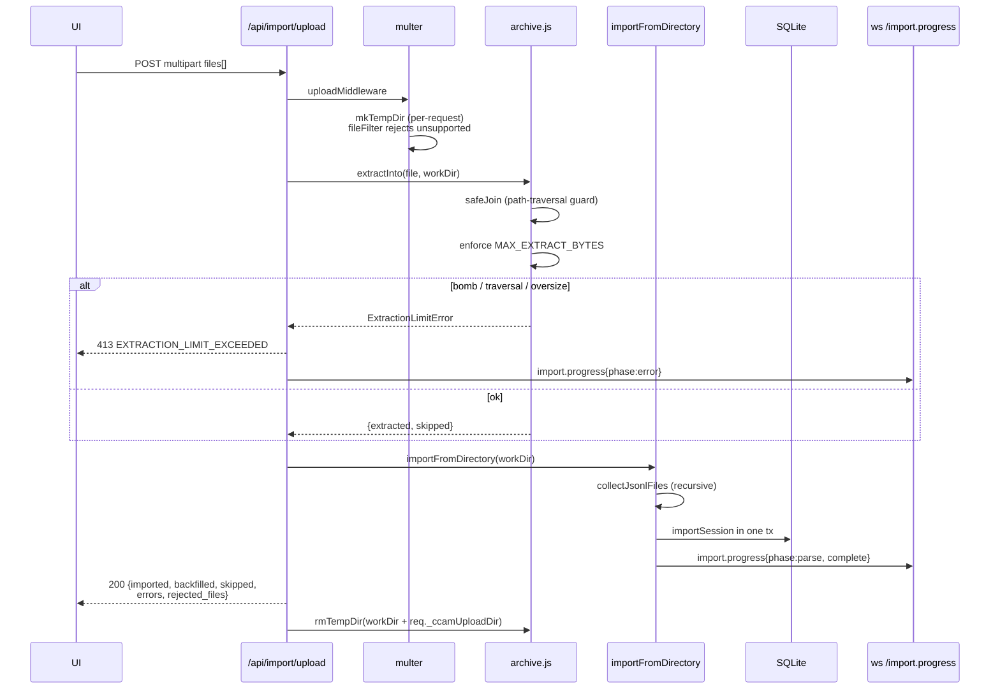

**Supported source layouts.** Both canonical Claude Code JSONL layouts
are recognised automatically — `<proj>/<sid>/subagents/agent-*.jsonl`
(default) and `<proj>/subagents/<sid>/agent-*.jsonl` (alternative) —
and orphan subagent files (parent JSONL missing from the upload) are
attached to an existing DB session whenever the inferred session ID
matches one probed from either layout candidate.

**Environment variables**

| Variable                          | Default     | Purpose                                                           |
| --------------------------------- | ----------- | ----------------------------------------------------------------- |
| `CCAM_IMPORT_MAX_BYTES`           | `1073741824` | Maximum size per uploaded file                                   |
| `DASHBOARD_TOKEN_REPAIR`          | `1`         | One-time automatic repair of token totals inflated before usage was reconciled per `message.id`; `0` skips it (repair manually with `npm run repair-tokens`) |
| `CCAM_IMPORT_MAX_FILES`           | `2000`      | Maximum files per upload request                                 |
| `CCAM_IMPORT_MAX_EXTRACT_BYTES`   | `4294967296` | Total uncompressed bytes allowed per archive (zip-bomb guard)   |

**WebSocket event schema.** Progress is broadcast on `/ws` with type
`import.progress`. Messages are throttled at ~150 ms; the terminal
`complete` and `error` frames are always delivered.

```json
{
  "type": "import.progress",
  "timestamp": "2026-04-18T15:48:34.123Z",
  "data": {
    "importId": "upload-1729264114000",
    "phase": "parse",
    "source": "upload",
    "processed": 184,
    "total": 512,
    "current": "/tmp/ccam-import-work-xyz/project/<uuid>.jsonl",
    "counters": { "imported": 120, "backfilled": 40, "skipped": 20, "errors": 4 }
  }
}
```

Phases: `start` → `scan` → `extract` (upload only) → `parse` →
`complete`, with `error` / `extract_error` replacing `complete` on
failure.

**Response envelopes**

```jsonc
// 200 — import completed
{
  "ok": true,
  "source": "upload",            // "default" | "path" | "upload"
  "path": "/abs/path",           // only for source=path
  "imported": 120,
  "backfilled": 40,
  "skipped": 20,
  "errors": 4,
  "sessions_seen": 180,
  "files_scanned": 512,
  "files_received": 8,           // upload only
  "rejected_files": [],          // upload only; unsupported extensions
  "entries_extracted": 180,      // upload only
  "entries_skipped": 0           // upload only
}

// 400 — validation failure
{ "error": { "code": "PATH_NOT_FOUND", "message": "..." } }

// 413 — extraction cap exceeded (zip-bomb defense)
{
  "error": { "code": "EXTRACTION_LIMIT_EXCEEDED", "message": "..." },
  "offending_file": "suspicious.tar.gz"
}
```

---

## WebSocket Protocol

### Connection Lifecycle

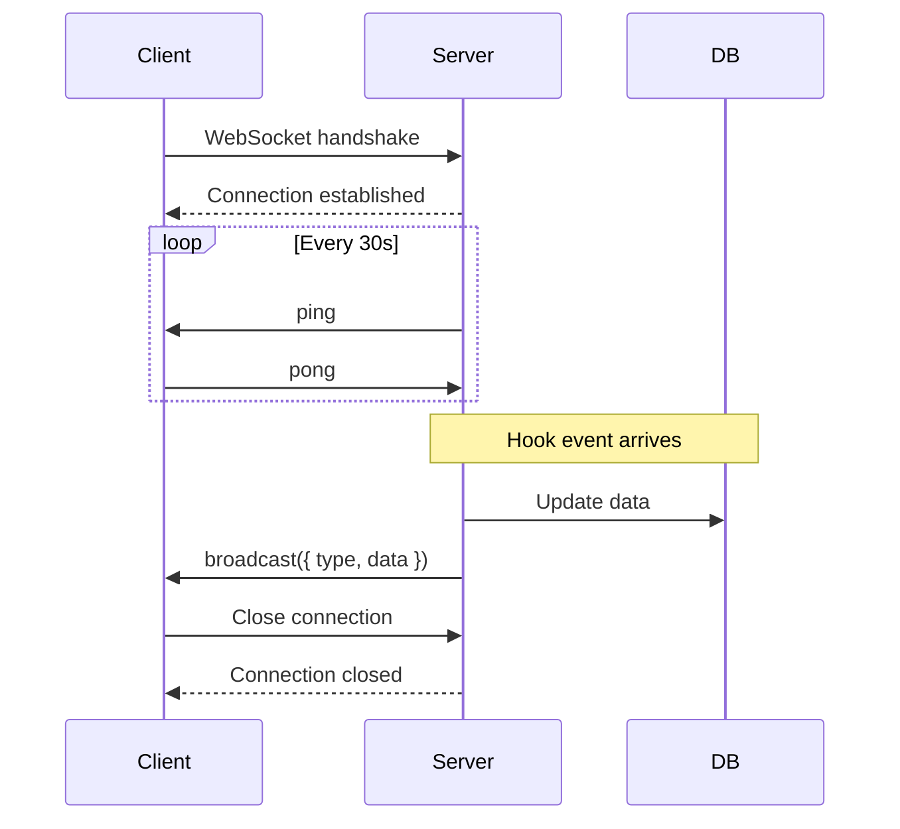

### Message Types

Server broadcasts JSON messages to all connected clients:

```typescript
// Session created
{
  "type": "session.created",
  "data": { ...session object }
}

// Session updated (status change, cost update)
{
  "type": "session.updated",
  "data": { ...session object }
}

// Agent created
{
  "type": "agent.created",
  "data": { ...agent object }
}

// Agent updated (status, tokens, cost)
{
  "type": "agent.updated",
  "data": { ...agent object }
}

// Tool executed
{
  "type": "tool.executed",
  "data": { ...tool execution object }
}

// Notification received
{
  "type": "notification.received",
  "data": { ...notification object }
}

// Remote data source status transition
{
  "type": "remote_source.status",
  "data": { "id": "...", "status": "idle|syncing|ok|error|deleted", "error": "...?", "last_sync_at": "...?" }
}

// Remote data imported — nudge stats pages to refetch
{
  "type": "remote_data.updated",
  "data": { "sourceId": "...", "source": "...", "label": "...?", "counters": { "imported": 0, "skipped": 0 }, "last_sync_at": "...?" }
}
```

### Broadcasting Logic

```javascript
// websocket.js
function broadcast(message) {
  const payload = JSON.stringify(message);
  wss.clients.forEach(client => {
    if (client.readyState === WebSocket.OPEN) {
      client.send(payload);
    }
  });
}

// Usage in routes/hooks.js
broadcast({ type: 'session.created', data: session });
```

---

## Hook Processing

### Hook Event Flow

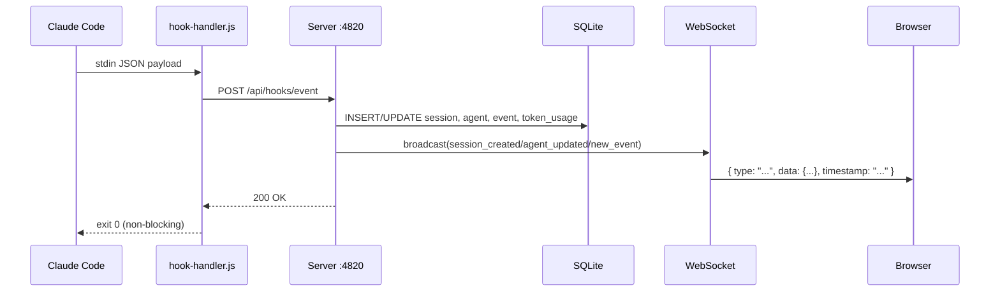

### Hook Endpoints

All hook traffic is sent to one endpoint:

| Method | Endpoint | Notes |
|--------|----------|-------|
| `POST` | `/api/hooks/event` | Body includes `hook_type` and `data`; server routes behavior by hook type |

Supported `hook_type` values include `PreToolUse`, `PostToolUse`, `Stop`, `SubagentStop`, `Notification`, `SessionStart`, and `SessionEnd`.

### Hook Processing Logic

```javascript
// routes/hooks.js
router.post("/event", (req, res) => {
  const { hook_type, data } = req.body;
  if (!hook_type || !data) {
    return res.status(400).json({
      error: { code: "INVALID_INPUT", message: "hook_type and data are required" },
    });
  }

  const event = processEvent(hook_type, data); // updates sessions, agents, events, tokens
  if (!event) {
    return res.status(400).json({
      error: { code: "MISSING_SESSION", message: "session_id is required in data" },
    });
  }

  res.json({ ok: true, event });
});
```

### Pricing Calculation

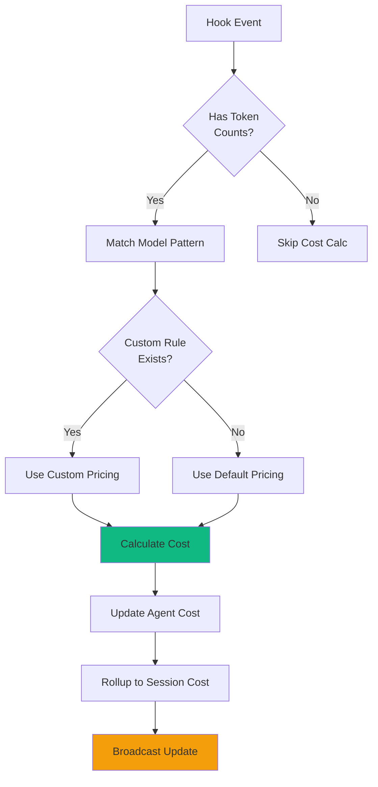

**Cost Formula:**

```javascript
function calculateCost(model, inputTokens, outputTokens) {
  // Find matching pricing rule (custom or default)
  const rule = findPricingRule(model);
  
  // Cost = (input tokens / 1M * input price) + (output tokens / 1M * output price)
  const inputCost = (inputTokens / 1_000_000) * rule.input_cost_per_1m;
  const outputCost = (outputTokens / 1_000_000) * rule.output_cost_per_1m;
  
  return inputCost + outputCost;
}
```

### Default Pricing Rules

Loaded on first run from `db.js`:

```javascript
// [pattern, display_name, input, output, cache_read, cache_write_5m, cache_write_1h]
// (rates per million tokens; 5m write ≈ 1.25× input, 1h write ≈ 2× input)
const DEFAULT_PRICING = [
  ["claude-fable-5%", "Claude Fable 5", 10, 50, 1, 12.5, 20],
  ["claude-mythos-5%", "Claude Mythos 5", 10, 50, 1, 12.5, 20],
  ["claude-opus-4-8%", "Claude Opus 4.8", 5, 25, 0.5, 6.25, 10],
  ["claude-sonnet-4-6%", "Claude Sonnet 4.6", 3, 15, 0.3, 3.75, 6],
  ["claude-haiku-4-5%", "Claude Haiku 4.5", 1, 5, 0.1, 1.25, 2],
  // ... one explicit row per model (see server/db.js for the full list)
];
```

---

## Data Flow

### Session Lifecycle

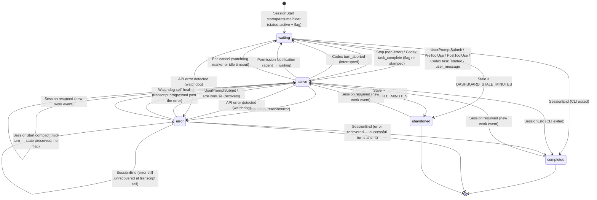

### Agent Lifecycle

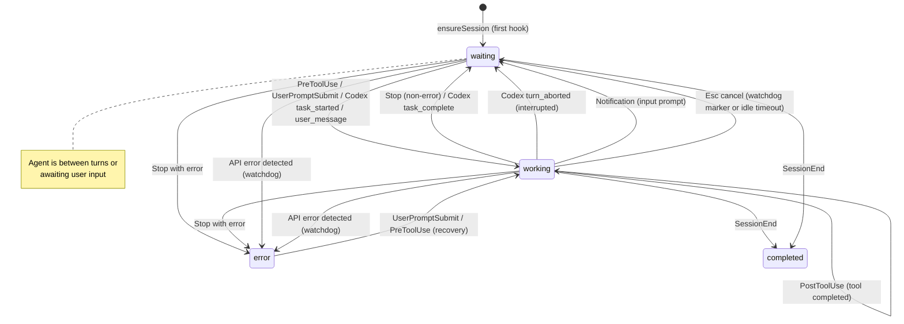

### Hook to Database Flow

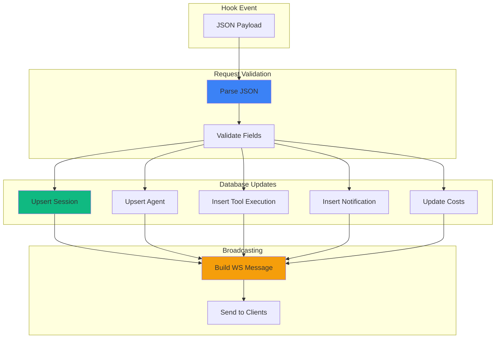

---

## Error Handling

### HTTP Error Codes

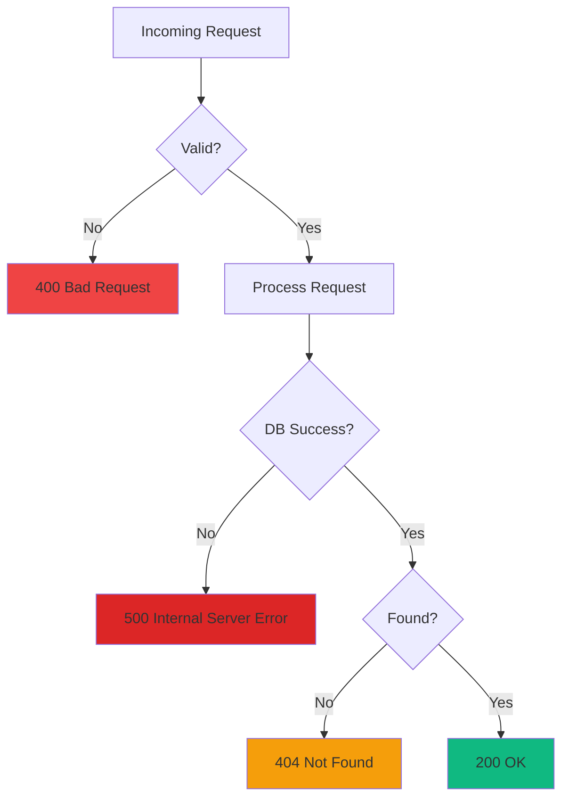

### Error Response Format

```json
{
  "error": "Session not found",
  "code": "NOT_FOUND",
  "details": {
    "session_id": "sess_invalid"
  }
}
```

### Graceful Degradation

```javascript
// Hook endpoint never throws unhandled errors to Claude Code
router.post("/api/hooks/event", (req, res) => {
  try {
    // Process hook
    processHookEvent(req.body);
    res.json({ ok: true });
  } catch (err) {
    console.error("Hook processing error:", err);
    // Still return 200 to avoid blocking Claude Code
    res.json({ ok: false, error: err.message });
  }
});
```

### Error Detection Watchdog

The server runs a background error detection timer every 15 seconds that proactively catches API errors even when Claude Code fails to fire hooks:

1. **Stale session scan** — finds active sessions with no recent hook events (>10 seconds since last event)
2. **Transcript re-read** — re-reads JSONL transcript files for those sessions looking for API errors (401 auth failures, rate limits, quota exhaustion)
3. **Path derivation** — for imported sessions that don't have `transcript_path` in event data, derives the transcript path from the session's `cwd`
4. **Error marking** — marks sessions and agents as `error` when API errors are found in transcripts

This catches cases where the Claude CLI doesn't fire a hook after an API error (e.g., 401 auth failures where the CLI just shows the error message and waits for user input).

### Continuous Project Sync

The startup auto-import of `~/.claude/projects` is **one-time** (marker-gated via `.legacy-import.done`), so a project folder created *after* first launch — whose sessions never flow through hooks (e.g. host-only hooks disabled) — would stay invisible until a manual rescan. `startSessionSync` (in `server/index.js`, wired into `startBackgroundServices`) closes that gap. It calls the exported `syncDefaultProjects(dbModule, { mtimeCache })` from `scripts/import-history.js` via three triggers that share **one** `mtimeCache` and a **single coalesced sweep** (a `running`/`queued` guard serializes overlapping triggers so at most one sweep runs at a time, with at most one more queued):

1. **Immediate sweep** at startup — surfaces anything the one-time backfill missed, right away instead of after the first interval.
2. **Debounced `fs.watch` (800 ms)** — fires a sweep the instant a *new* session file or project folder appears. Events for paths already in `mtimeCache` (active transcripts being appended) are ignored, so a busy session never thrashes the importer — its growth is left to the poll. Recursive watch is used on macOS/Windows (native, stable); on Linux the root + each immediate child folder are watched **non-recursively** (avoids the userland recursive-watcher hazard documented in `lib/cc-watcher.js`), adding a child watcher whenever a new folder appears.
3. **Periodic poll** — a safety-net sweep on `DASHBOARD_SESSION_SYNC_MS` (default `30000` ms; `0` disables the poll but leaves the watcher running), covering events a watcher can miss (e.g. on network filesystems).

Each sweep parses **only** files whose mtime is new or has advanced. A cold-cache fast path (e.g. the immediate sweep on every restart, when `mtimeCache` is empty) additionally skips an already-imported session whose file mtime hasn't advanced past its DB row's `updated_at`, so restart cost stays O(new/changed files) instead of re-parsing every transcript on disk. For each touched session it then broadcasts `session_created` / `session_updated` plus the session's main agent (`agent_created` / `agent_updated`) — the same frames hooks emit, so the UI refreshes live. All timers and watchers are `unref`'d and best-effort; nothing here can block shutdown or take down the server.

### Codex Sweep Triggers

The codex-home watcher deliberately does **not** treat the SQLite `-shm` sidecar as a reason to sweep.
SQLite touches the wal-index on every WAL-mode reader open — including the sweep's own read-only open of
that same state database — so matching `-shm` made each sweep schedule the next one: a self-sustaining
full-scan loop (directory walk + state-DB read + a synchronous `ps` probe) that ran with no Codex process
running and no user activity. Durable changes always land in the main database or its `-wal`, both of
which still match; the predicate is exported as `codexHomeChangeTriggersSweep` so the exclusion is
directly testable. A null filename still triggers, so the watcher never goes blind on platforms that omit
it — there the 1 s debounce, not the filename filter, is the frequency cap.

The response-item tool-call backfill runs for every discovered file once per process, then only for
fingerprint-changed files (its "no-op" early exit still costs a `statSync` plus two DB lookups per file);
a file whose ingest fails is re-queued so a transient error retries instead of waiting for the file to
grow.

### Remote Data Source Sync

`startRemoteSourceSync` (in `server/index.js`, wired into `startBackgroundServices`) pulls history from every **enabled** [Remote Data Source](#remote-data-sources) on an interval. A cheap guard first checks whether any enabled source exists, so the poller does no SSH work at all until the user configures one. Each tick delegates to `server/lib/remote-sync.js`, which mirrors Claude projects and Codex rollouts into separate per-provider staging dirs and sends them through `importFromDirectory` / `importCodexFromDirectory`. Codex's safe `session_index.jsonl` copy preserves native renamed titles without copying configuration or credentials. The interval is `DASHBOARD_REMOTE_SYNC_MS` (default `15000` ms; `0` disables the poller); adding or re-enabling a source also triggers an immediate pull. A per-source pull is bounded by `DASHBOARD_REMOTE_SYNC_TIMEOUT_MS` (default `600000` ms) and the connectivity test by `DASHBOARD_REMOTE_TEST_TIMEOUT_MS` (default `15000` ms). Status transitions broadcast provider-specific `remote_source.status`; a source is `ok` when either provider imports, and successful syncs broadcast `remote_data.updated` so the client refetches sessions, costs, and analytics as soon as the mirror lands. The timer is `unref`'d and fail-safe — a hung or unreachable remote never wedges the dashboard.

After each pull imports and tags a source's sessions, `remote-sync.js` **reconciles their live status from the fresh mirror** (`reconcileRemoteSessionStatus`). Remote sessions receive no live hooks, so a healthy provider remains excluded from this host's process-liveness reap and transcript watchdog: activity is judged from the **newest event timestamp inside each provider's transcript** (falling back to mirror mtime when the file has no parseable events). A session whose last event is within `DASHBOARD_REMOTE_ACTIVE_WINDOW_MS` (default `600000` ms = 10 min) is treated as still running (→ `active`, main agent back to `waiting`); once it stops advancing, the session lands in `completed` with its agents completed and `ended_at` stamped — the same terminal state a real `SessionEnd` produces. This keeps an already-imported remote session's status correct on every subsequent sync (the shared importer only sets status on first insert), and it self-heals any remote session a pre-fix build wrongly completed. If a provider is unavailable/errors, or remains `syncing` longer than `DASHBOARD_STALE_MINUTES`, only that provider's old active sessions fall back to the ordinary stale-session sweep; a healthy sibling provider stays mirror-owned. A later fresh mirror reactivates a session that is still writing, so an unavailable remote cannot leave a permanent Waiting card.

### User-Interrupt (Esc) Recovery

Cancelling a turn with `Esc` fires **no Claude Code hook** (a documented CLI limitation), so the `UserPromptSubmit` that promoted the main agent to `working` is never undone — the session would otherwise sit in `working` forever. The same 15 s watchdog recovers it, with two detection paths:

1. **Transcript marker** — when the cancel happens *after* some output, Claude Code writes a `[Request interrupted by user]` entry (carrying an `interruptedMessageId`) to the transcript. `TranscriptCache` exposes `pendingInterrupt`, computed purely from transcript ordering — the latest interrupt timestamp vs the latest real turn activity (assistant output or a genuine user prompt), both on Claude Code's clock. This is deliberately **not** compared against the session's last hook event: those are different clocks, and for a sub-second cancel the `UserPromptSubmit` event is stamped *after* the transcript interrupt, which is exactly what left such sessions stuck. Recovers within ~15 s.
2. **Idle-working timeout** — when Esc is pressed *before any output*, Claude Code writes **no marker at all**; the only signal is silence. When the main agent has been `working` with `current_tool` null and **neither a hook event nor the transcript mtime** has advanced for `DASHBOARD_WORKING_IDLE_SECONDS` (default `120`), the turn is treated as dead. Streaming output (transcript still growing) and in-flight tool calls are exempt by these guards; a rare false flip self-heals on the next real hook.

Both paths move the session to **Waiting** (main agent → `waiting`, `awaiting_input_since` stamped, and its paired nullable `awaiting_reason` TEXT column — one of `notification` | `stop` | `session_start` | `interrupted`, set and cleared in lock-step with `awaiting_input_since` — set to `interrupted`) — the same state a normal `Stop` produces (which records `awaiting_reason` = `stop`) — and log an `Interrupted` event. If the user resumes (a new prompt lands in the transcript), `pendingInterrupt` flips back to false and the fresh hook keeps the session non-stale.

### Dead-Session Liveness Reap

`SessionEnd` is the **only** signal that a session closed, and hooks are fire-and-forget — if the dashboard was down when the user quit (Ctrl+C, terminal closed), the event is lost forever and the session previously sat in **Waiting** until the stale sweep (3 h by default). The same 15 s watchdog now supplies the missing ground truth with a **process-liveness probe** (`server/lib/session-liveness.js`): it lists matching running `claude` or `codex` CLI processes (`ps -Ao pid=,args=` + `lsof -d cwd` on macOS, `/proc/<pid>/cwd` on Linux) and completes an `active` local-provider session only when its matching CLI has no live process — the same terminal state a real `SessionEnd` produces (agents → `completed`, `ended_at` stamped, `awaiting_input_since` and its paired `awaiting_reason` cleared to NULL together, a synthetic `SessionEnd` event with `data.source = "liveness-probe"`, broadcasts for live UI updates).

Fail-safe guards, in order:

- The probe must be **trustworthy**: it reports "no answer" (and the reap changes nothing) on Windows, inside containers (host processes are invisible), when `ps`/`lsof` fail, or when explicitly disabled via `DASHBOARD_LIVENESS_PROBE=0` — the escape hatch for setups where hooks arrive from another machine, where local processes prove nothing.
- The session must have a `cwd` to match on.
- The `cwd` must be **POSIX-absolute** (`path.isAbsolute`). A session forwarded from another machine via household hooks reports the origin's own path syntax (e.g. a Windows `D:\Git\ai-deck`), which this host's `/proc`/`lsof` scan can never produce — so its absence from the probe is not a death signal. Such sessions are skipped (never reaped by this probe), while genuinely-local POSIX sessions are still reaped on real crashes. This keeps a **mixed** deployment (local *and* household-forwarded sessions on one instance) correct without sacrificing local crash detection via `DASHBOARD_LIVENESS_PROBE=0`.
- **Remote Data Source sessions** (`sessions.source` ≠ `local`) are always excluded from the local reap query and watchdog transcript error/interrupt scan. A remote session's `cwd` is legitimately POSIX-absolute on *another* machine (e.g. `/home/ubuntu/matroid`), so the POSIX-cwd guard above cannot establish whether its CLI is alive. Healthy-source sessions are also excluded from the startup and periodic stale sweeps: `remote-sync.js` owns their active/completed lifecycle through mirror reconciliation (see the Remote source sync section above). If the source reports `error`, or remains `syncing` longer than `DASHBOARD_STALE_MINUTES`, an `active` session older than that same window falls back to the ordinary stale sweep (`abandoned`, agents completed). A later fresh mirror reactivates it if the remote CLI is still writing, so failure never leaves Waiting rows indefinitely.
- On **watchdog ticks only** (both startup passes skip this gate — at boot the probe alone decides, so a session quit moments before launch clears immediately): the session's **transcript mtime** must be older than `DASHBOARD_LIVENESS_IDLE_SECONDS` (default `60`) — the transcript is the ground-truth activity clock (Claude Code and Codex append to it as their turns progress and it stops moving when the process dies); `updated_at` is only the fallback for sessions with no transcript on disk. Keying on `updated_at` would leave a freshly imported dead session in Waiting for a full extra gate period after every boot, since import/backfill passes bump it at startup. A mid-turn session with a mismatched cwd (e.g. `claude --resume` run from a different directory) keeps its transcript mtime fresh and is spared.
- A false completion self-heals: the next hook event reactivates the session via the existing reactivation path.
- Only `status = 'active'` rows are considered; `error` sessions keep their existing recovery paths.

Cadence: **immediately at startup** (dead sessions already in the DB from a previous run clear before they ever render), **again ~5 s after startup** (covering rows the startup project sync just imported), and on every 15 s watchdog tick as the safety net for anything later (`kill -9` / crashes fire no `SessionEnd` either). Both boot passes live in `startBackgroundServices` and are fail-safe.

### API Error → Error State Flow

API errors detected in JSONL transcripts (`isApiErrorMessage` entries: quota limits, rate limits, `invalid_request`) now **immediately mark the session and agent as `error`**. Previously, these errors were recorded as `APIError` events but did not change session/agent status.

Error state transitions:
- `Stop` with `stop_reason=error` → agent `error`, session `error`
- API error in transcript (hook-based or watchdog) → session `error`, agent `error`
- `Notification` indicating input prompt → agent `waiting` (status change, not just flag)
- `SessionEnd` on error session → **preserves** `error` **only if the error is unrecovered at the transcript tail** (`isErrorAtTail`: the latest API error has no successful turn after it). A transient error the CLI retried past (successful turns after it) finalizes as `completed`, so a long healthy run doesn't exit frozen in a stale `error` from days earlier.

### Error Recovery

Three ways a session leaves `error`:
- **`UserPromptSubmit`** — user hits enter on a new prompt (active retry)
- **`PreToolUse`** — agent begins using a tool (session resumed with work)
- **Watchdog self-heal** — the 15 s watchdog now scans `error` sessions too. When the transcript shows the session progressed past the last API error (successful turns after it — `isErrorAtTail` is false), it clears the error back to `active`. This closes the gap where a transient API error (e.g. "Connection closed mid-response" — the CLI auto-retries and keeps going) left a session that recovered but never received a live `UserPromptSubmit`/`PreToolUse` hook — or one driven purely by the transcript sweep — pinned in `error` forever.

Live user actions and the transcript-tail check clear the error; unrelated background activity does not (the watchdog only clears when the transcript proves recovery).

### Graceful Shutdown

`SIGTERM` / `SIGINT` tear the server down in a fixed order so a restart is fast and clean. In development, `scripts/dev-server.js` watches runtime server/script sources, coalesces a burst of saves for 500 ms, and sends one SIGTERM before waiting for this shutdown sequence to finish. Its child inherits stdio directly, avoiding the built-in `node --watch` output proxy's fatal `EPIPE` during repeated restarts. The WSL remote-history transport also owns error handlers on both sides of its `ssh.stdout → tar.stdin` pipe: if reload closes `tar` while SSH still has buffered archive bytes, that source sync reports a contained stream failure instead of an uncaught `write EPIPE` terminating the dashboard.

1. **Drop realtime clients first** — `closeWebSocket()` (`server/websocket.js`) terminates every WebSocket client so their underlying TCP sockets release. Open WS sockets otherwise keep the HTTP server alive.
2. **`httpServer.close()`** — stop accepting new connections and begin draining in-flight requests.
3. **`httpServer.closeAllConnections()`** — forcibly drop lingering keep-alive sockets so `close()` actually completes promptly instead of hanging.
4. **Close SQLite last** — inside the `close()` callback, *after* the HTTP server has drained, then `process.exit(0)`.

Ordering matters: closing the DB before the HTTP server drained made in-flight requests throw `The database connection is not open` (e.g. `routes/agents.js`); leaving WS/keep-alive sockets open stalled shutdown until the 5 s force-exit backstop (the "waiting for graceful termination" hang). A second signal forces an immediate exit.

---

## Performance

### Query Optimization

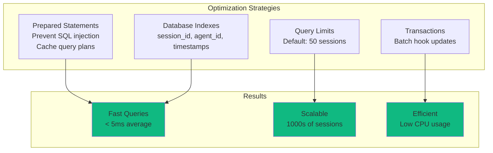

### Benchmarks

| Operation | Average Time | Notes |
|-----------|--------------|-------|
| Hook ingestion | 2-5 ms | Includes DB write + broadcast |
| Session list query | 3-8 ms | 50 sessions with agent counts |
| Session detail query | 1-2 ms | Single session lookup |
| Agent tools query | 5-15 ms | 100 tool executions |
| WebSocket broadcast | < 1 ms | Per client |

### Memory Usage

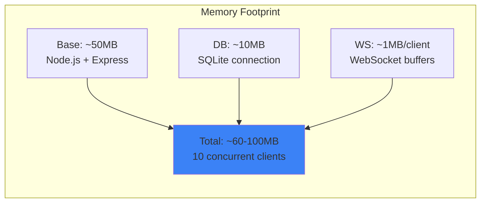

### Scaling Considerations

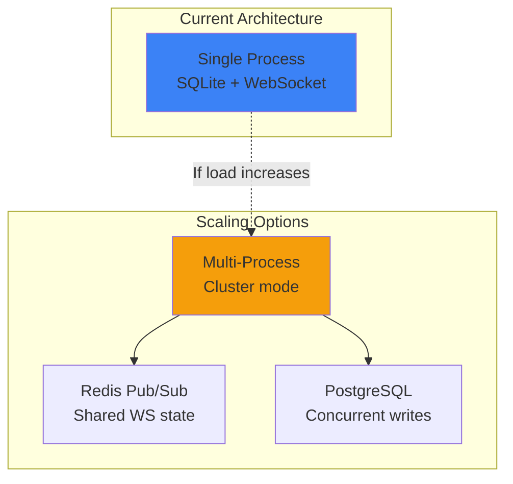

**Current limits:**
- SQLite: 1000s of sessions, 10,000s of tool executions
- WebSocket: 100+ concurrent clients
- CPU: Low (<5% idle, <20% during hook bursts)

For >1000 concurrent clients or >100k sessions, consider:
- Cluster mode with Redis pub/sub for WebSocket broadcasting
- PostgreSQL for better concurrent write performance
- Read replicas for API queries

---

## Testing

### Test Structure

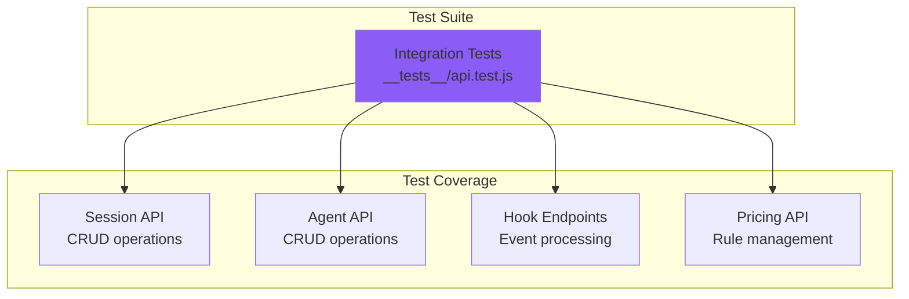

### Running Tests

```bash
# Run all server tests
npm run test:server

# Run with verbose output
node --test --test-reporter=spec server/__tests__/*.test.js
```

### Example Test

```javascript
// __tests__/api.test.js
import { test } from 'node:test';
import assert from 'node:assert';

test("POST /api/hooks/event ingests hook payload", async () => {
  const response = await fetch("http://localhost:4820/api/hooks/event", {
    method: 'POST',
    headers: { 'Content-Type': 'application/json' },
    body: JSON.stringify({
      hook_type: "SessionStart",
      data: {
        session_id: "test_session",
        model: "claude-sonnet-4",
        session_name: "Example Session",
      },
    })
  });
  
  const data = await response.json();
  assert.strictEqual(data.ok, true);
  
  // Verify session created
  const session = await fetch('http://localhost:4820/api/sessions/test_session');
  const sessionData = await session.json();
  assert.strictEqual(sessionData.session.model, 'claude-sonnet-4');
});
```

---

## Terminal Access (`ccam` CLI)

Everything this server exposes over JSON REST is reachable from the dependency-free `ccam` CLI (`bin/ccam.js`, linked by `npm run setup`). High-level commands cover monitoring, data browsing, workflows/cost, Run Agent, alerts/rules/webhooks, Claude, Cursor, and GPT pricing, provider-aware imports, remote sources, Claude/Codex config, hooks, backup restore, and administration. `ccam api <METHOD> /api/path` provides future-proof low-level coverage with `--yes` on writes and exact confirmation tokens for destructive actions. Multipart history upload is available through `ccam import upload`. It resolves the live server through the same `~/.claude/.agent-dashboard.json` registry as the hook handler and supports `DASHBOARD_API_TOKEN` / `CCAM_API_TOKEN` when the API is protected. See [docs/CLI.md](../docs/CLI.md).

## Deployment

### Production Checklist

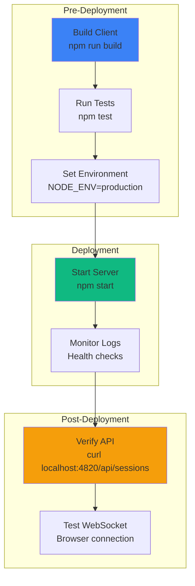

### Environment Variables

```bash
# Server configuration
DASHBOARD_PORT=4820                # Server port
NODE_ENV=production                # Environment mode

# Network exposure & hardening (see server/lib/security.js)
DASHBOARD_HOST=127.0.0.1           # Bind address; default loopback. Set 0.0.0.0 to widen (logs a warning)
DASHBOARD_TOKEN=                   # Optional bearer token; when set, /api/* and the WebSocket require it (off by default)
DASHBOARD_TOKEN_FILE=              # File-backed dashboard token for Docker/Kubernetes secrets
DASHBOARD_HOOK_TOKEN=              # Independent token for the local hook routes (/api/hooks/event, /api/hooks/codex) when exposed beyond loopback
DASHBOARD_HOOK_TOKEN_FILE=         # File-backed hook token
REMOTE_PUSH_TOKEN=                 # Separate token gating POST /api/hooks/ingest-batch (public-internet remote-push route). Unset = route disabled (503). Deliberately independent of DASHBOARD_HOOK_TOKEN above
REMOTE_PUSH_TOKEN_FILE=            # File-backed remote-push token
DASHBOARD_ALLOWED_HOSTS=           # Extra Host-header names to allow (comma-separated), e.g. for LAN access
POD_IP=                            # Kubernetes downward-API pod IP; automatically accepted by the Host guard
DASHBOARD_ENV_PATH=                # Writable dotenv path for persisted Settings overrides

# Database
DASHBOARD_DB_PATH=./data/dashboard.db  # SQLite database path

# Background services
DASHBOARD_SESSION_SYNC_MS=30000    # Continuous project-sync poll interval (ms); 0 disables the poll (watcher stays)
DASHBOARD_CURSOR_HOME=             # Optional Cursor home; defaults to ~/.cursor for native history and chat metadata
DASHBOARD_CURSOR_SYNC_MS=5000      # Cursor chat/transcript safety-net poll (ms); 0 keeps watchers but disables polling
DASHBOARD_CODEX_HOME=              # Optional Codex home; Settings saves this dashboard-only override and immediately re-arms live watching
DASHBOARD_CODEX_SYNC_MS=4000       # Codex rollout safety-net poll (ms); 0 disables poll (watcher stays)
DASHBOARD_CODEX_MAX_ATTEMPTS=5     # Consecutive failed ingest attempts per unchanged rollout, including the first attempt
DASHBOARD_CODEX_HOOK_IDLE_SECONDS=60 # Wait for a lost SessionEnd on a hook-only (rollout-less) Codex session
DASHBOARD_TASK_SUMMARY_TTL_MS=2000 # Serve-stale window (ms) for task-progress summaries of actively-growing transcripts; 0 re-parses on every change
DASHBOARD_TOKEN_REPAIR=1           # One-time startup repair of pre-reconciliation token totals; 0 skips it
DASHBOARD_LIVENESS_PROBE=1         # 0 disables the local Claude Code/Codex dead-session liveness reap (use when hooks arrive from another machine)
DASHBOARD_LIVENESS_IDLE_SECONDS=60 # Idle gate before the liveness reap may complete a process-less session

# Remote Data Sources (SSH pull; see the Remote Data Sources section)
DASHBOARD_REMOTE_SYNC_MS=15000         # Remote-source sync poll interval (ms); 0 disables the poller
DASHBOARD_REMOTE_SYNC_TIMEOUT_MS=600000# Per-source scp/pull timeout (ms)
DASHBOARD_REMOTE_TEST_TIMEOUT_MS=15000 # SSH connectivity-test timeout (ms)
DASHBOARD_REMOTE_ACTIVE_WINDOW_MS=600000 # Freshness window (ms) for a remote session's live status (active↔completed)

# Logging
LOG_LEVEL=info                     # Log level (debug, info, warn, error)
```

### Running in Production

```bash
# Start server (production mode)
NODE_ENV=production node server/index.js

# With PM2 (process manager)
pm2 start server/index.js --name agent-dashboard

# With systemd
sudo systemctl start agent-dashboard
```

### Docker, Podman, and Kubernetes

Use the repository `Dockerfile` and Compose files rather than recreating an
image. The runtime is non-root, includes Git/OpenSSH/SQLite, uses Tini as PID 1,
and is read-only except for mounted data/config volumes and tmpfs.

```bash
docker compose up -d --build

# Complete authenticated stack
npm run docker:full:up

# Full deployment validation
npm run deploy:validate
```

For Kubernetes, Helm and Kustomize enforce one Recreate-managed dashboard
replica with a retained ReadWriteOnce PVC. See [`DEPLOYMENT.md`](../DEPLOYMENT.md).

---

## Configuration

### Server Configuration (index.js)

```javascript
const PORT = parseInt(process.env.DASHBOARD_PORT || '4820', 10);
const HOST = process.env.DASHBOARD_HOST || '127.0.0.1';
const DB_PATH = process.env.DASHBOARD_DB_PATH || './data/dashboard.db';

const { corsOptions, hostGuard, tokenGuard } = require('./lib/security');

const app = express();
app.use(cors(corsOptions()));    // loopback-only origins
app.use(hostGuard);              // Host-header allowlist (anti DNS-rebinding)
app.use('/api', tokenGuard);     // optional DASHBOARD_TOKEN bearer auth
app.use(express.json({ limit: '10mb' }));

server.listen(PORT, HOST);       // binds 127.0.0.1 by default
```

The server **binds `127.0.0.1` (loopback) by default**, so it is not
network-reachable out of the box (CVE / advisory `GHSA-gr74-4xfh-6jw9`).
The hardening helpers all live in [`server/lib/security.js`](lib/security.js):

- **`corsOptions()`** restricts CORS to loopback origins — cross-origin pages
  in a browser cannot read responses (no-Origin clients such as `curl` still work).
- **`hostGuard`** enforces a Host-header allowlist on HTTP requests and WebSocket
  upgrades, blocking DNS-rebinding attacks.
- **`tokenGuard`** is a no-op unless `DASHBOARD_TOKEN` is set; when it is, every
  `/api/*` request (and the WebSocket) must present the token via
  `Authorization: Bearer <token>`, an `x-dashboard-token` header, or `?token=`.

Set **`DASHBOARD_HOST`** (e.g. `0.0.0.0`) to widen the bind beyond loopback —
this logs a startup warning and you should set **`DASHBOARD_TOKEN`** for auth
when you do. Add extra LAN Host names that should be accepted to
**`DASHBOARD_ALLOWED_HOSTS`** (comma-separated).

### Database Configuration (db.js)

```javascript
// SQLite connection options
const db = new Database(DB_PATH, {
  verbose: process.env.NODE_ENV === 'development' ? console.log : undefined,
  fileMustExist: false
});

// Performance pragmas
db.pragma('journal_mode = WAL');  // Write-Ahead Logging
db.pragma('synchronous = NORMAL'); // Faster writes
db.pragma('cache_size = -64000');  // 64MB cache
db.pragma('temp_store = MEMORY');  // Temp tables in memory
```

### WebSocket Configuration (websocket.js)

```javascript
const wss = new WebSocketServer({
  server: httpServer,
  path: '/ws',
  clientTracking: true,
  maxPayload: 1024 * 1024 // 1MB max message size
});

// Heartbeat interval
const HEARTBEAT_INTERVAL = 30000; // 30s
```

---

## Summary

The server is production-ready with:

- 🚀 **High Performance** - Sub-5ms hook processing, prepared statements, WAL mode
- 📊 **Comprehensive API** - RESTful endpoints for all data access
- ⚡ **Real-time Updates** - WebSocket broadcasting with heartbeat
- 🗄️ **Robust Storage** - SQLite with indexes, migrations, transactions
- 💰 **Flexible Pricing** - Custom pricing rules with pattern matching
- 🧪 **Well Tested** - Integration tests with Node.js test runner
- 🔒 **Secure** - Prepared statements, input validation, loopback bind by default, Host-header allowlist, loopback-only CORS, optional `DASHBOARD_TOKEN` auth
- 📈 **Scalable** - Handles 1000s of sessions, 100+ concurrent clients

For client documentation, see [client/README.md](../client/README.md).
